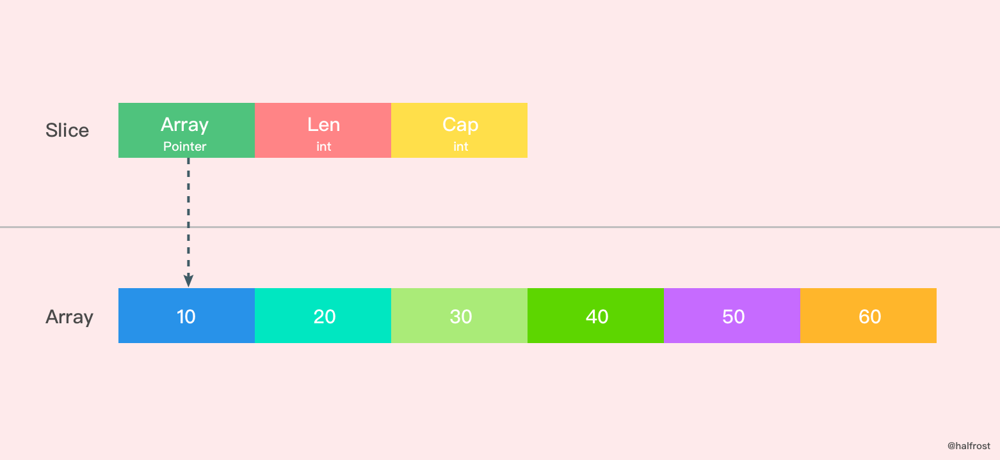

# main 
基础语法 —— main 函数要点 
* 无参数、无返回值 
* main 方法必须要在 main 包里面 
* `go run main.go` 就可以执行 
* 如果文件不叫 `main.go`，则需要 `go build` 之后再 `go run`

# package

语法：package xxxx 
* 字母和下划线的组合 
* 可以和文件夹不同名字 
* 同一个文件夹下的声明一致

引入包语法：import [alia] xxx 

* 如果一个包引入了但是没有使用，会报错 
* 匿名引入：前面多一个下划线

# string

string
* 双引号引起来，则内部双引号需要使用\转义 
* `引号引起来，则内部`需要\转义

[string长度
* 字节长度：和编码无关，用 len(str)获取 
* 字符数量：和编码有关，用编码库来计算]()

strings包

* string的拼接直接使用 + 号就可以。注意的是，某些语言支持 string 和别的类型拼接，但是 golang 不可以 
* strings 主要方法（你所需要的全部都可以找 到）： 
  * 查找和替换 
  * 大小写转换 
  * 子字符串相关 
  * 相等

```go
func main() {
	 fmt.Println(`表示核心线程池的大小。
      当提交一个任务时`)
	 fmt.Println("表示核心线程池的大小。\"当提交一个任务时\"")
	 fmt.Println(len("表示核心线程池的大小。当提交一个任务时，如果当前核心线程池的线程个数没有达到 corePoolSize"))
	 fmt.Println(utf8.RuneCountInString("表示核心线程池的大小。当提交一个任务时，如果当前核心线程池的线程个数没有达到 corePoolSize"))
	 strings.Contains("表示核心线程池的大小", "大小")

}

```

# rune类型

* rune，直观理解，就是字符 
* rune 不是 byte! 
* rune 本质是 int32，一个 rune 四个字节 
* rune 在很多语言里面是没有的，与之对应的 是，golang 没有 char 类型。rune 不是数字， 也不是 char，也不是 byte！ 
* 实际中不太常用

```go
type rune = int32
```

# 基础类型 ——bool, int, uint, float

* bool: true, false 
* int: int8, int16, int32, int64
* unit: uint8, uint16, uint32, uint64
* float: float32, float64

# byte类型
* byte，字节，本质是 uint8
* 对应的操作包在bytes上

```go

type byte = uint8

```

# 变量

var，语法：var name type = value 
* 局部变量 
* 包变量 
* 块声明 
* 驼峰命名 
* 首字符是否大写控制了访问性：大写包外可 访问； 
* golang 支持类型推断

变量声明 := 
* 只能用于局部变量，即方法内部 
* golang 使用类型推断来推断类型。数字会被理 解为int或者float64。（所以要其它类型的数字，就得用 var 来声明）

变量声明易错点
* 变量声明了没有使用 
* 类型不匹配 
* 同作用域下，变量只能声明一次

常量声明 const

首字符是否大写控制了访问性：大写包 外可访问； 
* 驼峰命名 
* 支持类型推断 
* 无法修改值


```go

package main

// Global 首字母大写，全局可以访问
var Global = "全局变量"

// 首字母小写，只能在这个包里面使用
// 其子包也不能用
var local = "包变量"

var (
	First string = "abc"
	second int32 = 16
)

func main() {
	// int 是灰色的，是因为 golang 自己可以做类型推断，它觉得你可以省略
	var a int = 13
	println(a)
	// 这里我们省略了类型
	var b = 14
	println(b)

	// 这里 uint 不可省略，因为生路之后，因为不加 uint 类型，15会被解释为 int 类型
	var c uint = 15
	println(c)

	// 这一句无法通过编译，因为 golang 是强类型语言，并且不会帮你做任何的转换
	// println(a == c)

	// 只声明不赋值，d 是默认值 0，类型不可以省略
	var d int
	println(d)
}


```

# func

```go

//一个返回值
func f0(name string) string {
	return "welcome " + name
}

// 多个参数，多个返回值
func f1(a string, name string) (int, string) {
	return 0, name
}

// 返回值命名
func f2(a int, b string) (age int, name string) {
	age = a + 1
	name = "Welcome " + b
	return
}

// 多个参数类型相同，可以写在一起
func f3(a, b string, a1, a2 int, c string) (d, e int, f string) {
	d = a1
	e = a2
	f = a + b
	return
}

// 不定参数
func f4(a string, b string, names ...string) {
	for _, name := range names {
		fmt.Printf("name = %s \n", name)
	}

}

```


# fmt

### demo
```go

package main
import "fmt"


type Model struct {
	Name string
	Age int32
}

func main() {
	model :=  Model{
		Name: "jun",
		Age : 22,
	}

	fmt.Println("model name =" + model.Name)
	fmt.Printf("model name = %s", model.Name)
	modelName :=  fmt.Sprintf("model name = %s", model.Name)
	println(modelName)

	fmt.Printf("v => %v \n", model)
	fmt.Printf("+v => %+v \n", model)
	fmt.Printf("#v => %#v \n", model)
	fmt.Printf("T => %T \n", model)

}

输出:
model name =jun
model name = junmodel name = jun
v => {jun 22}
+v => {Name:jun Age:22}
#v => main.Model{Name:"jun", Age:22}
T => main.Model


```
### 主要格式化
General:

	%v	the value in a default format
		when printing structs, the plus flag (%+v) adds field names
	%#v	a Go-syntax representation of the value
	%T	a Go-syntax representation of the type of the value
	%%	a literal percent sign; consumes no value

Boolean:

	%t	the word true or false

Integer:

	%b	base 2
	%c	the character represented by the corresponding Unicode code point
	%d	base 10
	%o	base 8
	%O	base 8 with 0o prefix
	%q	a single-quoted character literal safely escaped with Go syntax.
	%x	base 16, with lower-case letters for a-f
	%X	base 16, with upper-case letters for A-F
	%U	Unicode format: U+1234; same as "U+%04X"

Floating-point and complex constituents:

	%b	decimalless scientific notation with exponent a power of two,
		in the manner of strconv.FormatFloat with the 'b' format,
		e.g. -123456p-78
	%e	scientific notation, e.g. -1.234456e+78
	%E	scientific notation, e.g. -1.234456E+78
	%f	decimal point but no exponent, e.g. 123.456
	%F	synonym for %f
	%g	%e for large exponents, %f otherwise. Precision is discussed below.
	%G	%E for large exponents, %F otherwise
	%x	hexadecimal notation (with decimal power of two exponent), e.g. -0x1.23abcp+20
	%X	upper-case hexadecimal notation, e.g. -0X1.23ABCP+20

String and slice of bytes (treated equivalently with these verbs):

	%s	the uninterpreted bytes of the string or slice
	%q	a double-quoted string safely escaped with Go syntax
	%x	base 16, lower-case, two characters per byte
	%X	base 16, upper-case, two characters per byte

Slice:

	%p	address of 0th element in base 16 notation, with leading 0x

Pointer:

	%p	base 16 notation, with leading 0x
	The %b, %d, %o, %x and %X verbs also work with pointers,
	formatting the value exactly as if it were an integer.

The default format for %v is:

	bool:                    %t
	int, int8 etc.:          %d
	uint, uint8 etc.:        %d, %#x if printed with %#v
	float32, complex64, etc: %g
	string:                  %s
	chan:                    %p
	pointer:                 %p


# array
数组语法：[cap]type
* 初始化要指定长度（或者叫做容量） 
* 直接初始化 
* arr[i]的形式访问元素 
* len和cap操作用于获取数组长度

```go

	//初始化数组，必须包含3个初始值
	a1 := [3]int{1, 2, 3}
	fmt.Printf("a: %v, len: %d, cap: %d", a1, len(a1), cap(a1))

	// 初始化3个元素的空数组，所有元素都是默认值0
	var a2 [3]int
	fmt.Printf("a: %v, len: %d, cap: %d", a2, len(a2), cap(a2))

	// 按下标索引
	fmt.Printf("a1[1]: %d", a1[0])


```

# slice
### 基本使用
切片语法：[]`type`
* 直接初始化 a1 := []type{...}
* make初始化:make([]type, length, capacity) 
* slice[i] 的形式访问元素 
* append 追加元素 
* len 获取元素数量  cap 获取切片容容量
* 推荐写法：a1 := make([]type, 0, capacity)

内存数据结构：
```go

type slice struct {
	array unsafe.Pointer
	len   int
	cap   int
}

```
切片的结构体由3部分构成，Pointer 是指向一个数组的指针，len 代表当前切片的长度，cap 是当前切片的容量。cap 总是大于等于 len 的。
 

### 子切片

切片都可以通过[start:end]的形式来获取子切片： 
* slice[start:end]，获得[start, end)之间的元素 
* slice[:end]，获得[0, end)之间的元素
* slice[start:]，获得[start, len(arr))之间的元素

```go
fmt.Println("subSliceDemo()===========================")
array := []int{10, 20, 30, 40, 50, 60}
fmt.Printf("array: %v, len %d, cap: %d \n",array, len(array), cap(array))
sliceA := array[2:5]
sliceB := array[1:3]
fmt.Printf("sliceA: %v, len %d, cap: %d \n",sliceA, len(sliceA), cap(sliceA))
fmt.Printf("sliceB: %v, len %d, cap: %d \n",sliceB, len(sliceB), cap(sliceB))

```


子切片和切片共享底层数据，当子切片发生数据结构变化，不共享底层数据

```go
func shareSliceDemo() {
	fmt.Println("shareSliceDemo()===========================")
	a1 := []int{1, 2, 3, 4, 5, 6, 7, 8}
	a2 := a1[2:]
	fmt.Printf("a1: %v, pointer = %p, len %d, cap: %d \n", a1, &a1, len(a1), cap(a1))
	fmt.Printf("a2: %v, pointer = %p, len %d, cap: %d \n", a2, &a2, len(a2), cap(a2))
	//a1, a2共享底层数据
	a2[0] = 9
	fmt.Printf("a1: %v, pointer = %p, len %d, cap: %d \n", a1, &a1, len(a1), cap(a1))
	fmt.Printf("a2: %v, pointer = %p, len %d, cap: %d \n", a2, &a2, len(a2), cap(a2))

	//a2结构发生变化，a1,a2不共享底层数据
	a2 = append(a2, 19)
	fmt.Printf("a1: %v, pointer = %p, len %d, cap: %d \n", a1, &a1, len(a1), cap(a1))
	fmt.Printf("a2: %v, pointer = %p, len %d, cap: %d \n", a2, &a2, len(a2), cap(a2))

	a2[1] = 29
	fmt.Printf("a1: %v, pointer = %p, len %d, cap: %d \n", a1, &a1, len(a1), cap(a1))
	fmt.Printf("a2: %v, pointer = %p, len %d, cap: %d \n", a2, &a2, len(a2), cap(a2))
}


```
输出结果
```shell
shareSliceDemo()===========================
a1: [1 2 3 4 5 6 7 8], pointer = 0x1400011a108, len 8, cap: 8 
a2: [3 4 5 6 7 8], pointer = 0x1400011a120, len 6, cap: 6 
a1: [1 2 9 4 5 6 7 8], pointer = 0x1400011a108, len 8, cap: 8 
a2: [9 4 5 6 7 8], pointer = 0x1400011a120, len 6, cap: 6 
a1: [1 2 9 4 5 6 7 8], pointer = 0x1400011a108, len 8, cap: 8 
a2: [9 4 5 6 7 8 19], pointer = 0x1400011a120, len 7, cap: 12 
a1: [1 2 9 4 5 6 7 8], pointer = 0x1400011a108, len 8, cap: 8 
a2: [9 29 5 6 7 8 19], pointer = 0x1400011a120, len 7, cap: 12 

```


### nil和空切片

```go
//nil切片
var slice []int

//空切片
silce := make( []int , 0 )
slice := []int{ }

```
空切片和 nil 切片的区别在于，空切片指向的地址不是nil，指向的是一个内存地址，但是它没有分配任何内存空间，即底层元素包含0个元素。

### 切片扩容

当一个切片的容量满了，就需要扩容了.怎么扩，扩容策略是什么？
Go 中切片扩容的策略是这样的：
* 首先判断，如果新申请容量（cap）大于2倍的旧容量（old.cap），最终容量（newcap）就是新申请的容量（cap）
* 否则判断，如果旧切片的长度小于1024，则最终容量(newcap)就是旧容量(old.cap)的两倍，即（newcap=doublecap）
* 否则判断，如果旧切片长度大于等于1024，则最终容量（newcap）从旧容量（old.cap）开始循环增加原来的 1/4，即（newcap=old.cap,for {newcap += newcap/4}）直到最终容量（newcap）大于等于新申请的容量(cap)，即（newcap >= cap）
* 如果最终容量（cap）计算值溢出，则最终容量（cap）就是新申请容量（cap）

扩容后是新数组 or 老数组 ？

```go

func extendSliceDemo() {
	fmt.Println("extendSliceDemo()===========================")
	slice := []int{10, 20, 30, 40}
	newSlice := append(slice, 50)
	fmt.Printf("Before slice = %v, Pointer = %p, len = %d, cap = %d\n", slice, &slice, len(slice), cap(slice))
	fmt.Printf("Before newSlice = %v, Pointer = %p, len = %d, cap = %d\n", newSlice, &newSlice, len(newSlice), cap(newSlice))
	newSlice[1] += 10
	fmt.Printf("After slice = %v, Pointer = %p, len = %d, cap = %d\n", slice, &slice, len(slice), cap(slice))
	fmt.Printf("After newSlice = %v, Pointer = %p, len = %d, cap = %d\n", newSlice, &newSlice, len(newSlice), cap(newSlice))
}

```
输出结果：
```shell

extendSliceDemo()===========================
Before slice = [10 20 30 40], Pointer = 0x1400011a228, len = 4, cap = 4
Before newSlice = [10 20 30 40 50], Pointer = 0x1400011a240, len = 5, cap = 8
After slice = [10 20 30 40], Pointer = 0x1400011a228, len = 4, cap = 4
After newSlice = [10 30 30 40 50], Pointer = 0x1400011a240, len = 5, cap = 8

```

### slice append , add, remove

slice只支持append操作
```go

// The append built-in function appends elements to the end of a slice. If
// it has sufficient capacity, the destination is resliced to accommodate the
// new elements. If it does not, a new underlying array will be allocated.
// Append returns the updated slice. It is therefore necessary to store the
// result of append, often in the variable holding the slice itself:
//
//	slice = append(slice, elem1, elem2)
//	slice = append(slice, anotherSlice...)
//
// As a special case, it is legal to append a string to a byte slice, like this:
//
//	slice = append([]byte("hello "), "world"...)

func append(slice []Type, elems ...Type) []Type

```

...的用法
目前总结出的...用法有两种： 
* 放在参数后面，代表不定数量的参数 
* 放在slice后面，代表将slice打散进行传递

slice Add &Remove

```go

func Add(arr []int, index int, value int) ([]int, error) {
	if index > len(arr) || index < 0 {
		return arr, errors.New("index exceed slice length")
	}

	if index == 0 {
		arr = append([]int{value}, arr[:]...)
		return arr, nil
	}
	if index == len(arr)-1 {
		return append(arr, value), nil
	}

	temp := append(arr[:index], value)
	arr = append(temp, arr[index:]...)
	return arr, nil

	//s = append(s, zero_value)
	//copy(s[i+1:], s[i:])
	//s[i] = x
}

func Remove(arr []int, index int) ([]int, error) {
	if index >= len(arr) || index < 0 {
		return nil, errors.New("index exceed slice length")
	}

	if index == len(arr)-1 {
		return arr[:index-1], nil
	}
	if index == 0 {
		return arr[1:], nil
	}
	return append(arr[:index], arr[index+1:]...), nil
}

```

### 切片建议操作
* a1 := make([]type, 0, capacity)
* 子切片作为只读，不修改不append
* s = append(s, data)

### References
* https://halfrost.com/go_slice/

# for

for有三种形式： 
* for {} ，类似while的无限循环
* fori，一般的按照下标循环 
* for range最为特殊的range遍历 
* break 和 continue和别的语言一样

```go

func forLoop() {
	arr := []int{1, 2, 3, 4, 5, 6, 7, 8}
	index := 0
	fmt.Println(" for loop start \n ")
	for {
		if index == 4 {
			// break跳出for循环
			break
		}
		fmt.Printf("%d = %d\n", index, arr[index])
		index++
	}

	fmt.Println(" for loop end \n ")
}

func forI() {
	arr := []int{1, 2, 3, 4, 5, 6, 7, 8}
	fmt.Println("for i loop start \n ")
	for i := 0; i < len(arr); i++ {
		fmt.Printf("%d = %d \n", i, arr[i])
	}
	fmt.Println("for i loop end \n ")
}

func forRange() {
	arr := []int{1, 2, 3, 4, 5, 6, 7, 8}
	fmt.Println("for range loop start \n ")

	for index, value := range arr {
		fmt.Printf("%d = %d\n", index, value)
	}

	// 只需要value, 可以用 _ 代替index
	for _, value := range arr {
		fmt.Printf("value: %d \n", value)
	}

	// 只需要index也可以去掉写成for index := range arr
	for index := range arr {
		fmt.Printf("index: %d \n", index)
	}

	fmt.Println("for range loop end \n ")
}

```

# if-else
if-else和其他语言也差不多

```go

func checkGrade(grade int) {
	if grade >= 80 {
		fmt.Printf("Grade A\n")
	} else if grade < 80 && grade >= 60 {
		fmt.Printf("Grade B\n")
	} else {
		fmt.Printf("Grade C\n")
	}
}

```

带有局部变量声明if-else： 
* distance只能在if-else作用域里使用 
* 脱离了if-else作用域里，则不能再使用

```go

func checkDistance(begin int, end int) {

	//distance变量只在if-else语句作用域里使用
	if distance := end - begin; distance > 50 {
		fmt.Printf("distance: %d is far away\n", distance)
	} else {
		fmt.Printf("distance: %d is so closed\n", distance)
	}

	//这里不能访问distance变量
	//fmt.Printf("distance is： %d\n", distance)
}

```


