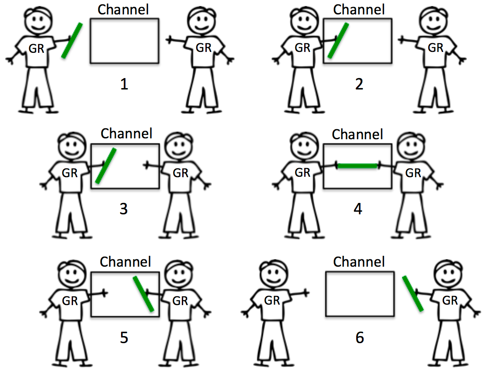
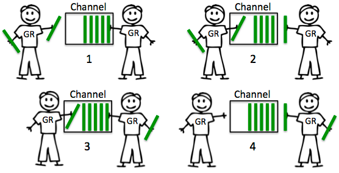
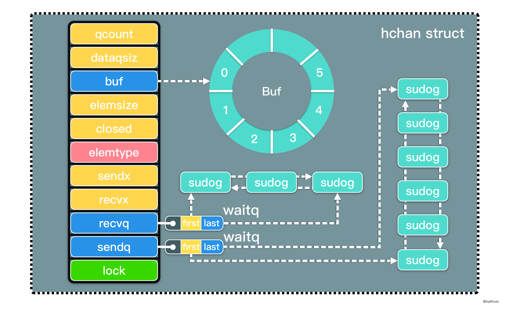

# channel

Go并发原语有 一个是 sync 包里面的，另一个是 channel。

sync 包里面主要是 WaitGroup，互斥锁和读写锁，cond，once，sync.Pool 这一类。
在 2 种情况下推荐使用 sync 包：
- 对性能要求极高的临界区
- 保护某个结构内部状态和完整性

相对于 sync 包，channel 也有三种情况：
- 输出数据给其他使用方, 看做是队列
- 组合多个逻辑
- 利用阻塞特性，可以间接控制住 goroutine 或者 其它资源的消耗。

输出数据给其他使用方的目的是转移数据的使用权。并发安全的实质是保证同时只有一个并发上下文拥有数据的所有权。 channel 可以很方便的将数据所有权转给其他使用方。

另一个优势是组合型。如果使用 sync 里面的锁，想实现组合多个逻辑并且保证并发安全，是比较困难的。但是使用 channel + select 实现组合逻辑实在太方便了.

利用阻塞特性这种用法有点像是令牌机制。 那么往 channel 里面读或者取一个数据，就有点 像是拿到一个令牌，拿到令牌才可以做某件事

## channel分类

```go
ch := make(chan int, 10)
```

### channel：无缓冲、有缓冲

|                 | 无缓冲                     | 有缓冲                 | 
|-----------------|---------------------------|---------------------| 
| 创建方式          | make(chan TYPE)         | make(chan TYPE,cap) | 
| 发送阻塞          | 数据接收前发送阻塞	        | 缓冲区满时发送阻塞           |
| 接收阻塞          | 数据发送前接收阻塞          | 缓冲区空时接收阻塞           | 

> 注意点：
> - 一个chan不能多次关闭，会导致panic
> - 如果多个goroutine都监听同一个channel,那么channel上的数据都可能随即被某一个goroutine取走进行消费
> - 如果多个goroutine都监听同一个channel,如果这个channel被关闭，则所有goroutine都能收到退出信号

- 无缓冲 channel
如下图所示，无缓冲的 channel 会阻塞直到数据接收完成，常用于两个 goroutine 互相等待同步



- 有缓冲 channel

有缓冲的 channel 如果在缓冲区未满的情况下发送是不阻塞的，在缓冲区不为空时，接收是不阻塞的



### channel 3种模式


写操作模式（单向通道）、读操作模式（单向通道）、读写操作模式（双向通道）

- 字面形式chan T表示一个元素类型为T的双向通道类型。 编译器允许从此类型的值中接收和向此类型的值中发送数据。
- 字面形式chan<- T表示一个元素类型为T的单向发送通道类型。 编译器不允许从此类型的值中接收数据。
- 字面形式<-chan T表示一个元素类型为T的单向接收通道类型。 编译器不允许向此类型的值中发送数据。

```go

// 这里只能读
func read(c <-chan int) {
	fmt.Println("read:", <-c)
}

// 这里只能写
func write(c chan<- int) {
	c <- 0
}

func main() {
	c := make(chan int) 
	go read(c)
	write(c)
}

```


## channel 和 goroutine 泄露

如果 channel 使用不当，就会导致 goroutine 泄 露：
 
- 只发送不接收，那么发送者一直阻塞，会导致发 送者 goroutine 泄露 
- 只接收不发送，那么接收者一直阻塞，会导致接 收者 goroutine 泄露 
- 读写 nil 不会 panic, 但会阻塞， 都会导致 goroutine 泄露,

**基本上可以说，goroutine 泄露都是因为 goroutine 被阻塞之后没有人唤醒它导致的。**

## channel 和 内存逃逸 

内存分配：
- 分配到栈上：不需要考虑 GC 
- 分配到堆上：需要考虑 GC 很不幸的，如果用 channel 发送指针，那么必然逃逸。 编译器无法确定，发送的指针数据最终会被哪个 goroutine 接收！


## channel 和 select

提供了一个关键字select,通过select可以监听channel上的数据流动

select的用法与switch语言非常类似,由select开始一个新的选择块,每个选择块条件由case语句来判断

与switch语句可以选择任何可使用相等比较的条件相比,select有比较多的限制,其中最大的一条限制就是每个case语句里必须是一个IO操作

```go
for {
    select {
        case <-chan1:
            //.....
        case chan2<-0:
            //....
        default:
            //都没成功,进入默认分支......
    }
}
```

在一个select语句中,会按顺序从头到尾评估每一个发送和接收的语句

> 注意:
> - 监听的case中,没有满足条件的就阻塞
> - 多个满足条件的就任选一个执行
> - select本身不带循环,需要外层的for
> - default通常不用,会产生忙轮询
> - break只能跳出select中的一个case
> - 加入了默认分支，那么无论涉及通道操作的表达式是否有阻塞，select语句都不会被阻塞。如果那几个表达式都阻塞了，或者说都没有满足求值的条件，那么默认分支就会被选中并执行。

## channel 编程 -  通过关闭 channel 实现一对多的通知

```go

func run(stop <-chan struct{}, done chan<- struct{}) {
	// 每一秒打印一次 hello
	for {
		select {
		case <-stop:
			fmt.Println("stop...")
			done <- struct{}{}
			return
		case <-time.After(time.Second):
			fmt.Println("hello")
		}
	}
}

func main() {
	// 一对多
	stop := make(chan struct{})
	// 多对一
	done := make(chan struct{}, 10)
	for i := 0; i < 10; i++ {
		go run(stop, done)
	}

	// 5s 后退出
	time.Sleep(5 * time.Second)
	close(stop)

	for i := 0; i < 10; i++ {
		<-done
	}
}
```

## channel 编程 — 实现消息队列

利用 channel 来实现一个基于内存的消息队列，并且有消费组的概念。

在 channel 里面的元素只能被一个 goroutine 消费。 所以要想同一个消息 能够被多 goroutine 消费，
- 方案一：每一个消费者订阅的时候，创建一个子 channel 
- 方案二：轮询所有的消费

```go


func main() {
	testBroker()
}

type handleFunc func(c *Consumer, msg string)

type Consumer struct {
	ch      chan string
	name    string
	handler handleFunc
}

func (c *Consumer) Start() {
	go func() {
		fmt.Printf("consumer:%s start\n", c.name)
		for {
			select {
			case msg, ok := <-c.ch:
				if !ok {
					fmt.Printf("consumer:%s return\n", c.name)
					return
				}
				c.handler(c, msg)
			}
		}
		fmt.Printf("consumer:%s end\n", c.name)
	}()
}

func (c *Consumer) close() {
	close(c.ch)
}

type Broker struct {
	consumers []*Consumer
}

func (b *Broker) Produce(msg string) {
	for _, consumer := range b.consumers {
		consumer.ch <- msg
	}
}

func (b *Broker) Subscribe(c *Consumer) {
	b.consumers = append(b.consumers, c)
}

func (b *Broker) Close() {
	for _, c := range b.consumers {
		c.close()
	}
}

func testBroker() {
	handler := func(c *Consumer, msg string) {
		fmt.Printf("consumer:%s get msg:%s\n", c.name, msg)
	}
	ctx, cancel := context.WithTimeout(context.Background(), 10*time.Second)
	defer cancel()
	b := &Broker{
		consumers: make([]*Consumer, 0, 4),
	}
	c1 := &Consumer{
		ch:      make(chan string, 1),
		name:    "A",
		handler: handler,
	}

	c2 := &Consumer{
		ch:      make(chan string, 1),
		name:    "B",
		handler: handler,
	}

	b.Subscribe(c1)
	b.Subscribe(c2)
	c1.Start()
	c2.Start()
	b.Produce("hello")
	b.Produce("world")
	<-ctx.Done()
	b.Close()
	time.Sleep(5 * time.Second)
}


```

输出结果：

```shell
consumer:B start
consumer:B get msg:hello
consumer:A start
consumer:A get msg:hello
consumer:A get msg:world
consumer:B get msg:world
consumer:B return
consumer:A return

```


## channel 编程 - 优雅退出

系统退出信号量转成 context

```shell

var onlyOneSignalHandler = make(chan struct{})

func SetupSignalHandler() context.Context {
	close(onlyOneSignalHandler) // 调用两次就会 panic

	ctx, cancel := context.WithCancel(context.Background())

	c := make(chan os.Signal, 2)
	signal.Notify(c, shutdownSignals...)
	go func() {
		<-c
		cancel() // 第一次 优雅 shutdown
		<-c
		os.Exit(1) // 第二次kill就直接退出
	}()

	return ctx
}
```

```shell

func main() {
	ctx := signals.SetupSignalHandler()
	
	go func(ctx context.Context) {
		for {
			// handle business here
			select {
			case <-ctx.Done():
				fmt.Printf("shutdown")
				return
			}
		}
	}(ctx)
	
	go func(ctx context.Context) {
		for {
			// handle business here
			select {
			case <-ctx.Done():
				fmt.Printf("shutdown")
				return
			}
		}
	}(ctx)

	<-ctx.Done()

	time.Sleep(5 * time.Second)

}
```

## channel 编程 - 超时机制

时候会出现协程阻塞的情况,那么我们如何避免这个情况? 可以使用 select 来设置超时

```go
package main

import (
	"fmt"
	"time"
)

func main() {
	ch1 := make(chan struct{})
	ch2 := make(chan struct{})
	done := make(chan struct{})

	go func() {
		time.Sleep(10 * time.Second)
		fmt.Println("go routine1 wake up")
		ch1 <- struct{}{}
	}()

	go func() {

		time.Sleep(time.Second)
		fmt.Println("go routine2 wake up")
		ch2 <- struct{}{}

	}()

	go func() {
		for {

			select {
			case <-ch1:
				fmt.Println("select go routine1")
			case <-ch2:
				fmt.Println("select go routine2")
			case <-time.After(2 * time.Second):
				done <- struct{}{}
				fmt.Println("select timeout")
				return
			}
		}
	}()

	<-done
	fmt.Println("main done")

}

```

输出结果

```shell
go routine2 wake up
select go routine2
main done

```

## channel 源码

### 基本数据结构

channel 的底层源码和相关实现在 src/runtime/chan.go 中。

```go

type hchan struct {
	qcount   uint           // 队列中所有数据总数
	dataqsiz uint           // 环形队列的 size
	buf      unsafe.Pointer // 指向 dataqsiz 长度的数组
	elemsize uint16         // 元素大小
	closed   uint32
	elemtype *_type // 元素类型
	sendx    uint   // 已发送的元素在环形队列中的位置
	recvx    uint   // 已接收的元素在环形队列中的位置
	recvq    waitq  // 接收者的等待队列
	sendq    waitq  // 发送者的等待队列

	// lock protects all fields in hchan, as well as several
	// fields in sudogs blocked on this channel.
	//
	// Do not change another G's status while holding this lock
	// (in particular, do not ready a G), as this can deadlock
	// with stack shrinking.
	lock mutex
}


```

lock 锁保护 hchan 中的所有字段，以及此通道上被阻塞的 sudogs 中的多个字段。持有 lock 的时候，禁止更改另一个 G 的状态（特别是不要使 G 状态变成ready），因为这会因为堆栈 shrinking 而发生死锁。



recvq 和 sendq 是等待队列，waitq 是一个双向链表：

```go

type waitq struct {
	first *sudog
	last  *sudog
}

```


channel 最核心的数据结构是 sudog。sudog 代表了一个在等待队列中的 g。

sudog 是 Go 中非常重要的数据结构，因为 g 与同步对象关系是多对多的。一个 g 可以出现在许多等待队列上，因此一个 g 可能有很多sudog。并且多个 g 可能正在等待同一个同步对象，因此一个对象可能有许多 sudog。

sudog 是从特殊池中分配出来的。使用 acquireSudog 和 releaseSudog 分配和释放它们。

```go

type sudog struct {

	g *g

	next *sudog
	prev *sudog
	elem unsafe.Pointer // 指向数据 (可能指向栈)

	// The following fields are never accessed concurrently.
	// For channels, waitlink is only accessed by g.
	// For semaphores, all fields (including the ones above)
	// are only accessed when holding a semaRoot lock.

	acquiretime int64
	releasetime int64
	ticket      uint32

	// isSelect indicates g is participating in a select, so
	// g.selectDone must be CAS'd to win the wake-up race.
	isSelect bool

	// success indicates whether communication over channel c
	// succeeded. It is true if the goroutine was awoken because a
	// value was delivered over channel c, and false if awoken
	// because c was closed.
	success bool

	parent   *sudog // semaRoot binary tree
	waitlink *sudog // g.waiting list or semaRoot
	waittail *sudog // semaRoot
	c        *hchan // channel
}
```

### channel 创建

在 Go 中使用 make(chan T, cap)  来创建 channel，make 语法会在编译时，转换为 makechan64  和 makechan

在分析channel的创建代码之前，我们看下源码文件中最开始定义的两个常量；

```go
const (
    maxAlign  = 8
    hchanSize = unsafe.Sizeof(hchan{}) + uintptr(-int(unsafe.Sizeof(hchan{}))&(maxAlign-1))

)
```

- maxAlign:   是内存对齐的最大值，这个等于 64 位 CPU 下的 cacheline 的大小
- hchanSize:  计算 unsafe.Sizeof(hchan{}) 最近的 8 的倍数

```go
func makechan(t *chantype, size int) *hchan {
	elem := t.elem

	// 先做一些检查
    // 元素大小不能大于等于 64k
	if elem.size >= 1<<16 {
		throw("makechan: invalid channel element type")
	}
    // 判断当前的 hchanSize 是否是 maxAlign 整数倍，并且元素的对齐大小不能大于最大对齐的大小
	if hchanSize%maxAlign != 0 || elem.align > maxAlign {
		throw("makechan: bad alignment")
	}

    // 这里计算内存是否超过限制
	mem, overflow := math.MulUintptr(elem.size, uintptr(size))
	if overflow || mem > maxAlloc-hchanSize || size < 0 {
		panic(plainError("makechan: size out of range"))
	}

	var c *hchan
	switch {
	case mem == 0: // 如果是无缓冲通道
		c = (*hchan)(mallocgc(hchanSize, nil, true)) // 为 hchan 分配内存
		c.buf = c.raceaddr() // 这个是 for data race 检测的
	case elem.ptrdata == 0: // 元素不包含指针
		c = (*hchan)(mallocgc(hchanSize+mem, nil, true)) // 为 hchan 和底层数组分配一段连续的内存地址
		c.buf = add(unsafe.Pointer(c), hchanSize)
	default: // 如果元素包含指针，分别为 hchan 和 底层数组分配内存地址
		c = new(hchan)
		c.buf = mallocgc(mem, elem, true)
	}

    // 初始化一些值
	c.elemsize = uint16(elem.size)
	c.elemtype = elem
	c.dataqsiz = uint(size)
	lockInit(&c.lock, lockRankHchan)

	return c
}

```

注释已经写得很全了，简单做个小结：

- 创建时会做一些检查
  - 元素大小不能超过 64K
  - 元素的对齐大小不能超过 maxAlign 也就是 8 字节
  - 计算出来的内存是否超过限制
  
- 创建时的策略 
  - 如果是无缓冲的 channel，会直接给 hchan 分配内存
  - 如果是有缓冲的 channel，并且元素不包含指针，那么会为 hchan 和底层数组分配一段连续的地址
  - 如果是有缓冲的 channel，并且元素包含指针，那么会为 hchan 和底层数组分别分配地址


> 就是因为 channel 的创建全部调用的 mallocgc()，在堆上开辟的内存空间，channel 本身会被 GC 自动回收。
> 
> 有了这一性质，所以才有了下文关闭 channel 中优雅关闭的方法。

### 发送数据

向 channel 中发送数据： chansend， 包含四个步骤

- 检查
- 同步发送
- 异步发送
- 阻塞发送

```go
// 代码中删除了调试相关的代码
func chansend(c *hchan, ep unsafe.Pointer, block bool, callerpc uintptr) bool {
    
	//检查
	// 如果是一个 nil 值的 channel
    // 如果是非阻塞的话就直接返回
    // 如果不是，那么则调用 gopark 休眠当前 goroutine 并且抛出 panic 错误
	if c == nil {
		if !block {
			return false
		}
		gopark(nil, nil, waitReasonChanSendNilChan, traceEvGoStop, 2)
		throw("unreachable")
	}

    // fast path 如果当前是非阻塞的
    // 并且通道尚未关闭
    // 并且缓冲区已满时，直接返回
	if !block && c.closed == 0 && full(c) {
		return false
	}

    // 加锁
	lock(&c.lock)

    // 如果通道已经关闭了，直接 panic，不允许向一个已经关闭的 channel 写入数据
	if c.closed != 0 {
		unlock(&c.lock)
		panic(plainError("send on closed channel"))
	}
	
	// 同步发送
    // 如果当前存在等待接收数据的 goroutine 直接取出第一个，将数据传递给第一个等待的 goroutine
	if sg := c.recvq.dequeue(); sg != nil {
		// send 用于发送数据，我们后面再看
		send(c, sg, ep, func() { unlock(&c.lock) }, 3)
		return true
	}

    // 异步发送
	// 如果当前 channel 包含缓冲区，并且缓冲区没有满
	if c.qcount < c.dataqsiz {
		
		// 计算数组中下一个可以存放数据的地址
		qp := chanbuf(c, c.sendx)

        // 将当前的数据放到缓冲区中
		typedmemmove(c.elemtype, qp, ep)

        // 索引加一
        c.sendx++

        // 由于是循环队列，如果索引地址等于数组长度，就需要将索引移动到 0
		if c.sendx == c.dataqsiz {
			c.sendx = 0
		}

        // 当前缓存数据量加一
		c.qcount++
		unlock(&c.lock)
		return true
	}

    // 如果是非阻塞的就直接返回了，因为非阻塞发送的情况已经走完了，下面是阻塞发送的逻辑
	if !block {
		unlock(&c.lock)
		return false
	}

    // 阻塞发送
	// 获取发送数据的 goroutine
	gp := getg()
    // 获取 sudog 结构体，并且设置相关信息，包括当前的 channel，是否是 select 等
	mysg := acquireSudog()
	mysg.releasetime = 0
	if t0 != 0 {
		mysg.releasetime = -1
	}
	mysg.elem = ep
	mysg.waitlink = nil
	mysg.g = gp
	mysg.isSelect = false
	mysg.c = c
	gp.waiting = mysg
	gp.param = nil

    // 将 sudog 结构加入到发送的队列中
	c.sendq.enqueue(mysg)

    // 挂起当前 goroutine 等待接收 channel数据
	gopark(chanparkcommit, unsafe.Pointer(&c.lock), waitReasonChanSend, traceEvGoBlockSend, 2)

    // 保证当前数据处于活跃状态避免被回收
	KeepAlive(ep)

	// 发送者 goroutine 被唤醒，检查当前 sg 的状态
	if mysg != gp.waiting {
		throw("G waiting list is corrupted")
	}
	gp.waiting = nil
	gp.activeStackChans = false
	if gp.param == nil {
		if c.closed == 0 {
			throw("chansend: spurious wakeup")
		}
		panic(plainError("send on closed channel"))
	}
	gp.param = nil
	if mysg.releasetime > 0 {
		blockevent(mysg.releasetime-t0, 2)
	}

    // 取消 channel 绑定
	mysg.c = nil
    // 释放 sudog
	releaseSudog(mysg)
	return true
}
```

send: 

```go
func send(c *hchan, sg *sudog, ep unsafe.Pointer, unlockf func(), skip int) {
    // 如果 sudog 上存在数据元素，就调用 sendDirect 直接把数据拷贝到接收变量的地址上
	if sg.elem != nil {
		sendDirect(c.elemtype, sg, ep)
		sg.elem = nil
	}
	gp := sg.g
	unlockf()
	gp.param = unsafe.Pointer(sg)
	if sg.releasetime != 0 {
		sg.releasetime = cputicks()
	}

    // 调用 goready 将接受者的 Goroutine 标记为可运行状态，并把它放到发送方的所在处理器的 runnext 等待执行，下次调度时就会执行到它。
    // 注意这里不是立即执行
	goready(gp, skip+1)
}
```
send() 函数主要完成了 2 件事：

- 调用 sendDirect() 函数将数据拷贝到了接收变量的内存地址上
- 调用 goready() 将等待接收的阻塞 goroutine 的状态从 Gwaiting 或者 Gscanwaiting 改变成 Grunnable。下一轮调度时会唤醒这个接收的 goroutine。


> 发送小结：
>
> 向 channel 中发送数据时大概分为两大块，检查和数据发送， 而数据发送又分为三种情况：
> - 同步发送： 如果 channel 的 recvq  存在阻塞等待的接收数据的 goroutine 那么将会直接将数据发送给第一个等待的 goroutine
    >  - 这里会直接将数据拷贝到 x <-ch  接收者的变量 x  上
>  - 然后将接收者的 Goroutine 修改为可运行状态，并把它放到发送方所在处理器的 runnext 上等待下一次调度时执行。
> - 异步发送： 如果 channel 是有缓冲的，并且缓冲区没有满，这个时候就会把数据放到缓冲区中
> - 阻塞发送： 如果 channel 的缓冲区满了，这个时候就会走阻塞发送的流程，获取到 sudog 之后将当前 Goroutine 挂起等待唤醒，唤醒后将相关的数据解绑，回收掉 sudog


### channel 接收

在 Go 中接收 channel 数据有两种方式:

- x <- ch       编译时会被转换为 chanrecv1
- x, ok <- ch   编译时会被转换为 chanrecv2

chanrecv1 和 chanrecv2 没有多大区别，只是 chanrecv2 比 chanrecv1 多了一个返回值，最终都是调用的 chanrecv 来实现的接收数据

```go
// selected 用于 select{} 语法中是否会选中该分支
// received 表示当前是否真正的接收到数据，用来判断 channel 是否 closed 掉了
func chanrecv(c *hchan, ep unsafe.Pointer, block bool) (selected, received bool) {
	// 和发送数据类似，先判断是否为nil，如果是 nil 并且阻塞接收就会 panic
	if c == nil {
		if !block {
			return
		}
		gopark(nil, nil, waitReasonChanReceiveNilChan, traceEvGoStop, 2)
		throw("unreachable")
	}

	// Fast path: 检查非阻塞的操作
    // empty 主要是有两种情况返回 true:
    // 1. 无缓冲channel，并且没有阻塞住发送者
    // 2. 有缓冲 channel，但是缓冲区没有数据
	if !block && empty(c) {
		// 这里判断通道是否关闭，如果是未关闭的通道说明当前还没准备好数据，直接返回
		if atomic.Load(&c.closed) == 0 {
			return
		}
		// 如果通道已经关闭了，再检查一下通道还有没有数据，如果已经没数据了，我们清理到 ep 指针中的数据并且返回
		if empty(c) {
			if ep != nil {
				typedmemclr(c.elemtype, ep)
			}
			return true, false
		}
	}

	// 上锁
	lock(&c.lock)

    // 和上面类似，如果通道已经关闭了，并且已经没数据了，我们清理到 ep 指针中的数据并且返回
	if c.closed != 0 && c.qcount == 0 {
		unlock(&c.lock)
		if ep != nil {
			typedmemclr(c.elemtype, ep)
		}
		return true, false
	}

    // 和发送类似，接收数据时也是先看一下有没有正在阻塞的等待发送数据的 Goroutine
    // 如果有的话 直接调用 recv 方法从发送者或者是缓冲区中接收数据，recv 方法后面会讲到
	if sg := c.sendq.dequeue(); sg != nil {
		recv(c, sg, ep, func() { unlock(&c.lock) }, 3)
		return true, true
	}

    // 如果 channel 的缓冲区还有数据
	if c.qcount > 0 {
		// 获取当前 channel 接收的地址
		qp := chanbuf(c, c.recvx)

        // 如果传入的指针不是 nil 直接把数据复制到对应的变量上
		if ep != nil {
			typedmemmove(c.elemtype, ep, qp)
		}
        // 清除队列中的数据，设置接受者索引并且返回
		typedmemclr(c.elemtype, qp)
		c.recvx++
		if c.recvx == c.dataqsiz {
			c.recvx = 0
		}
		c.qcount--
		unlock(&c.lock)
		return true, true
	}

    // 和发送一样剩下的就是阻塞操作了，如果是非阻塞的情况，直接返回
	if !block {
		unlock(&c.lock)
		return false, false
	}

	// 阻塞接受，和发送类似，拿到当前 Goroutine 和 sudog 并且做一些数据填充
	gp := getg()
	mysg := acquireSudog()
	mysg.releasetime = 0
	if t0 != 0 {
		mysg.releasetime = -1
	}
	mysg.elem = ep
	mysg.waitlink = nil
	gp.waiting = mysg
	mysg.g = gp
	mysg.isSelect = false
	mysg.c = c
	gp.param = nil

    // 把 sudog 放入到接收者队列当中
	c.recvq.enqueue(mysg)
    // 然后休眠当前 Goroutine 等待唤醒
	gopark(chanparkcommit, unsafe.Pointer(&c.lock), waitReasonChanReceive, traceEvGoBlockRecv, 2)

	// Goroutine 被唤醒，接收完数据，做一些数据清理的操作，释放掉 sudog 然后返回
	if mysg != gp.waiting {
		throw("G waiting list is corrupted")
	}
	gp.waiting = nil
	gp.activeStackChans = false
	if mysg.releasetime > 0 {
		blockevent(mysg.releasetime-t0, 2)
	}
	closed := gp.param == nil
	gp.param = nil
	mysg.c = nil
	releaseSudog(mysg)
	return true, !closed
}
```

recv:

```go
func recv(c *hchan, sg *sudog, ep unsafe.Pointer, unlockf func(), skip int) {
	// 如果无缓冲的 channel 直接调用 recvDirect 将数据从发送者 Goroutine 拷贝到变量
    if c.dataqsiz == 0 {
		if ep != nil {
			// copy data from sender
			recvDirect(c.elemtype, sg, ep)
		}
	} else {
		// 否则的话说明这是一个有缓冲的 channel 并且缓冲已经满了

        // 先从底层数组中拿到数据地址
		qp := chanbuf(c, c.recvx)

		// 然后把数据复制到接收变量上
		if ep != nil {
			typedmemmove(c.elemtype, ep, qp)
		}

		// 然后将发送者 Goroutine 中的数据拷贝到底层数组上
		typedmemmove(c.elemtype, qp, sg.elem)
		c.recvx++
		if c.recvx == c.dataqsiz {
			c.recvx = 0
		}
		c.sendx = c.recvx // c.sendx = (c.sendx+1) % c.dataqsiz
	}
    // 最后做一些清理操作
	sg.elem = nil
	gp := sg.g
	unlockf()
	gp.param = unsafe.Pointer(sg)
	if sg.releasetime != 0 {
		sg.releasetime = cputicks()
	}
	goready(gp, skip+1)
}
```

**小结: **数据接收和发送其实大同小异，也是分为检查和数据接收，数据接收又分三种情况

- 直接获取数据，如果当前有阻塞的发送者 Goroutine 走这条路
  - 如果是无缓冲 channel，直接从发送者那里把数据拷贝给接收变量
  - 如果是有缓冲 channel，并且 channel 已经满了，就先从 channel 的底层数组拷贝数据，再把阻塞的发送者 Goroutine 的数据拷贝到 channel 的循环队列中
- 从 channel 的缓冲中获取数据，有缓冲 channel 并且缓存队列有数据时走这条路
  - 直接从缓存队列中复制数据给接收变量
- 阻塞接收，剩余情况走这里
  - 和发送类似，先获取当前 Goroutine 信息，构造 sudog 加入到 channel 的 recvq 上
  - 然后休眠当前 Goroutine 等待唤醒
  - 唤醒后做一些清理工作，释放 sudog 返回

### 关闭 channel

使用 close(ch)  来关闭 channel 最后会调用 runtime 中的 closechan  方法


```go
func closechan(c *hchan) {
    // 关闭 nil 的 channel 会导致 panic
	if c == nil {
		panic(plainError("close of nil channel"))
	}

    // 加锁
	lock(&c.lock)

    // 关闭已关闭的 channel 会导致 panic
	if c.closed != 0 {
		unlock(&c.lock)
		panic(plainError("close of closed channel"))
	}

	// 设置 channel 状态
	c.closed = 1

	var glist gList

	// 释放所有的接收者 Goroutine
	for {
		sg := c.recvq.dequeue()
		if sg == nil {
			break
		}
		if sg.elem != nil {
			typedmemclr(c.elemtype, sg.elem)
			sg.elem = nil
		}
		if sg.releasetime != 0 {
			sg.releasetime = cputicks()
		}
		gp := sg.g
		gp.param = nil

		glist.push(gp)
	}

	// 释放所有的发送者channel，会 panic 因为不允许向已关闭的 channel 发送数据
	for {
		sg := c.sendq.dequeue()
		if sg == nil {
			break
		}
		sg.elem = nil
		if sg.releasetime != 0 {
			sg.releasetime = cputicks()
		}
		gp := sg.g
		gp.param = nil
		if raceenabled {
			raceacquireg(gp, c.raceaddr())
		}
		glist.push(gp)
	}
	unlock(&c.lock)

	// 将所有的 Goroutine 设置为可运行状态
	for !glist.empty() {
		gp := glist.pop()
		gp.schedlink = 0
		goready(gp, 3)
	}
}


```

> 小结:
> 
> - 关闭一个 nil 的 channel 和已关闭了的 channel 都会导致 panic
> - 关闭 channel 后会释放所有因为 channel 而阻塞的 Goroutine


## Reference

1. https://halfrost.com/go_channel/
2. https://blog.csdn.net/u012391423/article/details/118174735
3. https://www.ardanlabs.com/blog/2014/02/the-nature-of-channels-in-go.htm1
4. https://www.cyub.vip/2020/11/04/Golang%E6%BA%90%E7%A0%81%E5%88%86%E6%9E%90%E7%B3%BB%E5%88%97%E4%B9%8BChannel%E5%BA%95%E5%B1%82%E5%AE%9E%E7%8E%B0/