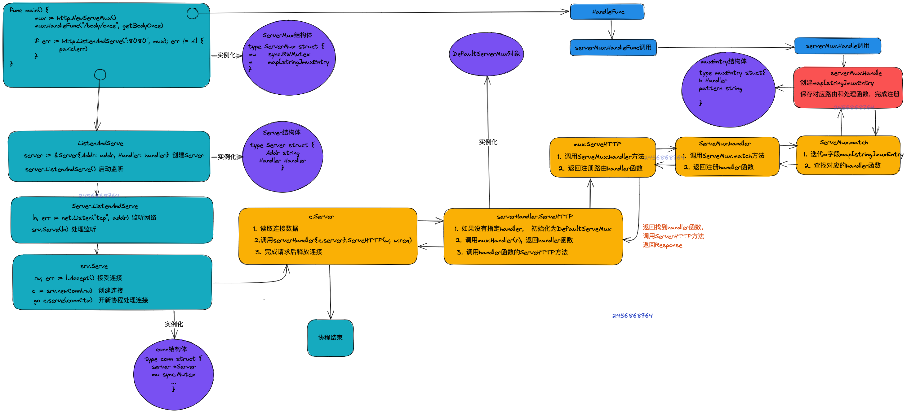

# http

http服务器，接受 client 的 request，并向 client 返回 response。
接收request的过程中，最重要是路由 router， 可以使用内置的 DefautServeMux，也可以自定义。

## handler

* Handler函数： 具有func(w http.ResponseWriter, r *http.Requests)签名的函数
* handler处理器: 经过HandlerFunc结构包装的handler函数，它实现了ServeHTTP接口方法的函数。调用handler处理器的ServeHTTP方法时，即调用handler函数本身。
* handler对象：实现了Handler接口ServeHTTP方法的结构。


```go
type Handler interface {
	ServeHTTP(ResponseWriter, *Request)
}
```

```go
// The HandlerFunc type is an adapter to allow the use of
// ordinary functions as HTTP handlers. If f is a function
// with the appropriate signature, HandlerFunc(f) is a
// Handler that calls f.
type HandlerFunc func(ResponseWriter, *Request)

// ServeHTTP calls f(w, r).
func (f HandlerFunc) ServeHTTP(w ResponseWriter, r *Request) {
	f(w, r)
}

```

```go
// HandleFunc registers the handler function for the given pattern.
func (mux *ServeMux) HandleFunc(pattern string, handler func(ResponseWriter, *Request)) {
	if handler == nil {
		panic("http: nil handler")
	}
	//这是报handler函数转成HandlerFunc结构体
	mux.Handle(pattern, HandlerFunc(handler))
}
```

## ServeMux
ServeMux的源码很简单：
```go
// ServeMux also takes care of sanitizing the URL request path and the Host
// header, stripping the port number and redirecting any request containing . or
// .. elements or repeated slashes to an equivalent, cleaner URL.
type ServeMux struct {
	mu    sync.RWMutex
	m     map[string]muxEntry
	es    []muxEntry // slice of entries sorted from longest to shortest.
	hosts bool       // whether any patterns contain hostnames
}

type muxEntry struct {
	h       Handler
	pattern string
}

```
ServeMux结构m，这是一个map，key是url模式，value是一个muxEntry结构存储了具体的url模式和handler。

ServeMux实现ServeHTTP接口，也是一个handler，这里ServeMux的ServeHTTP方法不是处理 request, respone，用来查找注册路由handler，再执行对应handler。

## Server
从http.ListenAndServe的源码看出，它创建了一个server对象，并调用server对象的ListenAndServe方法
```go
// ListenAndServe always returns a non-nil error.
// 这里传入 handler, 如果不传就用默认 handler : 
func ListenAndServe(addr string, handler Handler) error {
	server := &Server{Addr: addr, Handler: handler}
	return server.ListenAndServe()
}

```
Server结构体
```go
// A Server defines parameters for running an HTTP server.
// The zero value for Server is a valid configuration.
type Server struct {
	
	Addr string

	//如果Server接口没有提供Handler结构对象，那么会使用DefautServeMux。
	Handler Handler // handler to invoke, http.DefaultServeMux if nil

	TLSConfig *tls.Config

	ReadTimeout time.Duration
	
	ReadHeaderTimeout time.Duration
	
	WriteTimeout time.Duration
	IdleTimeout time.Duration
	...
	BaseContext func(net.Listener) context.Context

	
	ConnContext func(ctx context.Context, c net.Conn) context.Context

	inShutdown atomicBool // true when server is in shutdown

	disableKeepAlives int32     // accessed atomically.
	nextProtoOnce     sync.Once // guards setupHTTP2_* init
	nextProtoErr      error     // result of http2.ConfigureServer if used

	mu         sync.Mutex
	listeners  map[*net.Listener]struct{}
	activeConn map[*conn]struct{}
	doneChan   chan struct{}
	onShutdown []func()

	listenerGroup sync.WaitGroup
}
```


## 简单server
```go
package main

import (
	"encoding/json"
	"fmt"
	"io"
	"net/http"
	"net/http/pprof"
)

func index(w http.ResponseWriter, r *http.Request) {
	fmt.Fprintf(w, "index page")

}

func healthz(w http.ResponseWriter, r *http.Request) {
	io.WriteString(w, "ok\n")
}

func getUserAgent(w http.ResponseWriter, r *http.Request) {
	ip  := r.Header.Get("User-Agent")
	io.WriteString(w, fmt.Sprintf("User-Agent=%s\n", ip))
}

func getIP(w http.ResponseWriter, r *http.Request) {
	ip  := r.Header.Get("REMOTE-ADDR")
	io.WriteString(w, fmt.Sprintf("ip=%s\n", ip))
}

func getForm(w http.ResponseWriter, r *http.Request) {
	fmt.Fprintf(w, "before parse form %v\n", r.Form)
	err := r.ParseForm()
	if err != nil {
		fmt.Fprintf(w, "parse form error %v\n", r.Form)
	}
	fmt.Fprintf(w, "before parse form %v\n", r.Form)
}

func getHeaders(w http.ResponseWriter, r *http.Request) {
	for k, v := range r.Header {
		io.WriteString(w, fmt.Sprintf("%s=%s\n", k, v))
	}
}

func getUrl(w http.ResponseWriter, r *http.Request)  {
	data, _ := json.Marshal(r.URL)
	fmt.Fprintf(w, string(data))
}

func queryParams(w http.ResponseWriter, r *http.Request) {
	q := r.URL.Query()
	fmt.Fprintf(w, "query : %+v\n", q)
}


func getBodyOnce(w http.ResponseWriter, r *http.Request) {
	body, err := io.ReadAll(r.Body)
	if err!= nil {
		fmt.Fprintf(w, "read body fail: %v", err)
		return
	}
	//将 []byte 转换为 string
	fmt.Fprintf(w, "body content: [%s]\n", string(body))
	//尝试再次读取，读不到任何东西，但不报错
	body, err = io.ReadAll(r.Body)
	fmt.Fprintf(w, "read content again: [%s] and data length %d \n", string(body), len(body))

}

func main() {
	mux := http.NewServeMux()
	mux.HandleFunc("/body/once", getBodyOnce)
	mux.HandleFunc("/headers", getHeaders)
	mux.HandleFunc("/form", getForm)
	mux.HandleFunc("/ip", getIP)
	mux.HandleFunc("/user-agent", getUserAgent)
	mux.HandleFunc("/url", getUrl)
	mux.HandleFunc("/query", queryParams)

	mux.HandleFunc("/debug/pprof/", pprof.Index)
	mux.HandleFunc("/debug/pprof/profile", pprof.Profile)
	mux.HandleFunc("/debug/pprof/symbol", pprof.Symbol)
	mux.HandleFunc("/debug/pprof/trace", pprof.Trace)
	if err := http.ListenAndServe(":8080", mux); err != nil {
		panic(err)
	}
}
```

## 具体流程
1. 注册路由
```go
mux.HandleFunc("/body/once", getBodyOnce)
```
```go
func (mux *ServeMux) HandleFunc(pattern string, handler func(ResponseWriter, *Request)) {
	//把handler转成HanderFunc结构体，同时保存路由pattern, handler到mux.m map里
	mux.Handle(pattern, HandlerFunc(handler))
}
```
```go
func (mux *ServeMux) Handle(pattern string, handler Handler) {
	mux.mu.Lock()
	defer mux.mu.Unlock()
    //保存路由到mux.m
	e := muxEntry{h: handler, pattern: pattern}
	mux.m[pattern] = e
	
	//根据pattern排序，长路径在前面
	if pattern[len(pattern)-1] == '/' {
		mux.es = appendSorted(mux.es, e)
	}

	if pattern[0] != '/' {
		mux.hosts = true
	}
}
```
2. 启动服务、开始监听，处理网络连接
```go
http.ListenAndServe(":8080", mux)
```
这里 如果 handler 为nil, 就用默认DefaultServeMux， 默认DefaultServeMux也是ServeMux
```go
// NewServeMux allocates and returns a new ServeMux.
func NewServeMux() *ServeMux { return new(ServeMux) }

// DefaultServeMux is the default ServeMux used by Serve.
var DefaultServeMux = &defaultServeMux

var defaultServeMux ServeMux

```


```go
func ListenAndServe(addr string, handler Handler) error {
	server := &Server{Addr: addr, Handler: handler}
	return server.ListenAndServe()
}

```
server.go
```go
func (srv *Server) ListenAndServe() error {
	if srv.shuttingDown() {
		return ErrServerClosed
	}
	addr := srv.Addr
	if addr == "" {
		addr = ":http"
	}
	ln, err := net.Listen("tcp", addr)
	if err != nil {
		return err
	}
	return srv.Serve(ln)
}
```

```go
func (srv *Server) Serve(l net.Listener) error {
	...
	baseCtx := context.Background()
	

	var tempDelay time.Duration // how long to sleep on accept failure
    //把当前的srv放到context上下文里
	ctx := context.WithValue(baseCtx, ServerContextKey, srv)
	//死循环
	for {
		//接受连接
		rw, err := l.Accept()
		
		connCtx := ctx
	
		tempDelay = 0
		//创建连接
		c := srv.newConn(rw)
		c.setState(c.rwc, StateNew, runHooks) // before Serve can return
		//开新协程处理连接
		go c.serve(connCtx)
	}
}
```
```go
func (srv *Server) newConn(rwc net.Conn) *conn {
	c := &conn{
		server: srv,
		rwc:    rwc,
	}
	if debugServerConnections {
		c.rwc = newLoggingConn("server", c.rwc)
	}
	return c
}
```

3. 新协程处理网络连接，构建request & response

conn struct如下
```go
// A conn represents the server side of an HTTP connection.
type conn struct {
	// server is the server on which the connection arrived.
	// Immutable; never nil.
	server *Server

	// cancelCtx cancels the connection-level context.
	cancelCtx context.CancelFunc

	// rwc is the underlying network connection.
	// This is never wrapped by other types and is the value given out
	// to CloseNotifier callers. It is usually of type *net.TCPConn or
	// *tls.Conn.
	rwc net.Conn

	// remoteAddr is rwc.RemoteAddr().String(). It is not populated synchronously
	// inside the Listener's Accept goroutine, as some implementations block.
	// It is populated immediately inside the (*conn).serve goroutine.
	// This is the value of a Handler's (*Request).RemoteAddr.
	remoteAddr string

	// tlsState is the TLS connection state when using TLS.
	// nil means not TLS.
	tlsState *tls.ConnectionState

	// werr is set to the first write error to rwc.
	// It is set via checkConnErrorWriter{w}, where bufw writes.
	werr error

	// r is bufr's read source. It's a wrapper around rwc that provides
	// io.LimitedReader-style limiting (while reading request headers)
	// and functionality to support CloseNotifier. See *connReader docs.
	r *connReader

	// bufr reads from r.
	bufr *bufio.Reader

	// bufw writes to checkConnErrorWriter{c}, which populates werr on error.
	bufw *bufio.Writer

	// lastMethod is the method of the most recent request
	// on this connection, if any.
	lastMethod string

	curReq atomic.Value // of *response (which has a Request in it)

	curState struct{ atomic uint64 } // packed (unixtime<<8|uint8(ConnState))

	// mu guards hijackedv
	mu sync.Mutex

	// hijackedv is whether this connection has been hijacked
	// by a Handler with the Hijacker interface.
	// It is guarded by mu.
	hijackedv bool
}
```

```go
// Serve a new connection.
func (c *conn) serve(ctx context.Context) {
	c.remoteAddr = c.rwc.RemoteAddr().String()
	ctx = context.WithValue(ctx, LocalAddrContextKey, c.rwc.LocalAddr())
	...
	// HTTP/1.x from here on.

	ctx, cancelCtx := context.WithCancel(ctx)
	c.cancelCtx = cancelCtx
	defer cancelCtx()

	c.r = &connReader{conn: c}
	c.bufr = newBufioReader(c.r)
	c.bufw = newBufioWriterSize(checkConnErrorWriter{c}, 4<<10)

	for {
		//构建request和response
       w, err := c.readRequest(ctx)
       //处理请求
       serverHandler{c.server}.ServeHTTP(w, w.req)
	}
}
```

4. 处理请求
包装serverHandler结构体, ServerHTTP转发给server里 Handler 如果handler为nil, 就用默认DefaultServeMux
```go
// serverHandler delegates to either the server's Handler or
// DefaultServeMux and also handles "OPTIONS *" requests.
type serverHandler struct {
	srv *Server
}

func (sh serverHandler) ServeHTTP(rw ResponseWriter, req *Request) {
	handler := sh.srv.Handler
	//如果没有指定handler， 初始化为DefaultServeMux
	if handler == nil {
		handler = DefaultServeMux
	}
	...
	handler.ServeHTTP(rw, req)
}

```
5. Handler处理

ServeMux结构体处理请求，找到在mux.m[path]对应处理器进行处理
```go
// ServeHTTP dispatches the request to the handler whose
// pattern most closely matches the request URL.
func (mux *ServeMux) ServeHTTP(w ResponseWriter, r *Request) {
	//_根据路由找到匹配的处理器_
	h, _ := mux.Handler(r)
	//处理，这里就到了我们注册处理函数
	h.ServeHTTP(w, r)
}
```
```go
// If there is no registered handler that applies to the request,
// Handler returns a “page not found” handler and an empty pattern.
func (mux *ServeMux) Handler(r *Request) (h Handler, pattern string) {

	
	// All other requests have any port stripped and path cleaned
	// before passing to mux.handler.
	host := stripHostPort(r.Host)
	path := cleanPath(r.URL.Path)

	....
	return mux.handler(host, r.URL.Path)
}
```

```go
// handler is the main implementation of Handler.
// The path is known to be in canonical form, except for CONNECT methods.
func (mux *ServeMux) handler(host, path string) (h Handler, pattern string) {
	mux.mu.RLock()
	defer mux.mu.RUnlock()

	// Host-specific pattern takes precedence over generic ones
	if mux.hosts {
		h, pattern = mux.match(host + path)
	}
	if h == nil {
		h, pattern = mux.match(path)
	}
	if h == nil {
		h, pattern = NotFoundHandler(), ""
	}
	return
}
```

```go
// Find a handler on a handler map given a path string.
// Most-specific (longest) pattern wins.
func (mux *ServeMux) match(path string) (h Handler, pattern string) {
	// Check for exact match first.
	v, ok := mux.m[path]
	if ok {
		return v.h, v.pattern
	}

	// Check for longest valid match.  mux.es contains all patterns
	// that end in / sorted from longest to shortest.
	for _, e := range mux.es {
		if strings.HasPrefix(path, e.pattern) {
			return e.h, e.pattern
		}
	}
	return nil, ""
}
```


## 流程图总结



## 总结
* mux的ServeHTTP方法通过调用Handler方法查找路由上的handlerFunc，并调用该函数的ServeHTTP方法。

* mux的Handler方法对URL简单的处理，然后调用handler方法，后者会创建一个读锁，同时调用match方法返回一个handler和pattern。

* 在match方法中，mux的m字段是map[string]muxEntry，其保存pattern和handler处理器函数，通过迭代m寻找出注册路由的patten模式与实际url匹配的handler函数并返回。

* 返回的结构一直传递到mux的ServeHTTP方法，接下来调用handler函数的ServeHTTP方法，即注册函数HanderFunc，然后把response写到http.ResponseWriter对象返回给客户端。

* 上述函数运行结束后， serverHandler{c.server}.ServeHTTP(w, w.req) 运行结束。接下来就是对请求处理完毕之后，断开连接相关连接。

