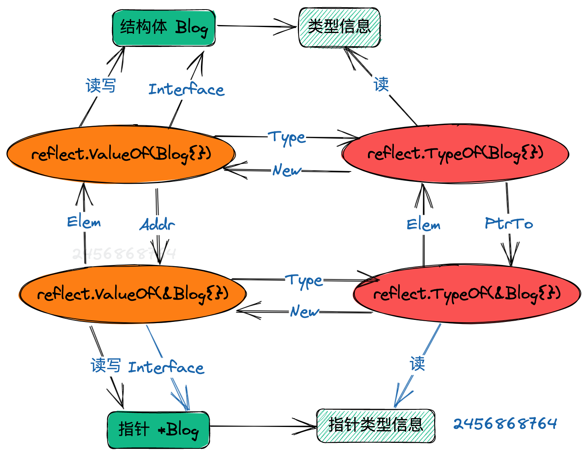

# 反射
##  反射可以从接口值中得到反射对象，反射对象二元组type, value
每个interface变量都有一个对应pair，pair中记录了实际变量的值和类型
(value, type)
value是实际变量值，type是实际变量的类型
value对应是reflect.Value， type对应是reflect.Type类型

* reflect.Value 用于操作值，部分值是可以被修改的
* reflect.Type 用于操作类信息，只能读取
* reflect.Type 可以通过reflect.Value得到，但是反过来则不行。


## reflect.Type数据结构和方法
在reflect包中，有一个描述类型公共信息的通用数据结构rtype。从源码的注释上看，它和 interface 里面的 _type 是同一个数据结构。它们俩只是因为包隔离，加上为了避免循环引用，所以在这边又复制了一遍。
```go
// rtype is the common implementation of most values.
// It is embedded in other struct types.
//
// rtype must be kept in sync with ../runtime/type.go:/^type._type.
type rtype struct {
	size       uintptr // 类型占用内存大小
	ptrdata    uintptr // 包含所有指针的内存前缀大小
	hash       uint32  // 类型 hash
	tflag      tflag   // 标记位，主要用于反射
	align      uint8   // 对齐字节信息
	fieldAlign uint8   // 当前结构字段的对齐字节数
	kind       uint8   // 基础类型枚举值
	equal func(unsafe.Pointer, unsafe.Pointer) bool // 比较两个形参对应对象的类型是否相等
	gcdata    *byte    // GC 类型的数据
	str       nameOff  // 类型名称字符串在二进制文件段中的偏移量
	ptrToThis typeOff  // 类型元信息指针在二进制文件段中的偏移量
}


```
1. reflect.Type 通用方法
```go

// Type 是 Go 类型的表示。
//
// 并非所有方法都适用于所有类型。
// 在调用 kind 具体方法之前，先使用 Kind 方法找出类型的种类。因为调用一个方法如果类型不匹配会导致 panic
//
// Type 类型值是可以比较的，比如用 == 操作符。所以它可以用做 map 的 key
// 如果两个 Type 值代表相同的类型，那么它们一定是相等的。
type Type interface {
	
	// Align 返回该类型在内存中分配时，以字节数为单位的字节数
	Align() int
	
	// FieldAlign 返回该类型在结构中作为字段使用时，以字节数为单位的字节数
	FieldAlign() int
	
	// Method 这个方法返回类型方法集中的第 i 个方法。
	// 如果 i 不在[0, NumMethod()]范围内，就会 panic。
	// 对于一个非接口类型 T 或 *T，返回的 Method 的 Type 和 Func。
	// fields 字段描述一个函数，它的第一个参数是接收方，而且只有导出的方法可以访问。
	// 对于一个接口类型，返回的 Method 的 Type 字段给出的是方法签名，没有接收者，Func字段为nil。
	// 方法是按字典序顺序排列的。
	Method(int) Method
	
	// MethodByName 返回类型中带有该名称的方法。
	// 方法集和一个表示是否找到该方法的布尔值。
	// 对于一个非接口类型 T 或 *T，返回的 Method 的 Type 和 Func。
	// fields 字段描述一个函数，其第一个参数是接收方。
	// 对于一个接口类型，返回的 Method 的 Type 字段给出的是方法签名，没有接收者，Func字段为nil。
	MethodByName(string) (Method, bool)

	// NumMethod 返回使用 Method 可以访问的方法数量。
	// 请注意，NumMethod 只在接口类型的调用的时候，会对未导出方法进行计数。
	NumMethod() int

	// 对于定义的类型，Name 返回其包中的类型名称。
	// 对于其他(非定义的)类型，它返回空字符串。
	Name() string

	// PkgPath 返回一个定义类型的包的路径，也就是导入路径，导入路径是唯一标识包的类型，如 "encoding/base64"。
	// 如果类型是预先声明的(string, error)或者没有定义(*T, struct{}, []int，或 A，其中 A 是一个非定义类型的别名），包的路径将是空字符串。
	PkgPath() string

	// Size 返回存储给定类型的值所需的字节数。它类似于 unsafe.Sizeof.
	Size() uintptr

	// String 返回该类型的字符串表示。
	// 字符串表示法可以使用缩短的包名。
	// (例如，使用 base64 而不是 "encoding/base64")并且它并不能保证类型之间是唯一的。如果是为了测试类型标识，应该直接比较类型 Type。
	String() string

	// Kind 返回该类型的具体种类。
	Kind() Kind

	// Implements 表示该类型是否实现了接口类型 u。
	Implements(u Type) bool

	// AssignableTo 表示该类型的值是否可以分配给类型 u。
	AssignableTo(u Type) bool

	// ConvertibleTo 表示该类型的值是否可转换为 u 类型。
	ConvertibleTo(u Type) bool

	// Comparable 表示该类型的值是否具有可比性。
	Comparable() bool
}

2. reflect.Type 专有方法

以下这些方法是某些类型专有的方法，如果类型不匹配会发生 panic。在不确定类型之前最好先调用 Kind() 方法确定具体类型再调用类型的专有方法。

Kind类型	 Methods集合
Int*	 Bits
Uint*	 Bits
Float*	 Bits
Complex* Bits
Array	 Elem, Len
Chan	 ChanDir, Elem
Func	 In, NumIn, Out, NumOut, IsVariadic
Map	     Key, Elem
Ptr	     Elem
Slice	 Elem
Struct	 Field, FieldByIndex, FieldByName,FieldByNameFunc, NumField


```
对专有方法的说明如下：
```go
type Type interface {

	// Bits 以 bits 为单位返回类型的大小。
	// 如果类型的 Kind 不属于：sized 或者 unsized Int, Uint, Float, 或者 Complex，会 panic。
	//大小不一的Int、Uint、Float或Complex类型。
	Bits() int

	// ChanDir 返回一个通道类型的方向。
	// 如果类型的 Kind 不是 Chan，会 panic。
	ChanDir() ChanDir


	// IsVariadic 表示一个函数类型的最后输入参数是否为一个 "..." 可变参数。如果是，t.In(t.NumIn() - 1) 返回参数的隐式实际类型 []T.
	// 更具体的，如果 t 代表 func(x int, y ... float64)，那么：
	// t.NumIn() == 2
	// t.In(0)是 "int" 的 reflect.Type 反射类型。
	// t.In(1)是 "[]float64" 的 reflect.Type 反射类型。
	// t.IsVariadic() == true
	// 如果类型的 Kind 不是 Func.IsVariadic，IsVariadic 会 panic
	IsVariadic() bool

	// Elem 返回一个 type 的元素类型。
	// 如果类型的 Kind 不是 Array、Chan、Map、Ptr 或 Slice，就会 panic
	Elem() Type

	// Field 返回一个结构类型的第 i 个字段。
	// 如果类型的 Kind 不是 Struct，就会 panic。
	// 如果 i 不在 [0, NumField()] 范围内，也会 panic。
	Field(i int) StructField

	// FieldByIndex 返回索引序列对应的嵌套字段。它相当于对每一个 index 调用 Field。
	// 如果类型的 Kind 不是 Struct，就会 panic。
	FieldByIndex(index []int) StructField

	// FieldByName 返回给定名称的结构字段和一个表示是否找到该字段的布尔值。
	FieldByName(name string) (StructField, bool)

	// FieldByNameFunc 返回一个能满足 match 函数的带有名称的 field 字段。布尔值表示是否找到。
	// FieldByNameFunc 先在自己的结构体的字段里面查找，然后在任何嵌入结构中的字段中查找，按广度第一顺序搜索。最终停止在含有一个或多个能满足 match 函数的结构体中。如果在该深度上满足条件的有多个字段，这些字段相互取消，并且 FieldByNameFunc 返回没有匹配。
	// 这种行为反映了 Go 在包含嵌入式字段的结构的情况下对名称查找的处理方式
	FieldByNameFunc(match func(string) bool) (StructField, bool)

	// In 返回函数类型的第 i 个输入参数的类型。
	// 如果类型的 Kind 不是 Func 类型会 panic。
	// 如果 i 不在 [0, NumIn()) 的范围内，会 panic。
	In(i int) Type

	// Key 返回一个 map 类型的 key 类型。
	// 如果类型的 Kind 不是 Map，会 panic。
	Key() Type

	// Len 返回一个数组类型的长度。
	// 如果类型的 Kind 不是 Array，会 panic。
	Len() int

	// NumField 返回一个结构类型的字段数目。
	// 如果类型的 Kind 不是 Struct，会 panic。
	NumField() int

	// NumIn 返回一个函数类型的输入参数数。
	// 如果类型的 Kind 不是Func.NumIn()，会 panic。
	NumIn() int

	// NumOut 返回一个函数类型的输出参数数。
	// 如果类型的 Kind 不是 Func.NumOut()，会 panic。
	NumOut() int

	// Out 返回一个函数类型的第 i 个输出参数的类型。
	// 如果类型的类型不是 Func.Out，会 panic。
	// 如果 i 不在 [0, NumOut()) 的范围内，会 panic。
	Out(i int) Type

}
```
## reflect.Value 数据结构

```go
type Value struct {
	// typ 包含由值表示的值的类型。
	typ *rtype

	// 指向值的指针，如果设置了 flagIndir，则是指向数据的指针。只有当设置了 flagIndir 或 typ.pointers（）为 true 时有效。
	ptr unsafe.Pointer

	// flag 保存有关该值的元数据。最低位是标志位：
	//	- flagStickyRO: 通过未导出的未嵌入字段获取，因此为只读
	//	- flagEmbedRO:  通过未导出的嵌入式字段获取，因此为只读
	//	- flagIndir:    val保存指向数据的指针
	//	- flagAddr:     v.CanAddr 为 true (表示 flagIndir)
	//	- flagMethod:   v 是方法值。
    // 接下来的 5 个 bits 给出 Value 的 Kind 种类，除了方法 values 以外，它会重复 typ.Kind（）。其余 23 位以上给出方法 values 的方法编号。如果 flag.kind（）!= Func，代码可以假定 flagMethod 没有设置。如果 ifaceIndir(typ)，代码可以假定设置了 flagIndir。
	flag
}
```
## Kind

* reflect 包有一个很强的假设：操作之前你是知道操作的是什么 Kind, 调用之前要Kind判断一下
* Kind 是一个枚举值，用来判断操作的对应类型，例如是否是指针、是否 是数组、是否是切片等 
* 用 reflect 的方法，如果调用方法不对，直接就 panic。 在调用 API 之前一定要先看注释，看上面reflect.Type专有方法,确认在什么样的情况下可以调用！

```go
// A Kind represents the specific kind of type that a Type represents.
// The zero Kind is not a valid kind.
type Kind uint

const (
	Invalid Kind = iota
	Bool
	Int
	Int8
	Int16
	Int32
	Int64
	Uint
	Uint8
	Uint16
	Uint32
	Uint64
	Uintptr
	Float32
	Float64
	Complex64
	Complex128
	Array
	Chan
	Func
	Interface
	Map
	Pointer
	Slice
	String
	Struct
	UnsafePointer
)

```

## 指针和指针指向的结构体

如果是指针类型，可以通过 .Elem() 方法获取对应的实际值。
1. 通过type判断是否指针类型，返回具体的结构体类型 
2. 通过value判断是否指针类型，返回具体的结构体数据


```go

func indirectReflectType(reflectType reflect.Type) reflect.Type {
	if reflectType.Kind() == reflect.Pointer {
		return reflectType.Elem()
	}
	return reflectType
}

func indirectReflectValue(reflectValue reflect.Value) reflect.Value {
	if reflectValue.Kind() == reflect.Pointer {
		return reflectValue.Elem()
	}
	return reflectValue
}


```


## 基本操作

1. 从接口变量中获取value和type信息
```go

func f1() {
	fmt.Println("f1()================================")
	a := 1234
	ty1 := reflect.TypeOf(a)
	va1 := reflect.ValueOf(a)
	fmt.Printf("typ1 name:%s, typ1 kind:%s\n", ty1.Name(), ty1.Kind())
	fmt.Printf("typ1 value:%+v\n", va1)

	book := Book{Name: "isito", Price: 108}
	ty2 := reflect.TypeOf(book)
	val2 :=reflect.ValueOf(book)

	fmt.Printf("typ2 name:%s, typ1 kind:%s\n",ty2.Name(), ty2.Kind())
	fmt.Printf("typ2 value:%+v\n", val2)

	bookp := &Book{Name: "envoy", Price: 100}
	ty3 := reflect.TypeOf(bookp)
	val3 := reflect.ValueOf(bookp)

	fmt.Printf("typ3 name:%s, typ1 kind:%s\n",ty3.Name(), ty3.Kind())
	fmt.Printf("typ3 value:%+v\n", val3)
}
```

2. 从反射对象中获得接口值
如果得到了一个类型为reflect.Value的变量，可以通过下面的方式，获得变量的信息。
如果知道v的真实类型，直接转化成对应的类型:

```go

r := v.Interface().(已知类型)

```

```go

func f2() {
	fmt.Println("f12()================================")
	a := 126.54
	val := reflect.ValueOf(a)
	b := val.Interface().(float64)
	fmt.Printf("a :%f b:%f\n", a, b)
	book := Book{
		Name: "eBRF",
		Price: 129,
	}
	fmt.Printf("book :%#v \n", book)
	valb := reflect.ValueOf(book)
	rbook := valb.Interface().(Book)
	fmt.Printf("book :%#v \n", rbook)
}

```

3. 若要修改反射对象，值必须可修改

* 指针类型 Type 转成值类型 Type。指针类型必须是 *Array、*Slice、*Pointer、*Map、*Chan 类型，否则会发生 panic。Type 返回的是内部元素的 Type。
```go
// Elem returns element type of array a.
func (a *Array) Elem() Type { return a.elem }

// Elem returns the element type of slice s.
func (s *Slice) Elem() Type { return s.elem }

// Elem returns the element type for the given pointer p.
func (p *Pointer) Elem() Type { return p.base }

// Elem returns the element type of map m.
func (m *Map) Elem() Type { return m.elem }

// Elem returns the element type of channel c.
func (c *Chan) Elem() Type { return c.elem }
```
* 值类型 Type 转成指针类型 Type。PtrTo 返回的是指向 t 的指针类型 Type。

```go
// PtrTo returns the pointer type with element t.
// For example, if t represents type Foo, PtrTo(t) represents *Foo.
func PtrTo(t Type) Type {
	return t.(*rtype).ptrTo()
}
```

reflect.Value是通过reflect.ValueOf(X)获得的，只有当X是指针的时候，才可以通过reflec.Value修改实际变量X的值。

```go
func f3() {
	var a float64 = 2.4
	v := reflect.ValueOf(a)
	v.SetFloat(76.1) // Error: 这里 panic.
}
```

```go
func f4() {
	var a float64 = 2.4
	v := reflect.ValueOf(&a)
	p := v.Elem()
	p.SetFloat(76.1)
}

```

4. Type 和 Value 相互转换
    1. 由于 Type 中只有类型信息，所以无法直接通过 Type 获取实例对象的 Value，但是可以通过 New() 这个方法得到一个指向 type 类型的指针，值是零值。
    2. 由于反射对象 Value 中本来就存有 Type 的信息，所以 Value 向 Type 转换比较简单。


5. Value 指针转换成值 
   1. 把指针的 Value 转换成值 Value 有 2 个方法 Indirect() 和 Elem()。
   2. 将值 Value 转换成指针的 Value 只有 Addr() 这一个方法。


## 反射整体结构关系总结


## 反射遍历
1. 遍历 array, slice, string

```go

func IterateList(object any) ([]any, error) {
	val := reflect.ValueOf(object)
	typ := reflect.ValueOf(object)
	kind := typ.Kind()
	if !(kind == reflect.Array || kind == reflect.String || kind == reflect.Slice) {
		return nil, errors.New("type is not supported")
	}
	len := val.Len()
	list := make([]any, 0, len)
	for i := 0; i < len; i++ {
		element := val.Index(i)
		list = append(list, element.Interface())
	}

	return list, nil

}
```


2. 遍历 map

```go

func IterateMap(object any) ([]any, []any, error) {
	val := reflect.ValueOf(object)
	typ := reflect.ValueOf(object)
	kind := typ.Kind()
	if kind != reflect.Map {
		return nil, nil, errors.New("type is not supported")
	}
	len := val.Len()
	keys := make([]any, 0, len)
	values := make([]any, 0, len)
	for _, key := range val.MapKeys() {
		keys = append(keys, key.Interface())
		values = append(values, val.MapIndex(key).Interface())
	}

	//另外一种写法
	//iterate := val.MapRange()
	//for iterate.Next() {
	//	keys = append(keys, iterate.Key().Interface())
	//	values = append(values, iterate.Value().Interface())
	//}

	return keys, values, nil

}
```

## 反射输出 struct 字段名字和值

```go

func IterateFields(object any) (map[string]any, error) {
	typ := indirectReflectType(reflect.TypeOf(object))
	if typ.Kind() != reflect.Struct {
		return nil, errors.New("type is not supported")
	}

	val := indirectReflectValue(reflect.ValueOf(object))
	numFields := typ.NumField()
	fields := make(map[string]any, numFields)
	for i := 0; i < numFields; i++ {
		fieldVal := val.Field(i)
		fieldTyp := typ.Field(i)

		if fieldTyp.IsExported() {
			//公开字段
			fields[fieldTyp.Name] = fieldVal.Interface()
		} else {
			fields[fieldTyp.Name] = reflect.Zero(fieldTyp.Type).Interface()
		}
	}
	return fields, nil
}

```

## 反射输出方法信息

```go

type MethodInfo struct {
	Name      string
	ParamsIn  []reflect.Type
	ParamsOut []reflect.Type
}

func IterateMethods(object any) (map[string]*MethodInfo, error) {
	typ := reflect.TypeOf(object)
	if !(typ.Kind() == reflect.Struct || typ.Kind() == reflect.Pointer) {
		return nil, errors.New("type is not supported")
	}

	numMethods := typ.NumMethod()
	methodInfos := make(map[string]*MethodInfo, numMethods)
	for i := 0; i < numMethods; i++ {
		method := typ.Method(i)
		numIns := method.Type.NumIn()
		numOuts := method.Type.NumOut()
		paramsIn := make([]reflect.Type, 0, numIns)
		paramsOut := make([]reflect.Type, 0, numOuts)
		// 第一个参数是接收器
		for j := 0; j < numIns; j++ {
			paramsIn = append(paramsIn, method.Type.In(j))
		}

		for j := 0; j < numOuts; j++ {
			paramsOut = append(paramsOut, method.Type.Out(j))
		}

		methodInfos[method.Name] = &MethodInfo{
			Name:      method.Name,
			ParamsIn:  paramsIn,
			ParamsOut: paramsOut,
		}
	}

	return methodInfos, nil

}

```


## 开源反射实践

### 开源：Dubbo-go 反射生成代理

### 开源：反射copier

https://github.com/jinzhu/copier


