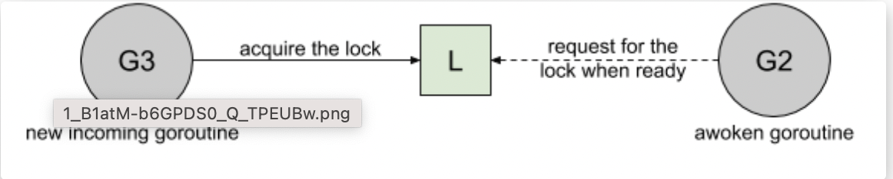

# sync 和 并发编程

## goroutine

请对你创建的 goroutine 负责：

- 不要创建一个你不知道何时退出的 goroutine
- 请不要作为一个旁观者
- 请将选择权留给对方，不要帮别人做选择
- 不要创建一个你永远不知道什么时候会退出的 goroutine
- 不要创建一个永远都无法退出的 goroutine [goroutine 泄漏]
- 确保创建出的 goroutine 的工作已经完成


### Bad Case

```go
package main

import (
	"log"
	"net/http"
	"fmt"
	_ "net/http/pprof"
)

func setup() {
	// 这里面有一些初始化的操作
}

func main() {
	setup()

	// 主服务
	server()

	// for debug
	pprof()

	select {}
}

func server() {
	go func() {
		mux := http.NewServeMux()
		mux.HandleFunc("/", func(w http.ResponseWriter, r *http.Request) {
			fmt.Fprintln(w, "Hello, QCon!")
		})

		// 主服务
		if err := http.ListenAndServe(":8080", mux); err != nil {
			log.Panicf("http server err: %+v", err)
			return
		}
	}()
}

func pprof() {
	// 辅助服务，监听了其他端口，这里是 pprof 服务，用于 debug
	go http.ListenAndServe(":8081", nil)
}

```

有如下问题：

- 如果 server(), pprof() 是在其他包里面，如果没有特殊说明，你知道这是一个异步调用么？
- main  函数当中最后在哪里空转干什么？会不会存在浪费？
- 如果线上出现事故，debug 服务已经退出，你想要 debug 这时你是否很茫然？

### Good Case

```go

func serve(addr string, handler http.Handler, stop <-chan struct{}) error {
	s := http.Server{
		Addr:    addr,
		Handler: handler,
	}

	go func() {
		<-stop // wait for stop signal
		s.Shutdown(context.Background())
	}()

	return s.ListenAndServe()
}

func serveApp(stop <-chan struct{}) error {
	mux := http.NewServeMux()
	mux.HandleFunc("/", func(resp http.ResponseWriter, req *http.Request) {
		fmt.Fprintln(resp, "Hello, QCon!")
	})
	return serve("0.0.0.0:8080", mux, stop)
}

func serveDebug(stop <-chan struct{}) error {
	return serve("127.0.0.1:8001", http.DefaultServeMux, stop)
}

func main() {
	done := make(chan error, 2)
	stop := make(chan struct{})
	go func() {
		done <- serveDebug(stop)
	}()
	go func() {
		done <- serveApp(stop)
	}()

	var stopped bool
	for i := 0; i < cap(done); i++ {
		// 只要有一个返回错误，其他服务同时退出
		if err := <-done; err != nil {
			fmt.Println("error: %v", err)
		}
		if !stopped {
			stopped = true
			// 退出所有服务
			close(stop)
		}
	}
}

```

> 小结:
> 
> - 请将是否异步调用的选择权交给调用者，不然很有可能大家并不知道你在这个函数里面使用了 goroutine
> - 如果你要启动一个 goroutine 请对它负责
> - 永远不要启动一个你无法控制它退出，或者你无法知道它何时推出的 goroutine
> - 启动 goroutine 时请加上 panic recovery 机制，避免服务直接不可用
> - 造成 goroutine 泄漏的主要原因就是 goroutine 中造成了阻塞，并且没有外部手段控制它退出

## 内存模型
同样我们先来看一段代码，请问下面的代码可能会输出什么？

```go
package main

var a, b int

func f() {
	a = 1
	b = 2
}

func g() {
	print(b)
	print(a)
}

func main() {
	go f()
	g()
}

```


比较容易想到的结果是:

-执行顺序: 1 - 2 - 3 - 4, f 先执行, g 后执行, 输出 2 1
-执行顺序: 3 - 4 - 1 - 2, g 先执行，f 后执行，输出 0 0

就这几种结果么？其实不然，还有可能
- 执行顺序: 1 - 3 - 4 - 2, f  先执行一部分, 然后 g  执行, 输出 0 1

那能不能输出 2 0 呢？
先说答案，是有可能的

> 软件(编译器)或硬件(CPU)系统可以根据其对代码的分析结果，一定程度上打乱代码的执行顺序，以达到其不可告人的目的(提高 CPU 利用率)


### 多级缓存设计

现代的处理器架构都是多级缓存的，cpu 有 L1，L2，L3 缓存，最后才是 DRAM，对于编译器生成的代码也是优先使用寄存器，其次才是主存。所以在并发场景下，必然是存在一致性问题的，一个执行体对变量的修改可能并不能立马对其他执行体可见。


### 编译优化和 cpu 乱序执行


编译器会对代码进行优化，包括代码的调整，重排等操作。cpu 执行指令也是以乱序执行指令的，这些都是为了性能的考虑。


### Go 内存模型

Go 内存模型，就是要解决两个问题

- 一个是要了解谁先谁后，有个专有名词叫 Happens Before
- 另外一个就是了解可见性的问题

> Advice:
> - Programs that modify data being simultaneously accessed by multiple goroutines must serialize such access.
> - To serialize access, protect the data with channel operations or other synchronization primitives such as those in the sync and sync/atomic packages.

程序存在多个 goroutine 去访问数据的时候，必须序列化的访问，如何保证序列化呢？我们可以采用 channel 或者是 sync 以及 sync/atomic 下面提供的同步语义来保证


## Happens Before


> Within a single goroutine, reads and writes must behave as if they executed in the order specified by the program. That is, compilers and processors may reorder the reads and writes executed within a single goroutine only when the reordering does not change the behavior within that goroutine as defined by the language specification. Because of this reordering, the execution order observed by one goroutine may differ from the order perceived by another. For example, if one goroutine executes a = 1; b = 2;, another might observe the updated value of b before the updated value of a.

这段话就解释了上面我们示例当中为什么会出现 2 0  这种情况。

这段话就是说我们在单个 goroutine 当中的编写的代码会总是按照我们编写代码的顺序来执行

- 当然这个也是符合我们的习惯的
- 当然这并不表示编译器在编译的时候不会对我们的程序进行指令重排
- 而是说只会在不影响语言规范对 goroutine 的行为定义的时候，编译器和 CPU 才会对读取和写入的顺序进行重新排序。

但是正是因为存在这种重排的情况，所以一个 goroutine 监测到的执行顺序和另外一个 goroutine 监测到的有可能不一样。就像我们最上面的这个例子一样，可能我们在 f 执行的顺序是先执行 a = 1 后执行 b = 2 但是在 g 中我们只看到了 b = 2 具体什么情况可能会导致这个呢？不要着急，我们后面还会说到

### 编译器重排

我们来看参考文章中的一个编译器重排例子

```go
X = 0
for i in range(100):
    X = 1
    print X
```

在这段代码中，X = 1 在 for 循环内部被重复赋值了 100 次，这完全没有必要，于是聪明的编译器就会帮助我们优化成下面的样子

```go
X = 1
for i in range(100):
    print X
```

happens before 定义

> To specify the requirements of reads and writes, we define happens before, a partial order on the execution of memory operations in a Go program. If event e1 happens before event e2, then we say that e2 happens after e1. Also, if e1 does not happen before e2 and does not happen after e2, then we say that e1 and e2 happen concurrently.

这是 Happens Before 的定义，如果 e1 发生在 e2 之前，那么我们就说 e2 发生在 e1 之后，如果 e1 既不在 e2 前，也不在 e2 之后，那我们就说这俩是并发的

> Within a single goroutine, the happens-before order is the order expressed by the program.
>

这就是我们前面提到的，在单个 goroutine 当中，事件发生的顺序，就是程序所表达的顺序

> happen before 本质：
> - 前面一个操作的结果对后续操作是可见的（可以理解成逻辑上的操作顺序是有先后的）。
> - happens-before 本质是一种偏序关系，所以要满足传递性。我们说 A happens-before B ，也就是说 A 的结果对于 B 是可见的，简称 A <= B，或者 hb(A, B)。

> A read r of a variable v is allowed to observe a write w to v if both of the following hold:
>
> 1. r does not happen before w.
> 2. There is no other write w' to v that happens after w but before r.

假设我们现在有一个变量 v，然后只要满足下面的两个条件，那么读取操作 r 就可以对这个变量 v 的写入操作 w 进行监测

1. 读取操作 r 发生在写入操作 w 之后
2. 并且在 w 之后，r 之前没有其他对 v 的写入操作 w'


这对条件的要求比第一个条件更强，它需要确保没有其它写入操作与 w 或 r 并发。
在单个 goroutine 当中这两个条件是等价的，因为单个 goroutine 中不存在并发，在多个 goroutine 中就必须使用同步语义来确保顺序，这样才能到保证能够监测到预期的写入

**单个 goroutine 的情况：**

我们可以发现在单个 goroutine 当中，读取操作 r 总是可以读取到上一次 w 写入的值的


**多个 goroutine 的情况:**

但是存在多个 goroutine 的时候这个就不一定了，r0 读到的是 哪一次写入的值呢？如果看图的话像是 w4 的，但其实不一定，因为图中的两个 goroutine 所表达的时间维度可能是不一致的，所以 r0 可能读到的是 w0 w3 w4 甚至是 w5 的结果，当然按照我们前面说的理论，读到的不可能是 w1 的结果的


**添加一些同步点:**

如下图所示我们通过 sync 包中的一些同步语义或者是 channel 为多个 goroutine 加入了 同步点，那么这个时候对于 r1 而言，他就是晚于 w4 并且早于 w1 和 w5 执行的，所以它读取到的是写入操作是可以确定的，是 w4


### golang happens-before 的规则

Golang 在 5 个方面提供了 happens-before  的规则承诺。

注意，后面我们说 A happens-before B，等价于 A <= B，等价于 A 先于 B，等价于 A 结果可见于 B，“先于”说的是可见性，并不是严格的物理时间顺序，注意下区别，后面不再解释。

我们展开看下 Golang 具体是提供了那几条 happens-before 规则，按照场景和类型分类，具体的规则如下：


#### 1.  Initialization

官方描述：

> If a package p imports package q, the completion of q's init functions happens before the start of any of p's.

规则解释：

import package  的时候，如果 package p 里面执行 import q ，那么逻辑顺序上 package q 的 init 函数执行先于 package p 后面执行任何其他代码。

举个例子：

```go
// package p
import "q"      // 1
import "x"      // 2
```

执行（2）的时候，package q 的 init 函数执行结果对（2）可见，换句话说，q 的 init 函数先执行，import "x"  后执行。

#### 2. Goroutine creation

官方描述：

> The go statement that starts a new goroutine happens before the goroutine's execution begins.
>

规则解释：

该规则说的是 goroutine 创建的场景，创建函数本身先于 goroutine 内的第一行代码执行。

举个例子：

```go
var a int

func main() {
 a = 1          // 1
 go func() {   // 2
  println(a)  // 3
 }()
}


```

按照这条 happens-before 规则：

1. （2）的结果可见于（3），也就是 2 <= 3；
2. （1）天然先于（2），有 1 <= 2

happens-before 属于一种偏序规则，具有传递性，所以 1<=2<=3，所以 golang 程序能保证在 println(a) 的时候，一定是执行了 a=1 的指令的。再换句话说，主 goroutine 修改了 a 的值，这个结果在 协程里 println 的时候是可见的。


#### 3. Goroutine destruction

官方描述：

> The exit of a goroutine is not guaranteed to happen before any event in the program.

规则解释：

该规则说的是 goroutine 销毁的场景，这条规则说的是，
- goroutine 的 exit 事件并不保证先于所有的程序内的其他事件，
- 或者说某个 goroutine exit 的结果并不保证对其他人可见。

举个例子：

```go
var a string

func hello() {
 go func() { a = "hello" }()
 print(a)
}
```

换句话说，协程的销毁流程本身没有做任何 happens-before 承诺。上面的实例里面的 goroutine 的退出结果不可见于下面的任何一行代码。

#### 4. Channel communiaction

官方描述：

> 1. A send on a channel happens before the corresponding receive from that channel completes.
> 2. The closing of a channel happens before a receive that returns a zero value because the channel is closed.
> 3. A receive from an unbuffered channel happens before the send on that channel completes.
> 4. The kth receive on a channel with capacity C happens before the k+Cth send from that channel completes.

规则解释：

channel 涉及到的 happens-before 规则一共有 4 条，数量最多。从这个条数我们也能看出来，Golang 里面 channel 才是保证内存可见性，有序性，代码同步的一等选择，我们一条条解析下：

##### 1.规则一解释：

> A send on a channel happens before the corresponding receive from that channel completes.
>

channel 的元素写入（send） 可见于 对应的元素读取（receive）操作完成。注意关键字：“对应的元素，指的是同一个元素”，说的是同一个元素哈。换句话说，一个元素的 send 操作先于这个元素 receive 调用完成（结果返回）。

举个例子：

```go
var c = make(chan int, 10)
var a string

func f() {
 a = "hello, world"  // A
 c <- 0                  // B
}

func main() {
 go f()              // C
 <-c                 // D
 print(a)            // E
}
```

这个例子能确保主协程打印出 “hello, world”字符串，也就是说 a="hello, world" 的赋值写可见于 print(a) 这条语句。我们由 happens-before 规则推导下：

1. C <= A ：协程 create 时候的 happens-before 规则承诺；
2. A <= B ：单协程上下文，指令顺序，天然保证；
3. B <= D ：send 0 这个操作先于 0 出队完成（ <-c ） ，这条正是本规则；
4. D <= E ：单协程上下文，指令顺序，天然保证；

所以整个逻辑可见性执行的顺序是：C <= A <= B <= D <= E ，根据传递性，即 A <= E ，所以 print(a) 的时候，必定是 a 已经赋值之后。

##### 2.规则二解释：

> The closing of a channel happens before a receive that returns a zero value because the channel is closed.
>

channel 的关闭（还未完成）行为可见于 channel receive 返回（ 返回 0， 因为 channel closed 导致 ）；

举个例子：

以下这个例子和上面的非常相似，只需要把 c<- 0 替换成 close(c) ，推到的过程也是完全一致的。

```go
var c = make(chan int, 10)
var a string

func f() {
    a = "hello, world"  // A
    close(c)            // B
}

func main() {
 go f()              // C
 <-c                 // D
 print(a)            // E
}
```

整个逻辑可见性执行的顺序是：C <= A <= B <= D <= E ，根据传递性，A <= E ，所以 print(a) 的时候，必定是 a  已经赋值之后，所以也可正确打印“hello, world”。

##### 3.规则三解释：

> A receive from an unbuffered channel happens before the send on that channel completes.
>

第三条规则是针对 no buffer 的 channel 的，no buffer 的 channel 的 receive 操作可见于 send 元素操作完成。

举个例子：

```go
var c = make(chan int)
var a string

func f() {
    a = "hello, world"      // A
    <-c                     // B
}

func main() {
    go f()                  // C
    c <- 0                  // D
    print(a)                // E
}
```

1. C <= A ：协程 create 时候的 happens-before 规则承诺；
2. A <= B ：单协程上下文，指令顺序，天然保证；
3. B <= D ：receive 操作可见于 0 入队完成（ c<-0 ），换句话说，执行 D 的时候 B 操作已经执行了 ，这条正是本规则；
4. D <= E ：单协程上下文，指令顺序，天然保证；

所以，整个可见性执行的顺序是：C <= A <= B <= D <= E ，根据传递性，A <= E ，所以 print(a) 的时候，必定是 a  已经赋值之后，所以也可正确打印“hello, world”。

注意，这条规则只适用于 no buffer 的 channel，如果上面的例子换成有 buffer 的 channel var c = make(chan int, 1) ，那么该程序将不能保证 print(a) 的时候打印 “hello，world”。

#### 4. 规则四解释：

> The kth receive on a channel with capacity C happens before the k+Cth send from that channel completes.
>

第四条规则是通用规则，说的是，如果 channel 的 ringbuffer 长度是 C ，那么第 K 个元素的 receive 操作先于 第 K+C 个元素 的 send 操作完成；

仔细思考下这条规则，当 C 等于 0 的时候，其实说的就是规则三，也就说 no buffer 的 channel 只是这条规则的一种特殊情况。

举个例子：

以上面的规则，先举一个简单形象的例子：

```go
c := make(chan int, 3)
c <- 1 
c <- 2
c <- 3
c <- 4  // A
go func (){
    <-c     // B     
}()
```

B 操作结果可见于 A（或者说，逻辑上 B 先于 A 执行），那么如果时间上，先到了 A 这一行怎么办？就会等待，等待 B 执行完成，B 返回之后，A 才会唤醒且 send 操作完成。只有这样，才保证了本条 happens-before 规则的语义不变，保证 B 先于 A 执行。Golang 在 chan 的实现里保证了这一点。

通俗的来讲，对于这种 buffer channel，一个坑只能蹲一个人，第 K+C 个元素一定要等第 K 个元素腾位置，chan 内部就是一个 ringbuffer，本身就是一个环，所以第 K+C 个元素和第 K 个元素要的是指向同一个位置，必须是 [ The kth receive ] happens-before [ the k+Cth send from that channel completes. ]

那我们再仔细思考下，这就类似一种计数的信号量控制。

- ringbuffer 当前里面的元素相当于当前的资源消耗；
- channel 的 ringbuffer 容量大小相当于最大的资源数；
- send 一个元素相当于 acquire 一个信号量；
- receive 相当于 release 一个信号量（腾出一个坑位）；
- 由于 Golang 承诺的这条 happens-before 规则，指明了第 K 个元素和第 K + C （同坑位）的同步行为；

这个跟我们用来限制并发数的场景是一样的，再看一个官方的例子：

```go

var limit = make(chan int, 3)

func main() {
	
 for _, w := range work {
  go func(w func()) {
   limit <- 1
   w()
   <-limit
  }(w)
 }
 
 select{}
}
```

这个不就是一个限制 3 并发的用法嘛。


#### 5.Lock

官方描述：

> 1. For any sync.Mutex or sync.RWMutex variable l and n < m, call n of l.Unlock() happens before call m of l.Lock() returns.
> 2. For any call to l.RLock on a sync.RWMutex variable l, there is an n such that the l.RLock happens (returns) after call n to l.Unlock and the matching l.RUnlock happens before call n+1 to l.Lock.

规则解释：

锁相关的 happens-before 规则有两条。

规则一解释：

> For any sync.Mutex or sync.RWMutex variable l and n < m, call n of l.Unlock() happens before call m of l.Lock() returns.
> 

该规则针对任意 sync.Mutex 和 sync.RWMutex 的锁变量 L，第 n 次调用 L.Unlock()  逻辑先于（结果可见于）第 m 次调用 L.Lock() 操作。

举个例子：

这个例子推导：

1. A <= B （单协程上下文指令顺序，天然保证）
2. B <= E （协程创建场景的 happens-before 承诺，见上）
3. E <= F
4. F <= C （这个就是本规则了，承诺了第 1 次的解锁可见于第二次的加锁，golang 为了守住这个承诺，所以必须让 C 行等待着 F 执行完）
5. C <= D


所以整体的逻辑顺序链条：A <= B <= E <= F <= C <= D，推导出 E <= D，所以 print(a)  的时候 a 是一定赋值了“hello, world”的，该程序允许符合预期。

这条规则规定的是加锁和解锁的一个逻辑关系，讲的是谁等谁的关系。该例子讲的就是 golang 为了遵守这个承诺，保证 C 等 F。

规则二解释：

> For any call to l.RLock on a sync.RWMutex variable l, there is an n such that the l.RLock happens (returns) after call n to l.Unlock and the matching l.RUnlock happens before call n+1 to l.Lock.
>

这个第二条规则是针对 sync.RWMutex 类型的锁变量 L，说的是 L.Unlock( ) 可见于 L.Rlock( ) ，第 n 次的 L.Runlock( ) 先于 第 n+1 次的 L.Lock() 。

我换一个角度说，两个方面：

1. L.Unlock 会唤醒其他等待的读锁（L.Rlock( ) ）请求；
2. L.RUnlock 会唤醒其他 L.Lock( ) 请求

#### 5. Once

官方描述：

> A single call of f() from once.Do(f) happens (returns) before any call of once.Do(f) returns.
>

规则解释：

该规则说的是 f( ) 函数执行先于 once.Do(f) 的返回。换句话说，f( ) 必定先执行完，once.Do(f)  函数调用才能返回。

```go
var a string
var once sync.Once

func setup() {
    a = "hello, world"  // A
}

func doprint() {
    once.Do(setup)      // B
    print(a)            // C
}

func twoprint() {
    go doprint()        // D
    go doprint()        // E
}
```

该例子保证了 setup( ) 一定先执行完 once.Do(setup) 调用才会返回，所以等到 print(a) 的时候，a 肯定是赋值了的。所以以上程序会打印两次“hello, world”。

# sync 包基本原语

Go 语言在 sync 包中提供了用于同步的一些基本原语，包括常见的 sync.Mutex、sync.RWMutex、sync.WaitGroup、sync.Once 和 sync.Cond：


机器码

> Reads and writes of values larger than a single machine word behave as multiple machine-word-sized operations in an unspecified order.
>

对大于单个机器码的值进行读取和写入，其表现如同以不确定的顺序对多个机器字大小的值进行操作。要理解这个我们首先要理解什么是机器码。

我们现在常见的还有 32 位系统和 64 位的系统，cpu 在执行一条指令的时候对于单个机器字长的的数据的写入可以保证是原子的，对于 32 位的就是 4 个字节，对于 64 位的就是 8 个字节，对于在 32 位情况下去写入一个 8 字节的数据时就需要执行两次写入操作，这两次操作之间就没有原子性，那就可能出现先写入后半部分的数据再写入前半部分，或者是写入了一半数据然后写入失败的情况。
也就是说虽然有时候我们看着仅仅只做了一次写入但是还是会有并发问题，因为它本身不是原子的


# sync.Mutex & RWMutex

我们来看一下在 Go 中锁是怎么实现的：

## 锁的实现模式

- Barging: 这种模式是为了提高吞吐量，当锁被释放时，它会唤醒第一个等待者，然后把锁给第一个等待者或者给第一个请求锁的人
  
- Handoff: 当锁释放时候，锁会一直持有直到第一个等待者准备好获取锁。它降低了吞吐量，因为锁被持有，即使另一个 goroutine 准备获取它。这种模式可以解决公平性的问题，因为在 Barging 模式下可能会存在被唤醒的 goroutine 永远也获取不到锁的情况，毕竟一直在 cpu 上跑着的 goroutine 没有上下文切换会更快一些。缺点就是性能会相对差一些
  
- Spining：自旋在等待队列为空或者应用程序重度使用锁时效果不错。Parking 和 Unparking goroutines 有不低的性能成本开销，相比自旋来说要慢得多。_但是自旋是有成本的，所以在 go 的实现中进入自旋的条件十分的苛刻。_
  

## Mutex 实现原理

Mutex 可以看做是锁，而 RWMutex 则是读写锁。 一般的用法是将 Mutex 或者 RWMutex 和需要被保 住的资源封装在一个结构体内。

- 如果有多个 goroutine 同时读写的资源，就一定要保护起来。 
- 如果多个 goroutine 只读某个资源，那就不需要保护。


使用锁的时候，优先使用 RWMutex。

- RWMutex：核心就是四个方法，RLock、 RUnlock、Lock、Unlock

- Mutex：Lock 和 Unlock

## 代码实例

实现一个线程安全SafeArrayList

```go

type ArrayList[T any] struct {
	vals []T
}

func (a *ArrayList[T]) Get(index int) T {
	return a.vals[index]
}

func (a *ArrayList[T]) Set(index int, t T) {
	if index >= len(a.vals) || index < 0 {
		panic("index out of range")
	}
	a.vals[index] = t
}

func (a *ArrayList[T]) DeleteAt(index int) T {
	if index >= len(a.vals) || index < 0 {
		panic("index out of range")
	}
	res := a.vals[index]
	a.vals = append(a.vals[:index], a.vals[index+1:]...)
	return res
}

func (a *ArrayList[T]) Append(t T) {
	a.vals = append(a.vals, t)
}

func (a *ArrayList[T]) Len() int {
	return len(a.vals)
}

func (a *ArrayList[T]) Cap() int {
	return cap(a.vals)
}

func NewArrayList[T any](initCap int) *ArrayList[T] {
	return &ArrayList[T]{
		vals: make([]T, 0, initCap),
	}
}

type SafeWapperArrayList[T any] struct {
	l     List[T]
	mutex sync.Mutex
}

func (s *SafeWapperArrayList[T]) Get(index int) T {
	s.mutex.Lock()
	defer s.mutex.Unlock()
	return s.l.Get(index)
}

func (s *SafeWapperArrayList[T]) Set(index int, t T) {
	s.mutex.Lock()
	defer s.mutex.Unlock()
	s.l.Set(index, t)
}

func (s *SafeWapperArrayList[T]) DeleteAt(index int) T {
	s.mutex.Lock()
	defer s.mutex.Unlock()
	return s.l.DeleteAt(index)
}

func (s *SafeWapperArrayList[T]) Append(t T) {
	s.mutex.Lock()
	defer s.mutex.Unlock()
	s.l.Append(t)
}

func (s *SafeWapperArrayList[T]) Len() int {
	s.mutex.Lock()
	defer s.mutex.Unlock()
	return s.l.Len()
}

func (s *SafeWapperArrayList[T]) Cap() int {
	s.mutex.Lock()
	defer s.mutex.Unlock()
	return s.l.Cap()
}

func NewSafeWapperArrayList[T any](initCap int) *SafeWapperArrayList[T] {
	return &SafeWapperArrayList[T]{
		l: NewArrayList[T](initCap),
	}
}
```

## 锁一般实现过程

1. 快路径获取：spinning (自旋) 获取， 同时通过控制自旋次数 或者 自旋的时间
2. 慢路径获取：放入等待队列


## mutex 实现过程

核心关键点： 

- state 就是用来控制锁状态的核心，所谓加锁，就是 把 state 修改为某个值，解锁也是类似 
- sema 是用来处理沉睡、唤醒的信号量，依赖于两 个 runtime 调用： 
  - runtime_SemacquireMutex：sema 加 1 并且挂 起 goroutine 
  - runtime_Semrelease：sema 减 1 并且唤醒 sema 上等待的一个 goroutine
- 有两种模式： 正常模式和饥饿模式

结构体: 

```go
type Mutex struct {
	state int32
	sema  uint32
}
```

sync.Mutex 由两个字段 state 和 sema 组成。
- state 表示当前互斥锁的状态
- sema 是用于控制锁状态的信号量


### 状态 

互斥锁的状态比较复杂，如下图所示，最低三位分别表示 mutexLocked、mutexWoken 和 mutexStarving，剩下的位置用来表示当前有多少个 Goroutine 在等待互斥锁的释放：


在默认情况下，互斥锁的所有状态位都是 0，int32 中的不同位分别表示了不同的状态：

- mutexLocked — 表示互斥锁的锁定状态；
- mutexWoken — 表示从正常模式被从唤醒；
- mutexStarving — 当前的互斥锁进入饥饿状态；
- waitersCount — 当前互斥锁上等待的 Goroutine 个数；

### 正常模式和饥饿模式

**正常模式**

锁的等待者会按照先进先出的顺序获取锁。刚被唤起的 Goroutine 与新创建的 Goroutine 竞争

**饥饿模式:** 

- 刚被唤起的 Goroutine 与新创建的 Goroutine 竞争, 大概率会获取不到锁，为了减少这种情况的出现，一旦 Goroutine 超过 1ms 没有获取到锁，它就会将当前互斥锁切换饥饿模式，防止部分 Goroutine 被『饿死』
- 在饥饿模式中，互斥锁会直接交给等待队列最前面的 Goroutine。新的 Goroutine 在该状态下不能获取锁、也不会进入自旋状态，它们只会在队列的末尾等待。
- 如果一个 Goroutine 获得了互斥锁并且它在队列的末尾或者它等待的时间少于 1ms，那么当前的互斥锁就会切换回正常模式。

### 加锁

```go
func (m *Mutex) Lock() {
	// Fast path: grab unlocked mutex.
	if atomic.CompareAndSwapInt32(&m.state, 0, mutexLocked) {
		if race.Enabled {
			race.Acquire(unsafe.Pointer(m))
		}
		return
	}
	// Slow path (outlined so that the fast path can be inlined)
	m.lockSlow()
}
```

- 调用 Lock 方法的时候，会先尝试走 Fast Path，也就是如果当前互斥锁如果处于未加锁的状态，尝试加锁，只要加锁成功就直接返回
- 否则的话就进入 slow path

```go
func (m *Mutex) lockSlow() {
	var waitStartTime int64
	starving := false
	awoke := false
	iter := 0
	old := m.state
	for {
		// Don't spin in starvation mode, ownership is handed off to waiters
		// so we won't be able to acquire the mutex anyway.
		if old&(mutexLocked|mutexStarving) == mutexLocked && runtime_canSpin(iter) {
			// Active spinning makes sense.
			// Try to set mutexWoken flag to inform Unlock
			// to not wake other blocked goroutines.
			if !awoke && old&mutexWoken == 0 && old>>mutexWaiterShift != 0 &&
				atomic.CompareAndSwapInt32(&m.state, old, old|mutexWoken) {
				awoke = true
			}
			runtime_doSpin()
			iter++
			old = m.state
			continue
		}
```

在 lockSlow  方法中我们可以看到，有一个大的 for 循环，不断的尝试去获取互斥锁，在循环的内部，第一步就是判断能否自旋状态。

进入自旋状态的判断比较苛刻，具体需要满足什么条件呢？ runtime_canSpin

- 当前互斥锁的状态是非饥饿状态，并且已经被锁定了
- 自旋次数不超过 4 次
- cpu 个数大于一，必须要是多核 cpu
- 当前正在执行当中，并且队列空闲的 p 的个数大于等于一

```go
        new := old
		// Don't try to acquire starving mutex, new arriving goroutines must queue.
		if old&mutexStarving == 0 {
			new |= mutexLocked
		}
		if old&(mutexLocked|mutexStarving) != 0 {
			new += 1 << mutexWaiterShift
		}
		// The current goroutine switches mutex to starvation mode.
		// But if the mutex is currently unlocked, don't do the switch.
		// Unlock expects that starving mutex has waiters, which will not
		// be true in this case.
		if starving && old&mutexLocked != 0 {
			new |= mutexStarving
		}
		if awoke {
			// The goroutine has been woken from sleep,
			// so we need to reset the flag in either case.
			if new&mutexWoken == 0 {
				throw("sync: inconsistent mutex state")
			}
			new &^= mutexWoken
		}
```

处理了自旋相关的特殊逻辑之后，互斥锁会根据上下文计算当前互斥锁最新的状态。几个不同的条件分别会更新 state 字段中存储的不同信息 — mutexLocked、mutexStarving、mutexWoken 和 mutexWaiterShift：

```go
if atomic.CompareAndSwapInt32(&m.state, old, new) {
			if old&(mutexLocked|mutexStarving) == 0 {
				break // locked the mutex with CAS
			}
			// If we were already waiting before, queue at the front of the queue.
			queueLifo := waitStartTime != 0
			if waitStartTime == 0 {
				waitStartTime = runtime_nanotime()
			}
			runtime_SemacquireMutex(&m.sema, queueLifo, 1)
			starving = starving || runtime_nanotime()-waitStartTime > starvationThresholdNs
			old = m.state
			if old&mutexStarving != 0 {
				// If this goroutine was woken and mutex is in starvation mode,
				// ownership was handed off to us but mutex is in somewhat
				// inconsistent state: mutexLocked is not set and we are still
				// accounted as waiter. Fix that.
				if old&(mutexLocked|mutexWoken) != 0 || old>>mutexWaiterShift == 0 {
					throw("sync: inconsistent mutex state")
				}
				delta := int32(mutexLocked - 1<<mutexWaiterShift)
				if !starving || old>>mutexWaiterShift == 1 {
					// Exit starvation mode.
					// Critical to do it here and consider wait time.
					// Starvation mode is so inefficient, that two goroutines
					// can go lock-step infinitely once they switch mutex
					// to starvation mode.
					delta -= mutexStarving
				}
				atomic.AddInt32(&m.state, delta)
				break
			}
			awoke = true
			iter = 0
		} else {
			old = m.state
		}
```

如果没有通过 CAS 获得锁，会调用 runtime.sync_runtime_SemacquireMutex 通过信号量保证资源不会被两个 Goroutine 获取。
runtime.sync_runtime_SemacquireMutex 会在方法中不断尝试获取锁并陷入休眠等待信号量的释放，一旦当前 Goroutine 可以获取信号量，它就会立刻返回，sync.Mutex.Lock 的剩余代码也会继续执行。

- 在正常模式下，这段代码会设置唤醒和饥饿标记、重置迭代次数并重新执行获取锁的循环；
- 在饥饿模式下，当前 Goroutine 会获得互斥锁，如果等待队列中只存在当前 Goroutine，互斥锁还会从饥饿模式中退出；




### 解锁

和加锁比解锁就很简单了，直接看注释就好

```go
// 解锁一个没有锁定的互斥量会报运行时错误
// 解锁没有绑定关系，可以一个 goroutine 锁定，另外一个 goroutine 解锁
func (m *Mutex) Unlock() {
	// Fast path: 直接尝试设置 state 的值，进行解锁
	new := atomic.AddInt32(&m.state, -mutexLocked)
    // 如果减去了 mutexLocked 的值之后不为零就会进入慢速通道，这说明有可能失败了，或者是还有其他的 goroutine 等着
	if new != 0 {
		// Outlined slow path to allow inlining the fast path.
		// To hide unlockSlow during tracing we skip one extra frame when tracing GoUnblock.
		m.unlockSlow(new)
	}
}

func (m *Mutex) unlockSlow(new int32) {
    // 解锁一个没有锁定的互斥量会报运行时错误
	if (new+mutexLocked)&mutexLocked == 0 {
		throw("sync: unlock of unlocked mutex")
	}
    // 判断是否处于饥饿模式
	if new&mutexStarving == 0 {
        // 正常模式
		old := new
		for {
			// 如果当前没有等待者.或者 goroutine 已经被唤醒或者是处于锁定状态了，就直接返回
			if old>>mutexWaiterShift == 0 || old&(mutexLocked|mutexWoken|mutexStarving) != 0 {
				return
			}
			// 唤醒等待者并且移交锁的控制权
			new = (old - 1<<mutexWaiterShift) | mutexWoken
			if atomic.CompareAndSwapInt32(&m.state, old, new) {
				runtime_Semrelease(&m.sema, false, 1)
				return
			}
			old = m.state
		}
	} else {
		// 饥饿模式，走 handoff 流程，直接将锁交给下一个等待的 goroutine，注意这个时候不会从饥饿模式中退出
		runtime_Semrelease(&m.sema, true, 1)
	}
}
```

互斥锁的解锁过程 sync.Mutex.Unlock 与加锁过程相比就很简单，该过程会先使用 sync/atomic.AddInt32 函数快速解锁，这时会发生下面的两种情况：

- 如果该函数返回的新状态等于 0，当前 Goroutine 就成功解锁了互斥锁；
- 如果该函数返回的新状态不等于 0，这段代码会调用 sync.Mutex.unlockSlow 开始慢速解锁：

慢速解锁: 
- 在正常模式下，上述代码会使用如下所示的处理过程：
  - 如果互斥锁不存在等待者或者互斥锁的 mutexLocked、mutexStarving、mutexWoken 状态不都为 0，那么当前方法可以直接返回，不需要唤醒其他等待者；
  - 如果互斥锁存在等待者，会通过 sync.runtime_Semrelease 唤醒等待者并移交锁的所有权；
- 在饥饿模式下，上述代码会直接调用 sync.runtime_Semrelease 将当前锁交给下一个正在尝试获取锁的等待者，等待者被唤醒后会得到锁，在这时互斥锁还不会退出饥饿状态


## RWMutex

读写锁相对于互斥锁来说粒度更细，使用读写锁可以并发读，但是不能并发读写，或者并发写写

### 代码

实现一个线程安全Map
```go

import "sync"

type SafeMap[K comparable, V any] struct {
	m     map[K]V
	mutex sync.RWMutex
}

// LoadOrStore 读写锁要 double check
// goroutine1 设置： key1 => 1
// goroutine2 设置： key1 => 2
func (s *SafeMap[K, V]) LoadOrStore(key K, newValue V) (val V, loaded bool) {
	// 先获取读锁， goroutine1 和  goroutine2 都获得读锁进入
	s.mutex.RLock()
	val, ok := s.m[key]
	s.mutex.RUnlock()
	if ok {
		return val, true
	}

	// 假如 goroutine1 获得写锁，
	// goroutine2 等待 goroutine1 释放锁
	s.mutex.Lock()
	defer s.mutex.Unlock()
	// 加锁 和 double check
	// goroutine1 修改 key1 => 1 后， 释放锁
	// goroutine2 进入后， 如果不 double check, 会把 key1 => 2, 而不是 goroutine1 设置 key1 == 1 的值
	// 到写锁 要 double check一下
	val, ok = s.m[key]
	if ok {
		return val, true
	}
	s.m[key] = newValue
	return newValue, false
}

func (s *SafeMap[K, V]) LockDoSomething() {
	s.mutex.Lock()
	// 检查
	// Do something
	s.mutex.Unlock()
}

func (s *SafeMap[K, V]) RWLockDoSomething() {
	s.mutex.RLock()
	// 第一次检查
	// Do something
	s.mutex.RUnlock()

	s.mutex.Lock()
	// 第二次检查 , Double Check
	// Do something
	defer s.mutex.Unlock()
}
```

### 核心内容:

- 适合于读多写少的场景 
- 写多读少不如直接加写锁 
- 可以考虑使用函数式写法，如延迟初始化 
- Mutex 和 RWMutex 都是不可重入的 
- 尽可能用 defer 来解锁，避免 panic
- Double Check


### 结构体:

sync.RWMutex 中总共包含以下 5 个字段：

```go
type RWMutex struct {
	w           Mutex
	writerSem   uint32
	readerSem   uint32
	readerCount int32
	readerWait  int32
}
```

- w — 复用互斥锁提供的能力；
- writerSem 和 readerSem — 分别用于写等待读和读等待写：
- readerCount 存储了当前正在执行的读操作数量；
- readerWait 表示当写操作被阻塞时等待的读操作个数；

### 写锁：

当资源的使用者想要获取写锁时，需要调用 sync.RWMutex.Lock 方法：

```go
func (rw *RWMutex) Lock() {
	rw.w.Lock()
	r := atomic.AddInt32(&rw.readerCount, -rwmutexMaxReaders) + rwmutexMaxReaders
	if r != 0 && atomic.AddInt32(&rw.readerWait, r) != 0 {
		runtime_SemacquireMutex(&rw.writerSem, false, 0)
	}
}
```

调用结构体持有的 sync.Mutex 结构体的 sync.Mutex.Lock 阻塞后续的写操作；
- 因为互斥锁已经被获取，其他 Goroutine 在获取写锁时会进入自旋或者休眠；
- 调用 sync/atomic.AddInt32 函数阻塞后续的读操作：
- 如果仍然有其他 Goroutine 持有互斥锁的读锁，该 Goroutine 会调用 runtime.sync_runtime_SemacquireMutex 进入休眠状态等待所有读锁所有者执行结束后释放 writerSem 信号量将当前协程唤醒；

写锁的释放会调用 sync.RWMutex.Unlock：

```go
func (rw *RWMutex) Unlock() {
	r := atomic.AddInt32(&rw.readerCount, rwmutexMaxReaders)
	if r >= rwmutexMaxReaders {
		throw("sync: Unlock of unlocked RWMutex")
	}
	for i := 0; i < int(r); i++ {
		runtime_Semrelease(&rw.readerSem, false, 0)
	}
	rw.w.Unlock()
}

```

与加锁的过程正好相反，写锁的释放分以下几个执行：

- 调用 sync/atomic.AddInt32 函数将 readerCount 变回正数，释放读锁；
- 通过 for 循环循环唤醒释放所有因为获取读锁而陷入等待的 Goroutine：
- 调用 sync.Mutex.Unlock 释放写锁；

获取写锁时会先阻塞写锁的获取，后阻塞读锁的获取，这种策略能够保证读操作不会被连续的写操作『饿死』。

### 读锁：

读锁的加锁方法 sync.RWMutex.RLock 很简单，该方法会通过 sync/atomic.AddInt32 将 readerCount 加一：

```go
func (rw *RWMutex) RLock() {
	if atomic.AddInt32(&rw.readerCount, 1) < 0 {
		runtime_SemacquireMutex(&rw.readerSem, false, 0)
	}
}
```

- 如果该方法返回负数 — 其他 Goroutine 获得了写锁，当前 Goroutine 就会调用 runtime.sync_runtime_SemacquireMutex 陷入休眠等待锁的释放；
- 如果该方法的结果为非负数 — 没有 Goroutine 获得写锁，当前方法会成功返回

当 Goroutine 想要释放读锁时，会调用如下所示的 sync.RWMutex.RUnlock 方法：

```go
func (rw *RWMutex) RUnlock() {
	if r := atomic.AddInt32(&rw.readerCount, -1); r < 0 {
		rw.rUnlockSlow(r)
	}
}
```
该方法会先减少正在读资源的 readerCount 整数，根据 sync/atomic.AddInt32 的返回值不同会分别进行处理：

- 如果返回值大于等于零 — 读锁直接解锁成功；
- 如果返回值小于零 — 有一个正在执行的写操作，在这时会调用sync.RWMutex.rUnlockSlow 方法；

```go
func (rw *RWMutex) rUnlockSlow(r int32) {
	if r+1 == 0 || r+1 == -rwmutexMaxReaders {
		throw("sync: RUnlock of unlocked RWMutex")
	}
	if atomic.AddInt32(&rw.readerWait, -1) == 0 {
		runtime_Semrelease(&rw.writerSem, false, 1)
	}
}
```
sync.RWMutex.rUnlockSlow 会减少获取锁的写操作等待的读操作数 readerWait 并在所有读操作都被释放之后触发写操作的信号量 writerSem，该信号量被触发时，调度器就会唤醒尝试获取写锁的 Goroutine。

> 小结 #
> 虽然读写互斥锁 sync.RWMutex 提供的功能比较复杂，但是因为它建立在 sync.Mutex 上，所以实现会简单很多。我们总结一下读锁和写锁的关系：

> - 调用 sync.RWMutex.Lock 尝试获取写锁时；
>  - 每次 sync.RWMutex.RUnlock 都会将 readerCount 其减一，当它归零时该 Goroutine 会获得写锁；
  - 将 readerCount 减少 rwmutexMaxReaders 个数以阻塞后续的读操作；
- 调用 sync.RWMutex.Unlock 释放写锁时，会先通知所有的读操作，然后才会释放持有的互斥锁；

读写互斥锁在互斥锁之上提供了额外的更细粒度的控制，能够在读操作远远多于写操作时提升性能。


# sync.Cond

Go 语言标准库中还包含条件变量 sync.Cond，它可以让一组的 Goroutine 都在满足特定条件时被唤醒。每一个 sync.Cond 结构体在初始化时都需要传入一个互斥锁，可以通过下面的例子了解它的使用方法：

## 代码

实现一个线程安全队列

```go

import (
	"sync"
)

type Queue[T any] struct {
	queue []T
	cond  *sync.Cond
}

func (q *Queue[T]) Enqueue(item T) {
	q.cond.L.Lock()
	defer q.cond.L.Unlock()
	q.queue = append(q.queue, item)
	q.cond.Broadcast()
}

func (q *Queue[T]) Dequeue() T {
	q.cond.L.Lock()
	defer q.cond.L.Unlock()
	if len(q.queue) == 0 {
		q.cond.Wait()
	}
	item := q.queue[len(q.queue)-1]
	q.queue = q.queue[:len(q.queue)-1]
	return item
}

func NewQueue[T any](initCap int) *Queue[T] {
	queue := &Queue[T]{
		queue: make([]T, 0, initCap),
		cond:  sync.NewCond(&sync.Mutex{}),
	}
	return queue
}

```


## 结构体 

sync.Cond 的结构体中包含以下 4 个字段：

```go
type Cond struct {
	noCopy  noCopy
	L       Locker
	notify  notifyList
	checker copyChecker
}
```

- noCopy — 用于保证结构体不会在编译期间拷贝；
- copyChecker — 用于禁止运行期间发生的拷贝；
- L — 用于保护内部的 notify 字段，Locker 接口类型的变量；
- notify — 一个 Goroutine 的链表，它是实现同步机制的核心结构；

```go
type notifyList struct {
	wait uint32
	notify uint32

	lock mutex
	head *sudog
	tail *sudog
}
```

在 sync.notifyList 结构体中，head 和 tail 分别指向的链表的头和尾，wait 和 notify 分别表示当前正在等待的和已经通知到的 Goroutine 的索引。

## sync.Cond.Wait 接口 

sync.Cond 对外暴露的 sync.Cond.Wait 方法会将当前 Goroutine 陷入休眠状态，它的执行过程分成以下两个步骤：

- 调用 runtime.notifyListAdd 将等待计数器加一 同时 释放锁；
- 调用 runtime.notifyListWait 等待其他 Goroutine 的唤醒，同时加锁：

```go
func (c *Cond) Wait() {
	c.checker.check()
	t := runtime_notifyListAdd(&c.notify) // runtime.notifyListAdd 的链接名
	// 释放锁
	c.L.Unlock()
	// 把自己加入到等待队列中，等待其他 goroutine 唤醒
	runtime_notifyListWait(&c.notify, t) // runtime.notifyListWait 的链接名
	// 唤醒后再加锁 
	c.L.Lock()
}

func notifyListAdd(l *notifyList) uint32 {
	return atomic.Xadd(&l.wait, 1) - 1
}
```
runtime.notifyListWait 会获取当前 Goroutine 并将它追加到 Goroutine 通知链表的最末端：

```go
func notifyListWait(l *notifyList, t uint32) {
	s := acquireSudog()
	s.g = getg()
	s.ticket = t
	if l.tail == nil {
		l.head = s
	} else {
		l.tail.next = s
	}
	l.tail = s
	goparkunlock(&l.lock, waitReasonSyncCondWait, traceEvGoBlockCond, 3)
	releaseSudog(s)
}
```


sync.Cond.Signal 和 sync.Cond.Broadcast 就是用来唤醒陷入休眠的 Goroutine 的方法，它们的实现有一些细微的差别：

- sync.Cond.Signal 方法会唤醒队列最前面的 Goroutine；
- sync.Cond.Broadcast 方法会唤醒队列中全部的 Goroutine；

```go
func (c *Cond) Signal() {
	c.checker.check()
	runtime_notifyListNotifyOne(&c.notify)
}

func (c *Cond) Broadcast() {
	c.checker.check()
	runtime_notifyListNotifyAll(&c.notify)
}
```

runtime.notifyListNotifyOne 只会从 sync.notifyList 链表中找到满足 sudog.ticket == l.notify 条件的 Goroutine 并通过 runtime.readyWithTime 唤醒：

```go
func notifyListNotifyOne(l *notifyList) {
	t := l.notify
	atomic.Store(&l.notify, t+1)

	for p, s := (*sudog)(nil), l.head; s != nil; p, s = s, s.next {
		if s.ticket == t {
			n := s.next
			if p != nil {
				p.next = n
			} else {
				l.head = n
			}
			if n == nil {
				l.tail = p
			}
			s.next = nil
			readyWithTime(s, 4)
			return
		}
	}
}
```

runtime.notifyListNotifyAll 会依次通过 runtime.readyWithTime 唤醒链表中 Goroutine：

```go
func notifyListNotifyAll(l *notifyList) {
	s := l.head
	l.head = nil
	l.tail = nil

	atomic.Store(&l.notify, atomic.Load(&l.wait))

	for s != nil {
		next := s.next
		s.next = nil
		readyWithTime(s, 4)
		s = next
	}
}
```

Goroutine 的唤醒顺序也是按照加入队列的先后顺序，先加入的会先被唤醒，而后加入的可能 Goroutine 需要等待调度器的调度。

在一般情况下，我们都会先调用 sync.Cond.Wait 陷入休眠等待满足期望条件，当满足唤醒条件时，就可以选择使用 sync.Cond.Signal 或者 sync.Cond.Broadcast 唤醒一个或者全部的 Goroutine。

> 小结 #
> - sync.Cond 不是一个常用的同步机制，但是在条件长时间无法满足时，与使用 for {} 进行忙碌等待相比，sync.Cond 能够让出处理器的使用权，提高 CPU 的利用率。使用时我们也需要注意以下问题：
> - sync.Cond.Wait 在调用之前一定要使用获取互斥锁，否则会触发程序崩溃；
> - sync.Cond.Signal 唤醒的 Goroutine 都是队列最前面、等待最久的 Goroutine；
> - sync.Cond.Broadcast 会按照一定顺序广播通知等待的全部 Goroutine；

# sync.Once

sync.Once 一般就是用来确保某个动作至多执行一次。

普遍用于初始化资源，单例模式。

```go

import (
	"fmt"
	"sync"
)

type Biz struct {
	onceClose sync.Once
}

func (b *Biz) Close() error {
	b.onceClose.Do(func() {
		fmt.Printf("close")
	})
	return nil
}

func init() {
	// 这里也是只执行一次
}

var singletone *Singleton
var instanceOnce sync.Once

type Singleton struct {
}

func NewInstance() *Singleton {
	instanceOnce.Do(func() {
		singletone = &Singleton{}
	})
	return singletone
}
```

## sync.Once 源码

sync.Once 源码比较简单

```go
type Once struct {
	done uint32
	m    Mutex
}

// Do calls the function f if and only if Do is being called for the
// first time for this instance of Once. In other words, given
//
//	var once Once
//
// if once.Do(f) is called multiple times, only the first call will invoke f,
// even if f has a different value in each invocation. A new instance of
// Once is required for each function to execute.
//
// Do is intended for initialization that must be run exactly once. Since f
// is niladic, it may be necessary to use a function literal to capture the
// arguments to a function to be invoked by Do:
//
//	config.once.Do(func() { config.init(filename) })
//
// Because no call to Do returns until the one call to f returns, if f causes
// Do to be called, it will deadlock.
//
// If f panics, Do considers it to have returned; future calls of Do return
// without calling f.
func (o *Once) Do(f func()) {
	// Note: Here is an incorrect implementation of Do:
	//
	//	if atomic.CompareAndSwapUint32(&o.done, 0, 1) {
	//		f()
	//	}
	//
	// Do guarantees that when it returns, f has finished.
	// This implementation would not implement that guarantee:
	// given two simultaneous calls, the winner of the cas would
	// call f, and the second would return immediately, without
	// waiting for the first's call to f to complete.
	// This is why the slow path falls back to a mutex, and why
	// the atomic.StoreUint32 must be delayed until after f returns.

	if atomic.LoadUint32(&o.done) == 0 {
		// Outlined slow-path to allow inlining of the fast-path.
		o.doSlow(f)
	}
}

func (o *Once) doSlow(f func()) {
	o.m.Lock()
	defer o.m.Unlock()
	// Double check
	if o.done == 0 {
		defer atomic.StoreUint32(&o.done, 1)
		f()
	}
}

```

看 go 的源码真的可以学到很多东西，在这里还给出了很容易犯错的一种实现

```go
if atomic.CompareAndSwapUint32(&o.done, 0, 1) {
    f()
}
```

如果这么实现最大的问题是，如果并发调用，一个 goroutine 执行，另外一个不会等正在执行的这个成功之后返回，而是直接就返回了，这就不能保证传入的方法一定会先执行一次了
所以回头看官方的实现

```go
if atomic.LoadUint32(&o.done) == 0 {
    // Outlined slow-path to allow inlining of the fast-path.
    o.doSlow(f)
}
```

> 小结： 
> - Once 保证了传入的函数只会执行一次，这常用在单例模式，配置文件加载，初始化这些场景下
但是需要注意。Once 是不能复用的，只要执行过了，再传入其他的方法也不会再执行了
> - 并且 Once.Do 在执行的过程中如果 f 出现 panic，后面也不会再执行了
> - 这是一种 double-check 的变种。 没有直接利用读写锁，而是利用原子操作来扮演读锁的角色。 值得学习的做法。


# sync.atomic

Mutex由操作系统实现，而atomic包中的原子操作则由底层硬件直接提供支持。在 CPU 实现的指令集里，有一些指令被封装进了atomic包，这些指令在执行的过程中是不允许中断（interrupt）的，因此原子操作可以在lock-free的情况下保证并发安全，并且它的性能也能做到随 CPU 个数的增多而线性扩展。

> 原子性:
> 
> 一个或者多个操作在 CPU 执行的过程中不被中断的特性，称为原子性（atomicity） 。
> 这些操作对外表现成一个不可分割的整体，他们要么都执行，要么都不执行，外界不会看到他们只执行到一半的状态。
> 而在现实世界中，CPU 不可能不中断的执行一系列操作，但如果我们在执行多个操作时，能让他们的中间状态对外不可见，那我们就可以宣称他们拥有了"不可分割”的原子性。


对于并发操作，原子操作 (不可异常/中断的一系列操作) 是一个绕不开的话题，典型的就是 i++ 问题，并发场景下，有多个 CPU 并发执行 i++，原本只想执行一次，实际上变成执行多次，这就涉及到我们今天要聊的 sync/atomic 了。常见的原子操作有


- Test-and-Set-Lock，TSL，对某个存储器位置写值并返回旧值

- Fetch-and-Add，FAA，对某个存储器位置加值并返回新值

- Compare-and-Swap，CAS，判断某个存储器位置的值是否与指定值相等，如果相等则替换为新的值

- Load-Linked/Store-Conditional，LL/SC，Load-Linked 返回某个存储器位置原值，Store-Conditional 写入新值 (如果 Load-Linked 后没有被修改)


原子操作是如何实现的:

CPU 原子操作的硬件实现是通过 LOCK 指令对 Cache Line 进行加锁，阻塞其它 CPU 对该 Cache Line 的内存访问，通过缓存一致性机制来加锁，缓存一致性机制的实现方式有很多种，其中的一种，MESI 缓存协议。

### 实现的原子操作

```go
// TSL
// 
// old = *addr
// *addr = new
// return old
func SwapInt32(addr *int32, new int32) (old int32)
func SwapInt64(addr *int64, new int64) (old int64)
func SwapUint32(addr *uint32, new uint32) (old uint32)
func SwapUint64(addr *uint64, new uint64) (old uint64)
func SwapUintptr(addr *uintptr, new uintptr) (old uintptr)
func SwapPointer(addr *unsafe.Pointer, new unsafe.Pointer) (old unsafe.Pointer)

// FAA
// 
// *addr += delta
// return *addr
func AddInt32(addr *int32, delta int32) (new int32)
func AddUint32(addr *uint32, delta uint32) (new uint32)
func AddInt64(addr *int64, delta int64) (new int64)
func AddUint64(addr *uint64, delta uint64) (new uint64)
func AddUintptr(addr *uintptr, delta uintptr) (new uintptr)

// CAS
// 
// if *addr == old {
//     *addr = new
//     return true
// }
// return false
func CompareAndSwapInt32(addr *int32, old, new int32) (swapped bool)
func CompareAndSwapInt64(addr *int64, old, new int64) (swapped bool)
func CompareAndSwapUint32(addr *uint32, old, new uint32) (swapped bool)
func CompareAndSwapUint64(addr *uint64, old, new uint64) (swapped bool)
func CompareAndSwapUintptr(addr *uintptr, old, new uintptr) (swapped bool)
func CompareAndSwapPointer(addr *unsafe.Pointer, old, new unsafe.Pointer) (swapped bool)

// Read
func LoadInt32(addr *int32) (val int32)
func LoadInt64(addr *int64) (val int64)
func LoadUint32(addr *uint32) (val uint32)
func LoadUint64(addr *uint64) (val uint64)
func LoadUintptr(addr *uintptr) (val uintptr)
func LoadPointer(addr *unsafe.Pointer) (val unsafe.Pointer)

// Write
func StoreInt32(addr *int32, val int32)
func StoreInt64(addr *int64, val int64)
func StoreUint32(addr *uint32, val uint32)
func StoreUint64(addr *uint64, val uint64)
func StoreUintptr(addr *uintptr, val uintptr)
func StorePointer(addr *unsafe.Pointer, val unsafe.Pointer)

// 任意类型 Read / Write
type Value
func (v *Value) Load() (x interface{})
func (v *Value) Store(x interface{})

```

### CAS 与 ABA 问题

CAS，Compare-and-Swap，一般我们会用它是实现乐观锁，自旋锁，伪代码如下

```go
while(!swapped) {
    swapped = CAS(V, E, N)
    sleep(1)
}
```

所谓自旋锁，Spin Lock，就是循环等待，直到获取到锁。不过乐观锁其实也会带来如下问题

- 自旋开销大
- ABA 问题


面对这种多线程下变量的读写问题，我们的主角——atomic.Value登场了，它使得我们可以不依赖于不保证兼容性的unsafe.Pointer类型，同时又能将任意数据类型的读写操作封装成原子性操作（让中间状态对外不可见）。

atomic.Value类型对外暴露的方法就两个：

- v.Store(c) - 写操作，将原始的变量c存放到一个atomic.Value类型的v里。
- c = v.Load() - 读操作，从线程安全的v中读取上一步存放的内容。


简洁的接口使得它的使用也很简单，只需将需要作并发保护的变量读取和赋值操作用Load()和Store()代替就行了。


```go
package main

import (
	"fmt"
	"math/rand"
	"sync/atomic"
	"time"
)

func loadConfig() map[string]string {
	// 从数据库或者文件系统中读取配置信息，然后以map的形式存放在内存里

	config := make(map[string]string)
	config["rand"] = fmt.Sprintf("%d", rand.Intn(100))
	fmt.Printf("load config: %+v\n", config)
	return config
}

func main() {
	// config变量用来存放该服务的配置信息
	var config atomic.Value
	// 初始化时从别的地方加载配置文件，并存到config变量里
	config.Store(loadConfig())
	time.Sleep(2 * time.Second)

	go func() {
		// 每10秒钟定时的拉取最新的配置信息，并且更新到config变量里
		for {
			// 对应于赋值操作 config = loadConfig()
			config.Store(loadConfig())
			time.Sleep(1 * time.Second)
		}
	}()

	ch := make(chan int)
	// 创建工作线程，每个工作线程都会根据它所读取到的最新的配置信息来处理请求
	for i := 0; i < 2; i++ {
		go func() {
			for r := range ch {
				// 对应于取值操作 c := config
				// 由于Load()返回的是一个interface{}类型，所以我们要先强制转换一下
				c := config.Load().(map[string]string)
				fmt.Printf("get config:%+v\n", c)
				time.Sleep(1 * time.Second)
				// 这里是根据配置信息处理请求的逻辑...
				_, _ = r, c
			}
		}()
	}

	for i := 0; i < 10; i++ {
		ch <- i
	}
	time.Sleep(10 * time.Second)
}


```

```go

func main() {
	
    type pair struct {
        x, y int
    }

    p := pair{1, 2}

    var v atomic.Value

    v.Store(p)
    fmt.Println(v.Load().(pair).x)
    fmt.Println(v.Load().(pair).y)
}

```

### atomic.Value 源码

#### 数据结构

```go

// A Value provides an atomic load and store of a consistently typed value.
// The zero value for a Value returns nil from Load.
// Once Store has been called, a Value must not be copied.
//
// A Value must not be copied after first use.
type Value struct {
	v any
}

// ifaceWords is interface{} internal representation.
type ifaceWords struct {
	typ  unsafe.Pointer
	data unsafe.Pointer
}

```

通过注释我们知道 atomic.Value 的零值为 nil，且使用后不允许被拷贝。写入值后 ifaceWords 中 typ 保存数据类型，data 保存值。atomic.Value 只实现了原子读写，

#### Store 的实现

看 store 方法，store 方法会将值存储为 x，这里需要注意，每次传入的 x 不能为 nil，并且他们类型必须是相同的，不然会导致 panic

```go

var firstStoreInProgress byte

// Store sets the value of the Value to x.
// All calls to Store for a given Value must use values of the same concrete type.
// Store of an inconsistent type panics, as does Store(nil).
func (v *Value) Store(val any) {
	if val == nil {
		panic("sync/atomic: store of nil value into Value")
	}
	// ifaceWords 其实就是定义了一下 interface 的结构，包含 data 和 type 两部分
    // 这里 vp 是原有值
    // vlp 是传入的值
	vp := (*ifaceWords)(unsafe.Pointer(v))
	vlp := (*ifaceWords)(unsafe.Pointer(&val))

    // for 循环不断尝试
	for {
        // 这里先用原子方法取一下老的类型值
		typ := LoadPointer(&vp.typ)
		if typ == nil {
            // 等于 nil 就说明这是第一次 store
			// 调用 runtime 的方法禁止抢占，避免操作完成一半就被抢占了
			// 同时可以避免 GC 的时候看到 unsafe.Pointer(^uintptr(0)) 这个中间状态的值
			runtime_procPin()
			if !CompareAndSwapPointer(&vp.typ, nil, unsafe.Pointer(&firstStoreInProgress)) {
				runtime_procUnpin()
				continue
			}
            // 分别把值和类型保存下来
			StorePointer(&vp.data, vlp.data)
			StorePointer(&vp.typ, vlp.typ)
			runtime_procUnpin()
			return
		}
		if typ == unsafe.Pointer(&firstStoreInProgress) {
            // 如果判断发现这个类型是这个固定值，说明当前第一次赋值还没有完成，所以进入自旋等待
			continue
		}
		// 第一次赋值已经完成，判断新的赋值的类型和之前是否一致，如果不一致就直接 panic
		if typ != vlp.typ {
			panic("sync/atomic: store of inconsistently typed value into Value")
		}
        // 保存值
		StorePointer(&vp.data, vlp.data)
		return
	}
}


```

具体的逻辑都写在注释中了，这里面复杂逻辑在第一次写入，因为第一次写入的时候有两次原子写操作，所以这个时候用 typ 值作为一个判断，通过不同值判断当前所处的状态，这个在我们业务代码中其实也经常用到。然后因为引入了这个中间状态，所以又使用了 runtime_procPin  方法避免抢占

```go
func sync_runtime_procPin() int {
	return procPin()
}

func procPin() int {
    // 获取到当前 goroutine 的 m
	_g_ := getg()
	mp := _g_.m

    // unpin 的时候就是 locks--
	mp.locks++
	return int(mp.p.ptr().id)
}
```

简化版的流程图:


#### Load实现

```go
// Load returns the value set by the most recent Store.
// It returns nil if there has been no call to Store for this Value.
func (v *Value) Load() (val any) {
	vp := (*ifaceWords)(unsafe.Pointer(v))
    // 先拿到类型值
	typ := LoadPointer(&vp.typ)
    // 这个说明还没有第一次 store 或者是第一次 store 还没有完成
	if typ == nil || typ == unsafe.Pointer(&firstStoreInProgress) {
		// First store not yet completed.
		return nil
	}
	// 获取值
	data := LoadPointer(&vp.data)
    // 构造 x 类型
	vlp := (*ifaceWords)(unsafe.Pointer(&val))
	vlp.typ = typ
	vlp.data = data
	return
}

```

读取相对就简单很多了，它有两个分支：
- 如果当前的typ是 nil 或者^uintptr(0)，那就证明第一次写入还没有开始，或者还没完成，那就直接返回 nil （不对外暴露中间状态）。
- 否则，根据当前看到的typ和data构造出一个新的interface{}返回出去。

#### 实现一个“无锁”栈

```go

import (
	"sync/atomic"
	"unsafe"
)

// LFStack 无锁栈
// 使用链表实现
type LFStack struct {
	head unsafe.Pointer // 栈顶
}

// Node 节点
type Node struct {
	val  int32
	next unsafe.Pointer
}

// NewLFStack NewLFStack
func NewLFStack() *LFStack {
	n := unsafe.Pointer(&Node{})
	return &LFStack{head: n}
}

// Push 入栈
func (s *LFStack) Push(v int32) {
	n := &Node{val: v}

	for {
		// 先取出栈顶
		old := atomic.LoadPointer(&s.head)
		n.next = old
		if atomic.CompareAndSwapPointer(&s.head, old, unsafe.Pointer(n)) {
			return
		}
	}
}

// Pop 出栈，没有数据时返回 nil
func (s *LFStack) Pop() int32 {
	for {
		// 先取出栈顶
		old := atomic.LoadPointer(&s.head)
		if old == nil {
			return 0
		}

		oldNode := (*Node)(old)
		// 取出下一个节点
		next := atomic.LoadPointer(&oldNode.next)
		// 重置栈顶
		if atomic.CompareAndSwapPointer(&s.head, old, next) {
			return oldNode.val
		}
	}
}
```


# sync.WaitGroup

WaitGroup 是用于同步多个 goroutine 之间工作的。常见场景是我们会把任务拆分给多个 goroutine 并行完成。在完成之后需要合并这些任务的结果，或者需要等到所有小任务都完成之后才能进入下一步。

WaitGroup 是用于同步多个 goroutine 之间工作的。
- 要在开启 goroutine 之前先加1 
- 每一个小任务完成就减1 
- 调用 Wait 方法来等待所有子任务

完成容易犯错的地方是 +1 和 -1 不匹配： 
- 加多了导致 Wait 一直阻塞，引起 goroutine 泄露 
- 减多了直接就 panic

```go

import (
	"fmt"
	"sync"
)

func worker(i int) {
	fmt.Println("worker: ", i)
}

func main() {
	var wg sync.WaitGroup
	for i := 0; i < 10; i++ {
		// 开始 goroutine 前 +1
		wg.Add(1)
		go func(i int) {
			// 完成后减 1
			defer wg.Done()
			worker(i)
		}(i)
	}
	// 等待
	wg.Wait()
	fmt.Println("main done")
}

```
sync.WaitGroup 可以等待一组 Goroutine 的返回，一个比较常见的使用场景是批量发出 RPC 或者 HTTP 请求：

```go
requests := []*Request{...}
wg := &sync.WaitGroup{}
wg.Add(len(requests))

for _, request := range requests {
    go func(r *Request) {
        defer wg.Done()
        // res, err := service.call(r)
    }(request)
}
wg.Wait()
```

可以通过 sync.WaitGroup 将原本顺序执行的代码在多个 Goroutine 中并发执行，加快程序处理的速度。


## 结构体

sync.WaitGroup 结构体中只包含两个成员变量：

```go
type WaitGroup struct {
	noCopy noCopy

	// 64-bit value: high 32 bits are counter, low 32 bits are waiter count.
	// 64-bit atomic operations require 64-bit alignment, but 32-bit
	// compilers only guarantee that 64-bit fields are 32-bit aligned.
	// For this reason on 32 bit architectures we need to check in state()
	// if state1 is aligned or not, and dynamically "swap" the field order if
	// needed.
	state1 uint64
	state2 uint32
}
```

- noCopy — 保证 sync.WaitGroup 不会被开发者通过再赋值的方式拷贝
- state1  / state2  — 存储着状态和信号量

sync.noCopy 是一个特殊的私有结构体，tools/go/analysis/passes/copylock 包中的分析器会在编译期间检查被拷贝的变量中是否包含 sync.noCopy 或者实现了 Lock 和 Unlock 方法，如果包含该结构体或者实现了对应的方法就会报出以下错误：

```go

func main() {
	wg := sync.WaitGroup{}
	copywg := wg
	fmt.Println(wg, copywg)

	url := URL{Name: "hello"}
	url2 := url
	fmt.Println(url2, url)
}

type noCopy struct {
}

func (*noCopy) Lock()   {}
func (*noCopy) Unlock() {}

type URL struct {
	noCopy noCopy
	Name   string
}

```

```shell
(base) ➜  go-learning git:(main) go vet advance/sync/demo/nocopy.go
# command-line-arguments
advance/sync/nocopy.go:10:12: assignment copies lock value to copywg: sync.WaitGroup contains sync.noCopy
advance/sync/nocopy.go:11:14: call of fmt.Println copies lock value: sync.WaitGroup contains sync.noCopy
advance/sync/nocopy.go:11:18: call of fmt.Println copies lock value: sync.WaitGroup contains sync.noCopy
advance/sync/nocopy.go:14:10: assignment copies lock value to url2: command-line-arguments.URL contains command-line-arguments.noCopy
advance/sync/nocopy.go:15:14: call of fmt.Println copies lock value: command-line-arguments.URL contains command-line-arguments.noCopy
advance/sync/nocopy.go:15:20: call of fmt.Println copies lock value: command-line-arguments.URL contains command-line-arguments.noCopy
(
```

这段代码会因为变量赋值或者调用函数时发生值拷贝导致分析器报错。

除了 sync.noCopy 之外，sync.WaitGroup` 结构体中还包含一个总共占用 12 字节的state1 和 state2，这个数组会存储当前结构体的状态，在 64 位与 32 位的机器上表现也非常不同。


> 	// 64-bit value: high 32 bits are counter, low 32 bits are waiter count.	
>	 // 64-bit atomic operations require 64-bit alignment, but 32-bit
>	// compilers only guarantee that 64-bit fields are 32-bit aligned.
>	// For this reason on 32 bit architectures we need to check in state()
>	// if state1 is aligned or not, and dynamically "swap" the field order if
>	// needed.
>

这段话的关键点在于，在做 64 位的原子操作的时候必须要保证 64 位（8 字节）对齐，如果没有对齐的就会有问题，但是 32 位的编译器并不能保证 64 位对齐所以这里用一个 8个 字节的 state1 和 4个字节 state2 字段来存储，然后根据是否 8 字节对齐选择不同的保存方式。


这个操作巧妙在哪里呢？

- 如果是 64 位的机器那肯定是 8 字节对齐了的，所以是上面第一种方式
- 如果在 32 位的机器上
  - 如果恰好 8 字节对齐了，那么也是第一种方式取前面的 8 字节数据
  - 如果是没有对齐，但是 32 位 4 字节是对齐了的，所以我们只需要后移四个字节，那么就 8 字节对齐了，所以是第二种方式

```go

// state returns pointers to the state and sema fields stored within wg.state*.
func (wg *WaitGroup) state() (statep *uint64, semap *uint32) {
	// 判断是否8个字节对齐
	if unsafe.Alignof(wg.state1) == 8 || uintptr(unsafe.Pointer(&wg.state1))%8 == 0 {
		// state1 is 64-bit aligned: nothing to do.
		return &wg.state1, &wg.state2
	} else {
		// state1 is 32-bit aligned but not 64-bit aligned: this means that
		// (&state1)+4 is 64-bit aligned.
		state := (*[3]uint32)(unsafe.Pointer(&wg.state1))
		return (*uint64)(unsafe.Pointer(&state[1])), &state[0]
	}
}
```

## Add

```go
func (wg *WaitGroup) Add(delta int) {
	// 先从 state 当中把数据和信号量取出来
	statep, semap := wg.state()
	if race.Enabled {
		_ = *statep // trigger nil deref early
		if delta < 0 {
			// Synchronize decrements with Wait.
			race.ReleaseMerge(unsafe.Pointer(wg))
		}
		race.Disable()
		defer race.Enable()
	}
	
	// 在 waiter 上加上 delta 值
	state := atomic.AddUint64(statep, uint64(delta)<<32)
	// 取出当前的 counter
	v := int32(state >> 32)
	// 取出当前的 waiter，正在等待 goroutine 数量
	w := uint32(state)
	if race.Enabled && delta > 0 && v == int32(delta) {
		// The first increment must be synchronized with Wait.
		// Need to model this as a read, because there can be
		// several concurrent wg.counter transitions from 0.
		race.Read(unsafe.Pointer(semap))
	}
	// counter 不能为负数
	if v < 0 {
		panic("sync: negative WaitGroup counter")
	}
	// 这里属于防御性编程
    // w != 0 说明现在已经有 goroutine 在等待中，说明已经调用了 Wait() 方法
    // 这时候 delta > 0 && v == int32(delta) 说明在调用了 Wait() 方法之后又想加入新的等待者
    // 这种操作是不允许的
	if w != 0 && delta > 0 && v == int32(delta) {
		panic("sync: WaitGroup misuse: Add called concurrently with Wait")
	}
	// 如果当前没有人在等待就直接返回，或者 counter > 0
	if v > 0 || w == 0 {
		return
	}
	// This goroutine has set counter to 0 when waiters > 0.
	// Now there can't be concurrent mutations of state:
	// - Adds must not happen concurrently with Wait,
	// - Wait does not increment waiters if it sees counter == 0.
	// Still do a cheap sanity check to detect WaitGroup misuse.
	// 这里也是防御 主要避免并发调用 add 和 wait
	if *statep != state {
		panic("sync: WaitGroup misuse: Add called concurrently with Wait")
	}
	// Reset waiters count to 0.
	// 唤醒所有 waiter，看到这里就回答了上面的问题了
	*statep = 0
	for ; w != 0; w-- {
		runtime_Semrelease(semap, false, 0)
	}
}

```


## Wait

```go

// Wait blocks until the WaitGroup counter is zero.
func (wg *WaitGroup) Wait() {
	// 先从 state 当中把数据和信号量的地址取出来
	statep, semap := wg.state()
	if race.Enabled {
		_ = *statep // trigger nil deref early
		race.Disable()
	}
	for {
		// 获取 counter 和 waiter 的数据
		state := atomic.LoadUint64(statep)
		v := int32(state >> 32)
		w := uint32(state)
		if v == 0 {
			// counter = 0 说明没有在等的，直接返回就行
			// Counter is 0, no need to wait.
			if race.Enabled {
				race.Enable()
				race.Acquire(unsafe.Pointer(wg))
			}
			// 说明没有在等的，直接返回就行
			return
		}
		// Increment waiters count.
		// waiter + 1，调用一次就多一个等待者，然后休眠当前 goroutine 等待被唤醒
		if atomic.CompareAndSwapUint64(statep, state, state+1) {
			if race.Enabled && w == 0 {
				// Wait must be synchronized with the first Add.
				// Need to model this is as a write to race with the read in Add.
				// As a consequence, can do the write only for the first waiter,
				// otherwise concurrent Waits will race with each other.
				race.Write(unsafe.Pointer(semap))
			}
			// 休眠当前 goroutine 等待被唤醒， 调用Wait() 被阻塞
			runtime_Semacquire(semap)
			
			if *statep != 0 {
				panic("sync: WaitGroup is reused before previous Wait has returned")
			}
			if race.Enabled {
				race.Enable()
				race.Acquire(unsafe.Pointer(wg))
			}
			// 等待被唤醒后，直接返回， 
			return
		}
	}
}
```
## Done

这个只是 add 的简单封装

```go
// Done decrements the WaitGroup counter by one.
func (wg *WaitGroup) Done() {
	wg.Add(-1)
}

```


> 小结 #
> 
> 通过对 sync.WaitGroup 的分析和研究，我们能够得出以下结论：
> - sync.WaitGroup 必须在 sync.WaitGroup.Wait 方法返回之后才能被重新使用；
> - sync.WaitGroup.Done 只是对 sync.WaitGroup.Add 方法的简单封装，我们可以向 sync.WaitGroup.Add 方法传入任意负数（需要保证计数器非负）快速将计数器归零以唤醒等待的 Goroutine；
> - 可以同时有多个 Goroutine 等待当前 sync.WaitGroup 计数器的归零，这些 Goroutine 会被同时唤醒；


# ErrGroup

在一个 goroutine 需要等待多个 goroutine 完成和多个 goroutine 等待一个 goroutine 干活时都可以用 WaitGroup 解决问题

但是仍然存在一些问题，例如如果需要返回错误，或者只要一个 goroutine 出错我们就不再等其他 goroutine 了，减少资源浪费，这些 WaitGroup 都不能很好的解决，这时候就 errgroup 出场了。

errgroup.Group 为我们在一组 Goroutine 中提供了同步、错误传播以及上下文取消的功能，可以使用如下所示的方式并行获取网页的数据：

## 函数签名

```go
type Group
func WithContext(ctx context.Context) (*Group, context.Context)
func (g *Group) Go(f func() error)
func (g *Group) Wait() error
```

- 通过 WithContext  可以创建一个带取消的 Group
- Go  方法传入一个 func() error  内部会启动一个 goroutine 去处理
- Wait  类似 WaitGroup 的 Wait 方法，等待所有的 goroutine 结束后退出，返回的错误是一个出错的 err

## Group

```go
type Group struct {
    // context 的 cancel 方法
	cancel func()

    // 复用 WaitGroup
	wg sync.WaitGroup

	// 用来保证只会接受一次错误
	errOnce sync.Once
    // 保存第一个返回的错误
	err     error
}
```

## WithContext
```go
func WithContext(ctx context.Context) (*Group, context.Context) {
	ctx, cancel := context.WithCancel(ctx)
	return &Group{cancel: cancel}, ctx
}
```

WithContext  就是使用 WithCancel  创建一个可以取消的 context 将 cancel 赋值给 Group 保存起来，然后再将 context 返回回去

> 注意:
> 这里有一个坑，在后面的代码中不要把这个 ctx 当做父 context 又传给下游，
> 因为 errgroup 取消了，这个 context 就没用了，会导致下游复用的时候出错

## Go
```go
func (g *Group) Go(f func() error) {
	g.wg.Add(1)

	go func() {
		defer g.wg.Done()

		if err := f(); err != nil {
			g.errOnce.Do(func() {
				g.err = err
				if g.cancel != nil {
					g.cancel()
				}
			})
		}
	}()
}
```

Go  方法其实就类似于 go 关键字，会启动一个 goroutine，然后利用 waitgroup  来控制是否结束，如果有一个非 nil  的 error 出现就会保存起来并且如果有 cancel  就会调用 cancel  取消掉，使 ctx  返回

## Wait
```go
func (g *Group) Wait() error {
	g.wg.Wait()
	if g.cancel != nil {
		g.cancel()
	}
	return g.err
}

```

Wait  方法其实就是调用 WaitGroup  等待，如果有 cancel  就调用一下


# SingleFlight

golang/sync/singleflight.Group 是 Go 语言扩展包中提供了另一种同步原语，它能够在一个服务中抑制对下游的多次重复请求。

一个比较常见的使用场景是：在使用 Redis 对数据库中的数据进行缓存，发生缓存击穿时，大量的流量都会打到数据库上进而影响服务的尾延时。

Redis 缓存击穿问题: 


golang/sync/singleflight.Group 能有效地解决这个问题，它能够限制对同一个键值对的多次重复请求，减少对下游的瞬时流量。

缓解缓存击穿问题:


## 代码

```go

import (
	"fmt"
	"golang.org/x/sync/singleflight"
	"sync"
	"sync/atomic"
	"time"
)

var count int32

func main() {

	time.AfterFunc(1*time.Second, func() {
		atomic.AddInt32(&count, -count)
	})

	var (
		wg  sync.WaitGroup
		now = time.Now()
		n   = 1000
		sg  = &singleflight.Group{}
	)

	for i := 0; i < n; i++ {
		wg.Add(1)
		go func() {
			res, _ := singleflightGetArticle(sg, 1)
			//res, _ := getArticle(1)
			if res != "article: 1" {
				panic("err")
			}
			wg.Done()
		}()
	}

	wg.Wait()
	fmt.Printf("同时发起 %d 次请求，耗时: %s", n, time.Since(now))
}

func getArticle(id int) (article string, err error) {
	// 假设这里会对数据库进行调用, 模拟不同并发下耗时不同
	fmt.Printf("发起获取 article: %d 请求\n", id)
	atomic.AddInt32(&count, 1)
	time.Sleep(time.Duration(count) * time.Millisecond)
	fmt.Printf("结束获取 article: %d 请求\n", id)
	return fmt.Sprintf("article: %d", id), nil
}

func singleflightGetArticle(sg *singleflight.Group, id int) (string, error) {
	v, err, _ := sg.Do(fmt.Sprintf("%d", id), func() (interface{}, error) {
		return getArticle(id)
	})
	return v.(string), err
}
```

输出结果： 1000个 goroutine 真正获取数据 只有一个 goroutine 发起请求

```shell
发起获取 article: 1 请求
结束获取 article: 1 请求
同时发起 1000 次请求，耗时: 1.405416ms

```


## 函数

主要是一个 Group  结构体，三个方法，具体信息看下方注释:

```go

type Group
    // Do 执行函数, 对同一个 key 多次调用的时候，在第一次调用没有执行完的时候
	// 只会执行一次 fn 其他的调用会阻塞住等待这次调用返回
	// v, err 是传入的 fn 的返回值
	// shared 表示是否真正执行了 fn 返回的结果，还是返回的共享的结果
    func (g *Group) Do(key string, fn func() (interface{}, error)) (v interface{}, err error, shared bool)

	// DoChan 和 Do 类似，只是 DoChan 返回一个 channel，也就是同步与异步的区别
	func (g *Group) DoChan(key string, fn func() (interface{}, error)) <-chan Result

    // Forget 用于通知 Group 删除某个 key 这样后面继续这个 key 的调用的时候就不会在阻塞等待了
	func (g *Group) Forget(key string)

```

Group 结构体：

- 一个互斥锁
- 一个 map 组成，可以看到注释 map 是懒加载的，所以 Group 只要声明就可以使用，不用进行额外的初始化零值就可以直接使用。call 保存了当前调用对应的信息，map 的键就是我们调用 Do  方法传入的 key

```go
type call struct {
	wg sync.WaitGroup

	// 函数的返回值，在 wg 返回前只会写入一次
	val interface{}
	err error

	// 使用调用了 Forgot 方法
	forgotten bool

    // 统计调用次数以及返回的 channel
	dups  int
	chans []chan<- Result
}
```

Result： 返回 fn 执行结果保持 

```go
type Result struct {
	// 返回结果
	Val    interface{}
	// 返回错误
	Err    error
	// 暂时没有用
	Shared bool
}

```

## Do

```go
func (g *Group) Do(key string, fn func() (interface{}, error)) (v interface{}, err error, shared bool) {
	g.mu.Lock()

    // 前面提到的懒加载
    if g.m == nil {
		g.m = make(map[string]*call)
	}

    // 会先去看 key 是否已经存在
	if c, ok := g.m[key]; ok {
       	// 如果存在就会解锁
		c.dups++
		g.mu.Unlock()

        // 然后等待 WaitGroup 执行完毕，只要一执行完，所有的 wait 都会被唤醒
		c.wg.Wait()

        // 这里区分 panic 错误和 runtime 的错误，避免出现死锁，后面可以看到为什么这么做
		if e, ok := c.err.(*panicError); ok {
			panic(e)
		} else if c.err == errGoexit {
			runtime.Goexit()
		}
		return c.val, c.err, true
	}

    // 如果我们没有找到这个 key 就 new call
	c := new(call)

    // 然后调用 waitgroup 这里只有第一次调用会 add 1，其他的都会调用 wait 阻塞掉
    // 所以这要这次调用返回，所有阻塞的调用都会被唤醒
	c.wg.Add(1)
	g.m[key] = c
	g.mu.Unlock()

    // 然后我们调用 doCall 去执行
	g.doCall(c, key, fn)
	return c.val, c.err, c.dups > 0
}
```

## doCall

这个方法的实现有点意思，使用了两个 defer 巧妙的将 runtime 的错误和我们传入 function 的 panic 区别开来避免了由于传入的 function panic 导致的死锁

```go
func (g *Group) doCall(c *call, key string, fn func() (interface{}, error)) {
	normalReturn := false
	recovered := false

    // 第一个 defer 检查 runtime 错误
	defer func() {
        ....
	}()

    // 使用一个匿名函数来执行
	func() {
		defer func() {
			if !normalReturn {
                // 如果 panic 了我们就 recover 掉，然后 new 一个 panic 的错误
                // 后面在上层重新 panic
				if r := recover(); r != nil {
					c.err = newPanicError(r)
				}
			}
		}()

		c.val, c.err = fn()

        // 如果 fn 没有 panic 就会执行到这一步，如果 panic 了就不会执行到这一步
        // 所以可以通过这个变量来判断是否 panic 了
		normalReturn = true
	}()

    // 如果 normalReturn 为 false 就表示，我们的 fn panic 了
    // 如果执行到了这一步，也说明我们的 fn  recover 住了，不是直接 runtime exit
	if !normalReturn {
		recovered = true
	}
}
```

再来看看第一个 defer 中的代码:


```go
defer func() {
	// 如果既没有正常执行完毕，又没有 recover 那就说明需要直接退出了
	if !normalReturn && !recovered {
		c.err = errGoexit
	}

	c.wg.Done()
	g.mu.Lock()
	defer g.mu.Unlock()

       // 如果已经 forgot 过了，就不要重复删除这个 key 了
	if !c.forgotten {
		delete(g.m, key)
	}

	if e, ok := c.err.(*panicError); ok {
		// 如果返回的是 panic 错误，为了避免 channel 死锁，我们需要确保这个 panic 无法被恢复
		if len(c.chans) > 0 {
			go panic(e)
			select {} // Keep this goroutine around so that it will appear in the crash dump.
		} else {
			panic(e)
		}
	} else if c.err == errGoexit {
		// 已经准备退出了，也就不用做其他操作了
	} else {
		// 正常情况下向 channel 写入数据
		for _, ch := range c.chans {
			ch <- Result{c.val, c.err, c.dups > 0}
		}
	}
}()
```

## DoChan

Do chan 和 Do 类似，其实就是一个是同步等待，一个是异步返回，主要实现上就是，如果调用 DoChan 会给 call.chans 添加一个 channel 这样等第一次调用执行完毕之后就会循环向这些 channel 写入数据

```go
func (g *Group) DoChan(key string, fn func() (interface{}, error)) <-chan Result {
	ch := make(chan Result, 1)
	g.mu.Lock()
	if g.m == nil {
		g.m = make(map[string]*call)
	}
	if c, ok := g.m[key]; ok {
		c.dups++
		c.chans = append(c.chans, ch)
		g.mu.Unlock()
		return ch
	}
	c := &call{chans: []chan<- Result{ch}}
	c.wg.Add(1)
	g.m[key] = c
	g.mu.Unlock()

	go g.doCall(c, key, fn)

	return ch
}
```

## Forget

forget 用于手动释放某个 key 下次调用就不会阻塞等待了

```go
func (g *Group) Forget(key string) {
	g.mu.Lock()
	if c, ok := g.m[key]; ok {
		c.forgotten = true
	}
	delete(g.m, key)
	g.mu.Unlock()
}
```

有哪些注意事项（避坑指南）？
单飞虽好但也不要滥用哦，还是存在一些坑的

1. 一个阻塞，全员等待

使用 singleflight 我们比较常见的是直接使用 Do 方法，但是这个极端情况下会导致整个程序 hang 住，如果我们的代码出点问题，有一个调用 hang 住了，那么会导致所有的请求都 hang 住

还是之前的例子，我们加一个 select 模拟阻塞 :

```go
func singleflightGetArticle(sg *singleflight.Group, id int) (string, error) {
	v, err, _ := sg.Do(fmt.Sprintf("%d", id), func() (interface{}, error) {
		// 模拟出现问题，hang 住
		select {}
		return getArticle(id)
	})

	return v.(string), err
}
```

```shell
goroutine 950 [semacquire]:
sync.runtime_Semacquire(0x1400046cf38?)

```

这时候我们可以使用 DoChan 结合 select 做超时控制:

```go
func singleflightGetArticle(ctx context.Context, sg *singleflight.Group, id int) (string, error) {
	result := sg.DoChan(fmt.Sprintf("%d", id), func() (interface{}, error) {
		// 模拟出现问题，hang 住
		select {}
		return getArticle(id)
	})

	select {
	case r := <-result:
		return r.Val.(string), r.Err
	case <-ctx.Done():
		return "", ctx.Err()
	}
}
```

2. 一个出错，全部出错

一旦调用的函数返回了错误，所有在等待的 Goroutine 也都会接收到同样的错误；

这个本身不是什么问题，因为 singleflight 就是这么设计的，但是实际使用的时候 如果我们一次调用要 1s，我们的数据库请求或者是 下游服务可以支撑 10rps 的请求的时候这会导致我们的错误阈提高，因为实际上我们可以一秒内尝试 10 次，但是用了 singleflight 之后只能尝试一次，只要出错这段时间内的所有请求都会受影响

这种情况我们可以启动一个 Goroutine 定时 forget 一下，相当于将 rps 从 1rps 提高到了 10rps.

Forget 可以通知 Group 在持有的映射表中删除某个键，接下来对该键的调用就不会等待前面的函数返回了；

```go
go func() {
       time.Sleep(100 * time.Millisecond)
       // logging
       g.Forget(key)
   }()
```

# Sync.Pool


# Reference
* 【好好阅读】https://dave.cheney.net/practical-go/presentations/qcon-china.html#_keep_yourself_busy_or_do_the_work_yourself 
* https://go-zh.org/ref/mem
* https://golang.google.cn/ref/mem
* https://lailin.xyz/post/go-training-week3-go-memory-model.html
* https://www.cs.utexas.edu/~bornholt/post/memory-models.html
* https://pkg.go.dev/sync/atomic 
* https://zhuanlan.zhihu.com/p/94811032
* https://blog.betacat.io/post/golang-atomic-value-exploration/
* https://draveness.me/golang/docs/part3-runtime/ch06-concurrency/golang-sync-primitives/
* https://www.cnblogs.com/ricklz/p/14610213.html
* https://mp.weixin.qq.com/s/vvKNAarcc3kz1hz9o4B1ZQ