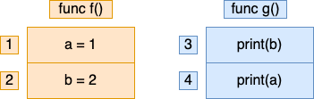

# sync 和 并发编程

## goroutine

请对你创建的 goroutine 负责：

- 不要创建一个你不知道何时退出的 goroutine
- 请不要作为一个旁观者
- 请将选择权留给对方，不要帮别人做选择
- 不要创建一个你永远不知道什么时候会退出的 goroutine
- 不要创建一个永远都无法退出的 goroutine [goroutine 泄漏]
- 确保创建出的 goroutine 的工作已经完成


### Bad Case

```go
package main

import (
	"log"
	"net/http"
	"fmt"
	_ "net/http/pprof"
)

func setup() {
	// 这里面有一些初始化的操作
}

func main() {
	setup()

	// 主服务
	server()

	// for debug
	pprof()

	select {}
}

func server() {
	go func() {
		mux := http.NewServeMux()
		mux.HandleFunc("/", func(w http.ResponseWriter, r *http.Request) {
			fmt.Fprintln(w, "Hello, QCon!")
		})

		// 主服务
		if err := http.ListenAndServe(":8080", mux); err != nil {
			log.Panicf("http server err: %+v", err)
			return
		}
	}()
}

func pprof() {
	// 辅助服务，监听了其他端口，这里是 pprof 服务，用于 debug
	go http.ListenAndServe(":8081", nil)
}

```

有如下问题：

- 如果 server(), pprof() 是在其他包里面，如果没有特殊说明，你知道这是一个异步调用么？
- main  函数当中最后在哪里空转干什么？会不会存在浪费？
- 如果线上出现事故，debug 服务已经退出，你想要 debug 这时你是否很茫然？

### Good Case

```go

func serve(addr string, handler http.Handler, stop <-chan struct{}) error {
	s := http.Server{
		Addr:    addr,
		Handler: handler,
	}

	go func() {
		<-stop // wait for stop signal
		s.Shutdown(context.Background())
	}()

	return s.ListenAndServe()
}

func serveApp(stop <-chan struct{}) error {
	mux := http.NewServeMux()
	mux.HandleFunc("/", func(resp http.ResponseWriter, req *http.Request) {
		fmt.Fprintln(resp, "Hello, QCon!")
	})
	return serve("0.0.0.0:8080", mux, stop)
}

func serveDebug(stop <-chan struct{}) error {
	return serve("127.0.0.1:8001", http.DefaultServeMux, stop)
}

func main() {
	done := make(chan error, 2)
	stop := make(chan struct{})
	go func() {
		done <- serveDebug(stop)
	}()
	go func() {
		done <- serveApp(stop)
	}()

	var stopped bool
	for i := 0; i < cap(done); i++ {
		// 只要有一个返回错误，其他服务同时退出
		if err := <-done; err != nil {
			fmt.Println("error: %v", err)
		}
		if !stopped {
			stopped = true
			// 退出所有服务
			close(stop)
		}
	}
}

```

> 小结:
> 
> - 请将是否异步调用的选择权交给调用者，不然很有可能大家并不知道你在这个函数里面使用了 goroutine
> - 如果你要启动一个 goroutine 请对它负责
> - 永远不要启动一个你无法控制它退出，或者你无法知道它何时推出的 goroutine
> - 启动 goroutine 时请加上 panic recovery 机制，避免服务直接不可用
> - 造成 goroutine 泄漏的主要原因就是 goroutine 中造成了阻塞，并且没有外部手段控制它退出

## 内存模型
同样我们先来看一段代码，请问下面的代码可能会输出什么？

```go
package main

var a, b int

func f() {
	a = 1
	b = 2
}

func g() {
	print(b)
	print(a)
}

func main() {
	go f()
	g()
}

```



比较容易想到的结果是:

-执行顺序: 1 - 2 - 3 - 4, f 先执行, g 后执行, 输出 2 1
-执行顺序: 3 - 4 - 1 - 2, g 先执行，f 后执行，输出 0 0

就这几种结果么？其实不然，还有可能
- 执行顺序: 1 - 3 - 4 - 2, f  先执行一部分, 然后 g  执行, 输出 0 1

那能不能输出 2 0 呢？
先说答案，是有可能的

> 软件(编译器)或硬件(CPU)系统可以根据其对代码的分析结果，一定程度上打乱代码的执行顺序，以达到其不可告人的目的(提高 CPU 利用率)


Go 内存模型，就是要解决两个问题

- 一个是要了解谁先谁后，有个专有名词叫 Happens Before
- 另外一个就是了解可见性的问题

> Advice:
> - Programs that modify data being simultaneously accessed by multiple goroutines must serialize such access.
> - To serialize access, protect the data with channel operations or other synchronization primitives such as those in the sync and sync/atomic packages.

程序存在多个 goroutine 去访问数据的时候，必须序列化的访问，如何保证序列化呢？我们可以采用 channel 或者是 sync 以及 sync/atomic 下面提供的同步语义来保证


## Happens Before


# sync 包基本原语

Go 语言在 sync 包中提供了用于同步的一些基本原语，包括常见的 sync.Mutex、sync.RWMutex、sync.WaitGroup、sync.Once 和 sync.Cond：


# sync.Mutex & RWMutex

Mutex 可以看做是锁，而 RWMutex 则是读写锁。 一般的用法是将 Mutex 或者 RWMutex 和需要被保 住的资源封装在一个结构体内。

- 如果有多个 goroutine 同时读写的资源，就一定要保护起来。 
- 如果多个 goroutine 只读某个资源，那就不需要保护。


使用锁的时候，优先使用 RWMutex。

- RWMutex：核心就是四个方法，RLock、 RUnlock、Lock、Unlock

- Mutex：Lock 和 Unlock


# sync.Cond


# sync.Once

sync.Once 一般就是用来确保某个动作至多执行一次。

普遍用于初始化资源，单例模式。

```go

import (
	"fmt"
	"sync"
)

type Biz struct {
	onceClose sync.Once
}

func (b *Biz) Close() error {
	b.onceClose.Do(func() {
		fmt.Printf("close")
	})
	return nil
}

func init() {
	// 这里也是只执行一次
}

var singletone *Singleton
var instanceOnce sync.Once

type Singleton struct {
}

func NewInstance() *Singleton {
	instanceOnce.Do(func() {
		singletone = &Singleton{}
	})
	return singletone
}
```

## sync.Once 源码

sync.Once 源码比较简单

```go
type Once struct {
	done uint32
	m    Mutex
}

// Do calls the function f if and only if Do is being called for the
// first time for this instance of Once. In other words, given
//
//	var once Once
//
// if once.Do(f) is called multiple times, only the first call will invoke f,
// even if f has a different value in each invocation. A new instance of
// Once is required for each function to execute.
//
// Do is intended for initialization that must be run exactly once. Since f
// is niladic, it may be necessary to use a function literal to capture the
// arguments to a function to be invoked by Do:
//
//	config.once.Do(func() { config.init(filename) })
//
// Because no call to Do returns until the one call to f returns, if f causes
// Do to be called, it will deadlock.
//
// If f panics, Do considers it to have returned; future calls of Do return
// without calling f.
func (o *Once) Do(f func()) {
	// Note: Here is an incorrect implementation of Do:
	//
	//	if atomic.CompareAndSwapUint32(&o.done, 0, 1) {
	//		f()
	//	}
	//
	// Do guarantees that when it returns, f has finished.
	// This implementation would not implement that guarantee:
	// given two simultaneous calls, the winner of the cas would
	// call f, and the second would return immediately, without
	// waiting for the first's call to f to complete.
	// This is why the slow path falls back to a mutex, and why
	// the atomic.StoreUint32 must be delayed until after f returns.

	if atomic.LoadUint32(&o.done) == 0 {
		// Outlined slow-path to allow inlining of the fast-path.
		o.doSlow(f)
	}
}

func (o *Once) doSlow(f func()) {
	o.m.Lock()
	defer o.m.Unlock()
	// Double check
	if o.done == 0 {
		defer atomic.StoreUint32(&o.done, 1)
		f()
	}
}

```

看 go 的源码真的可以学到很多东西，在这里还给出了很容易犯错的一种实现

```go
if atomic.CompareAndSwapUint32(&o.done, 0, 1) {
    f()
}
```

如果这么实现最大的问题是，如果并发调用，一个 goroutine 执行，另外一个不会等正在执行的这个成功之后返回，而是直接就返回了，这就不能保证传入的方法一定会先执行一次了
所以回头看官方的实现

```go
if atomic.LoadUint32(&o.done) == 0 {
    // Outlined slow-path to allow inlining of the fast-path.
    o.doSlow(f)
}
```

> 小结： 
> - Once 保证了传入的函数只会执行一次，这常用在单例模式，配置文件加载，初始化这些场景下
但是需要注意。Once 是不能复用的，只要执行过了，再传入其他的方法也不会再执行了
> - 并且 Once.Do 在执行的过程中如果 f 出现 panic，后面也不会再执行了
> - 这是一种 double-check 的变种。 没有直接利用读写锁，而是利用原子操作来扮演读锁的角色。 值得学习的做法。


# sync.atomic

Mutex由操作系统实现，而atomic包中的原子操作则由底层硬件直接提供支持。在 CPU 实现的指令集里，有一些指令被封装进了atomic包，这些指令在执行的过程中是不允许中断（interrupt）的，因此原子操作可以在lock-free的情况下保证并发安全，并且它的性能也能做到随 CPU 个数的增多而线性扩展。

> 原子性:
> 
> 一个或者多个操作在 CPU 执行的过程中不被中断的特性，称为原子性（atomicity） 。
> 这些操作对外表现成一个不可分割的整体，他们要么都执行，要么都不执行，外界不会看到他们只执行到一半的状态。
> 而在现实世界中，CPU 不可能不中断的执行一系列操作，但如果我们在执行多个操作时，能让他们的中间状态对外不可见，那我们就可以宣称他们拥有了"不可分割”的原子性。


对于并发操作，原子操作 (不可异常/中断的一系列操作) 是一个绕不开的话题，典型的就是 i++ 问题，并发场景下，有多个 CPU 并发执行 i++，原本只想执行一次，实际上变成执行多次，这就涉及到我们今天要聊的 sync/atomic 了。常见的原子操作有


- Test-and-Set-Lock，TSL，对某个存储器位置写值并返回旧值

- Fetch-and-Add，FAA，对某个存储器位置加值并返回新值

- Compare-and-Swap，CAS，判断某个存储器位置的值是否与指定值相等，如果相等则替换为新的值

- Load-Linked/Store-Conditional，LL/SC，Load-Linked 返回某个存储器位置原值，Store-Conditional 写入新值 (如果 Load-Linked 后没有被修改)


原子操作是如何实现的:

CPU 原子操作的硬件实现是通过 LOCK 指令对 Cache Line 进行加锁，阻塞其它 CPU 对该 Cache Line 的内存访问，通过缓存一致性机制来加锁，缓存一致性机制的实现方式有很多种，其中的一种，MESI 缓存协议。

### 实现的原子操作

```go
// TSL
// 
// old = *addr
// *addr = new
// return old
func SwapInt32(addr *int32, new int32) (old int32)
func SwapInt64(addr *int64, new int64) (old int64)
func SwapUint32(addr *uint32, new uint32) (old uint32)
func SwapUint64(addr *uint64, new uint64) (old uint64)
func SwapUintptr(addr *uintptr, new uintptr) (old uintptr)
func SwapPointer(addr *unsafe.Pointer, new unsafe.Pointer) (old unsafe.Pointer)

// FAA
// 
// *addr += delta
// return *addr
func AddInt32(addr *int32, delta int32) (new int32)
func AddUint32(addr *uint32, delta uint32) (new uint32)
func AddInt64(addr *int64, delta int64) (new int64)
func AddUint64(addr *uint64, delta uint64) (new uint64)
func AddUintptr(addr *uintptr, delta uintptr) (new uintptr)

// CAS
// 
// if *addr == old {
//     *addr = new
//     return true
// }
// return false
func CompareAndSwapInt32(addr *int32, old, new int32) (swapped bool)
func CompareAndSwapInt64(addr *int64, old, new int64) (swapped bool)
func CompareAndSwapUint32(addr *uint32, old, new uint32) (swapped bool)
func CompareAndSwapUint64(addr *uint64, old, new uint64) (swapped bool)
func CompareAndSwapUintptr(addr *uintptr, old, new uintptr) (swapped bool)
func CompareAndSwapPointer(addr *unsafe.Pointer, old, new unsafe.Pointer) (swapped bool)

// Read
func LoadInt32(addr *int32) (val int32)
func LoadInt64(addr *int64) (val int64)
func LoadUint32(addr *uint32) (val uint32)
func LoadUint64(addr *uint64) (val uint64)
func LoadUintptr(addr *uintptr) (val uintptr)
func LoadPointer(addr *unsafe.Pointer) (val unsafe.Pointer)

// Write
func StoreInt32(addr *int32, val int32)
func StoreInt64(addr *int64, val int64)
func StoreUint32(addr *uint32, val uint32)
func StoreUint64(addr *uint64, val uint64)
func StoreUintptr(addr *uintptr, val uintptr)
func StorePointer(addr *unsafe.Pointer, val unsafe.Pointer)

// 任意类型 Read / Write
type Value
func (v *Value) Load() (x interface{})
func (v *Value) Store(x interface{})

```

### CAS 与 ABA 问题

CAS，Compare-and-Swap，一般我们会用它是实现乐观锁，自旋锁，伪代码如下

```go
while(!swapped) {
    swapped = CAS(V, E, N)
    sleep(1)
}
```

所谓自旋锁，Spin Lock，就是循环等待，直到获取到锁。不过乐观锁其实也会带来如下问题

- 自旋开销大
- ABA 问题


面对这种多线程下变量的读写问题，我们的主角——atomic.Value登场了，它使得我们可以不依赖于不保证兼容性的unsafe.Pointer类型，同时又能将任意数据类型的读写操作封装成原子性操作（让中间状态对外不可见）。

atomic.Value类型对外暴露的方法就两个：

- v.Store(c) - 写操作，将原始的变量c存放到一个atomic.Value类型的v里。
- c = v.Load() - 读操作，从线程安全的v中读取上一步存放的内容。


简洁的接口使得它的使用也很简单，只需将需要作并发保护的变量读取和赋值操作用Load()和Store()代替就行了。


```go
package main

import (
	"fmt"
	"math/rand"
	"sync/atomic"
	"time"
)

func loadConfig() map[string]string {
	// 从数据库或者文件系统中读取配置信息，然后以map的形式存放在内存里

	config := make(map[string]string)
	config["rand"] = fmt.Sprintf("%d", rand.Intn(100))
	fmt.Printf("load config: %+v\n", config)
	return config
}

func main() {
	// config变量用来存放该服务的配置信息
	var config atomic.Value
	// 初始化时从别的地方加载配置文件，并存到config变量里
	config.Store(loadConfig())
	time.Sleep(2 * time.Second)

	go func() {
		// 每10秒钟定时的拉取最新的配置信息，并且更新到config变量里
		for {
			// 对应于赋值操作 config = loadConfig()
			config.Store(loadConfig())
			time.Sleep(1 * time.Second)
		}
	}()

	ch := make(chan int)
	// 创建工作线程，每个工作线程都会根据它所读取到的最新的配置信息来处理请求
	for i := 0; i < 2; i++ {
		go func() {
			for r := range ch {
				// 对应于取值操作 c := config
				// 由于Load()返回的是一个interface{}类型，所以我们要先强制转换一下
				c := config.Load().(map[string]string)
				fmt.Printf("get config:%+v\n", c)
				time.Sleep(1 * time.Second)
				// 这里是根据配置信息处理请求的逻辑...
				_, _ = r, c
			}
		}()
	}

	for i := 0; i < 10; i++ {
		ch <- i
	}
	time.Sleep(10 * time.Second)
}


```

```go

func main() {
	
    type pair struct {
        x, y int
    }

    p := pair{1, 2}

    var v atomic.Value

    v.Store(p)
    fmt.Println(v.Load().(pair).x)
    fmt.Println(v.Load().(pair).y)
}

```

### atomic.Value 源码

#### 数据结构

```go

// A Value provides an atomic load and store of a consistently typed value.
// The zero value for a Value returns nil from Load.
// Once Store has been called, a Value must not be copied.
//
// A Value must not be copied after first use.
type Value struct {
	v any
}

// ifaceWords is interface{} internal representation.
type ifaceWords struct {
	typ  unsafe.Pointer
	data unsafe.Pointer
}

```

通过注释我们知道 atomic.Value 的零值为 nil，且使用后不允许被拷贝。写入值后 ifaceWords 中 typ 保存数据类型，data 保存值。atomic.Value 只实现了原子读写，

#### Store 的实现

看 store 方法，store 方法会将值存储为 x，这里需要注意，每次传入的 x 不能为 nil，并且他们类型必须是相同的，不然会导致 panic

```go

var firstStoreInProgress byte

// Store sets the value of the Value to x.
// All calls to Store for a given Value must use values of the same concrete type.
// Store of an inconsistent type panics, as does Store(nil).
func (v *Value) Store(val any) {
	if val == nil {
		panic("sync/atomic: store of nil value into Value")
	}
	// ifaceWords 其实就是定义了一下 interface 的结构，包含 data 和 type 两部分
    // 这里 vp 是原有值
    // vlp 是传入的值
	vp := (*ifaceWords)(unsafe.Pointer(v))
	vlp := (*ifaceWords)(unsafe.Pointer(&val))

    // for 循环不断尝试
	for {
        // 这里先用原子方法取一下老的类型值
		typ := LoadPointer(&vp.typ)
		if typ == nil {
            // 等于 nil 就说明这是第一次 store
			// 调用 runtime 的方法禁止抢占，避免操作完成一半就被抢占了
			// 同时可以避免 GC 的时候看到 unsafe.Pointer(^uintptr(0)) 这个中间状态的值
			runtime_procPin()
			if !CompareAndSwapPointer(&vp.typ, nil, unsafe.Pointer(&firstStoreInProgress)) {
				runtime_procUnpin()
				continue
			}
            // 分别把值和类型保存下来
			StorePointer(&vp.data, vlp.data)
			StorePointer(&vp.typ, vlp.typ)
			runtime_procUnpin()
			return
		}
		if typ == unsafe.Pointer(&firstStoreInProgress) {
            // 如果判断发现这个类型是这个固定值，说明当前第一次赋值还没有完成，所以进入自旋等待
			continue
		}
		// 第一次赋值已经完成，判断新的赋值的类型和之前是否一致，如果不一致就直接 panic
		if typ != vlp.typ {
			panic("sync/atomic: store of inconsistently typed value into Value")
		}
        // 保存值
		StorePointer(&vp.data, vlp.data)
		return
	}
}


```

具体的逻辑都写在注释中了，这里面复杂逻辑在第一次写入，因为第一次写入的时候有两次原子写操作，所以这个时候用 typ 值作为一个判断，通过不同值判断当前所处的状态，这个在我们业务代码中其实也经常用到。然后因为引入了这个中间状态，所以又使用了 runtime_procPin  方法避免抢占

```go
func sync_runtime_procPin() int {
	return procPin()
}

func procPin() int {
    // 获取到当前 goroutine 的 m
	_g_ := getg()
	mp := _g_.m

    // unpin 的时候就是 locks--
	mp.locks++
	return int(mp.p.ptr().id)
}
```

简化版的流程图:


#### Load实现

```go
// Load returns the value set by the most recent Store.
// It returns nil if there has been no call to Store for this Value.
func (v *Value) Load() (val any) {
	vp := (*ifaceWords)(unsafe.Pointer(v))
    // 先拿到类型值
	typ := LoadPointer(&vp.typ)
    // 这个说明还没有第一次 store 或者是第一次 store 还没有完成
	if typ == nil || typ == unsafe.Pointer(&firstStoreInProgress) {
		// First store not yet completed.
		return nil
	}
	// 获取值
	data := LoadPointer(&vp.data)
    // 构造 x 类型
	vlp := (*ifaceWords)(unsafe.Pointer(&val))
	vlp.typ = typ
	vlp.data = data
	return
}

```

读取相对就简单很多了，它有两个分支：
- 如果当前的typ是 nil 或者^uintptr(0)，那就证明第一次写入还没有开始，或者还没完成，那就直接返回 nil （不对外暴露中间状态）。
- 否则，根据当前看到的typ和data构造出一个新的interface{}返回出去。

#### 实现一个“无锁”栈

```go

import (
	"sync/atomic"
	"unsafe"
)

// LFStack 无锁栈
// 使用链表实现
type LFStack struct {
	head unsafe.Pointer // 栈顶
}

// Node 节点
type Node struct {
	val  int32
	next unsafe.Pointer
}

// NewLFStack NewLFStack
func NewLFStack() *LFStack {
	n := unsafe.Pointer(&Node{})
	return &LFStack{head: n}
}

// Push 入栈
func (s *LFStack) Push(v int32) {
	n := &Node{val: v}

	for {
		// 先取出栈顶
		old := atomic.LoadPointer(&s.head)
		n.next = old
		if atomic.CompareAndSwapPointer(&s.head, old, unsafe.Pointer(n)) {
			return
		}
	}
}

// Pop 出栈，没有数据时返回 nil
func (s *LFStack) Pop() int32 {
	for {
		// 先取出栈顶
		old := atomic.LoadPointer(&s.head)
		if old == nil {
			return 0
		}

		oldNode := (*Node)(old)
		// 取出下一个节点
		next := atomic.LoadPointer(&oldNode.next)
		// 重置栈顶
		if atomic.CompareAndSwapPointer(&s.head, old, next) {
			return oldNode.val
		}
	}
}
```


# sync.WaitGroup

WaitGroup 是用于同步多个 goroutine 之间工作的。常见场景是我们会把任务拆分给多个 goroutine 并行完成。在完成之后需要合并这些任务的结果，或者需要等到所有小任务都完成之后才能进入下一步。

WaitGroup 是用于同步多个 goroutine 之间工作的。
- 要在开启 goroutine 之前先加1 
- 每一个小任务完成就减1 
- 调用 Wait 方法来等待所有子任务

完成容易犯错的地方是 +1 和 -1 不匹配： 
- 加多了导致 Wait 一直阻塞，引起 goroutine 泄露 
- 减多了直接就 panic

```go

import (
	"fmt"
	"sync"
)

func worker(i int) {
	fmt.Println("worker: ", i)
}

func main() {
	var wg sync.WaitGroup
	for i := 0; i < 10; i++ {
		// 开始 goroutine 前 +1
		wg.Add(1)
		go func(i int) {
			// 完成后减 1
			defer wg.Done()
			worker(i)
		}(i)
	}
	// 等待
	wg.Wait()
	fmt.Println("main done")
}

```
sync.WaitGroup 可以等待一组 Goroutine 的返回，一个比较常见的使用场景是批量发出 RPC 或者 HTTP 请求：

```go
requests := []*Request{...}
wg := &sync.WaitGroup{}
wg.Add(len(requests))

for _, request := range requests {
    go func(r *Request) {
        defer wg.Done()
        // res, err := service.call(r)
    }(request)
}
wg.Wait()
```

可以通过 sync.WaitGroup 将原本顺序执行的代码在多个 Goroutine 中并发执行，加快程序处理的速度。


## 结构体

sync.WaitGroup 结构体中只包含两个成员变量：

```go
type WaitGroup struct {
	noCopy noCopy

	// 64-bit value: high 32 bits are counter, low 32 bits are waiter count.
	// 64-bit atomic operations require 64-bit alignment, but 32-bit
	// compilers only guarantee that 64-bit fields are 32-bit aligned.
	// For this reason on 32 bit architectures we need to check in state()
	// if state1 is aligned or not, and dynamically "swap" the field order if
	// needed.
	state1 uint64
	state2 uint32
}
```

- noCopy — 保证 sync.WaitGroup 不会被开发者通过再赋值的方式拷贝
- state1  / state2  — 存储着状态和信号量

sync.noCopy 是一个特殊的私有结构体，tools/go/analysis/passes/copylock 包中的分析器会在编译期间检查被拷贝的变量中是否包含 sync.noCopy 或者实现了 Lock 和 Unlock 方法，如果包含该结构体或者实现了对应的方法就会报出以下错误：

```go

func main() {
	wg := sync.WaitGroup{}
	copywg := wg
	fmt.Println(wg, copywg)

	url := URL{Name: "hello"}
	url2 := url
	fmt.Println(url2, url)
}

type noCopy struct {
}

func (*noCopy) Lock()   {}
func (*noCopy) Unlock() {}

type URL struct {
	noCopy noCopy
	Name   string
}

```

```shell
(base) ➜  go-learning git:(main) go vet advance/sync/demo/nocopy.go
# command-line-arguments
advance/sync/nocopy.go:10:12: assignment copies lock value to copywg: sync.WaitGroup contains sync.noCopy
advance/sync/nocopy.go:11:14: call of fmt.Println copies lock value: sync.WaitGroup contains sync.noCopy
advance/sync/nocopy.go:11:18: call of fmt.Println copies lock value: sync.WaitGroup contains sync.noCopy
advance/sync/nocopy.go:14:10: assignment copies lock value to url2: command-line-arguments.URL contains command-line-arguments.noCopy
advance/sync/nocopy.go:15:14: call of fmt.Println copies lock value: command-line-arguments.URL contains command-line-arguments.noCopy
advance/sync/nocopy.go:15:20: call of fmt.Println copies lock value: command-line-arguments.URL contains command-line-arguments.noCopy
(
```

这段代码会因为变量赋值或者调用函数时发生值拷贝导致分析器报错。

除了 sync.noCopy 之外，sync.WaitGroup` 结构体中还包含一个总共占用 12 字节的state1 和 state2，这个数组会存储当前结构体的状态，在 64 位与 32 位的机器上表现也非常不同。


> 	// 64-bit value: high 32 bits are counter, low 32 bits are waiter count.	
>	 // 64-bit atomic operations require 64-bit alignment, but 32-bit
>	// compilers only guarantee that 64-bit fields are 32-bit aligned.
>	// For this reason on 32 bit architectures we need to check in state()
>	// if state1 is aligned or not, and dynamically "swap" the field order if
>	// needed.
>

这段话的关键点在于，在做 64 位的原子操作的时候必须要保证 64 位（8 字节）对齐，如果没有对齐的就会有问题，但是 32 位的编译器并不能保证 64 位对齐所以这里用一个 8个 字节的 state1 和 4个字节 state2 字段来存储，然后根据是否 8 字节对齐选择不同的保存方式。


这个操作巧妙在哪里呢？

- 如果是 64 位的机器那肯定是 8 字节对齐了的，所以是上面第一种方式
- 如果在 32 位的机器上
  - 如果恰好 8 字节对齐了，那么也是第一种方式取前面的 8 字节数据
  - 如果是没有对齐，但是 32 位 4 字节是对齐了的，所以我们只需要后移四个字节，那么就 8 字节对齐了，所以是第二种方式

```go

// state returns pointers to the state and sema fields stored within wg.state*.
func (wg *WaitGroup) state() (statep *uint64, semap *uint32) {
	// 判断是否8个字节对齐
	if unsafe.Alignof(wg.state1) == 8 || uintptr(unsafe.Pointer(&wg.state1))%8 == 0 {
		// state1 is 64-bit aligned: nothing to do.
		return &wg.state1, &wg.state2
	} else {
		// state1 is 32-bit aligned but not 64-bit aligned: this means that
		// (&state1)+4 is 64-bit aligned.
		state := (*[3]uint32)(unsafe.Pointer(&wg.state1))
		return (*uint64)(unsafe.Pointer(&state[1])), &state[0]
	}
}
```

## Add

```go
func (wg *WaitGroup) Add(delta int) {
	// 先从 state 当中把数据和信号量取出来
	statep, semap := wg.state()
	if race.Enabled {
		_ = *statep // trigger nil deref early
		if delta < 0 {
			// Synchronize decrements with Wait.
			race.ReleaseMerge(unsafe.Pointer(wg))
		}
		race.Disable()
		defer race.Enable()
	}
	
	// 在 waiter 上加上 delta 值
	state := atomic.AddUint64(statep, uint64(delta)<<32)
	// 取出当前的 counter
	v := int32(state >> 32)
	// 取出当前的 waiter，正在等待 goroutine 数量
	w := uint32(state)
	if race.Enabled && delta > 0 && v == int32(delta) {
		// The first increment must be synchronized with Wait.
		// Need to model this as a read, because there can be
		// several concurrent wg.counter transitions from 0.
		race.Read(unsafe.Pointer(semap))
	}
	// counter 不能为负数
	if v < 0 {
		panic("sync: negative WaitGroup counter")
	}
	// 这里属于防御性编程
    // w != 0 说明现在已经有 goroutine 在等待中，说明已经调用了 Wait() 方法
    // 这时候 delta > 0 && v == int32(delta) 说明在调用了 Wait() 方法之后又想加入新的等待者
    // 这种操作是不允许的
	if w != 0 && delta > 0 && v == int32(delta) {
		panic("sync: WaitGroup misuse: Add called concurrently with Wait")
	}
	// 如果当前没有人在等待就直接返回，或者 counter > 0
	if v > 0 || w == 0 {
		return
	}
	// This goroutine has set counter to 0 when waiters > 0.
	// Now there can't be concurrent mutations of state:
	// - Adds must not happen concurrently with Wait,
	// - Wait does not increment waiters if it sees counter == 0.
	// Still do a cheap sanity check to detect WaitGroup misuse.
	// 这里也是防御 主要避免并发调用 add 和 wait
	if *statep != state {
		panic("sync: WaitGroup misuse: Add called concurrently with Wait")
	}
	// Reset waiters count to 0.
	// 唤醒所有 waiter，看到这里就回答了上面的问题了
	*statep = 0
	for ; w != 0; w-- {
		runtime_Semrelease(semap, false, 0)
	}
}

```


## Wait

```go

// Wait blocks until the WaitGroup counter is zero.
func (wg *WaitGroup) Wait() {
	// 先从 state 当中把数据和信号量的地址取出来
	statep, semap := wg.state()
	if race.Enabled {
		_ = *statep // trigger nil deref early
		race.Disable()
	}
	for {
		// 获取 counter 和 waiter 的数据
		state := atomic.LoadUint64(statep)
		v := int32(state >> 32)
		w := uint32(state)
		if v == 0 {
			// counter = 0 说明没有在等的，直接返回就行
			// Counter is 0, no need to wait.
			if race.Enabled {
				race.Enable()
				race.Acquire(unsafe.Pointer(wg))
			}
			// 说明没有在等的，直接返回就行
			return
		}
		// Increment waiters count.
		// waiter + 1，调用一次就多一个等待者，然后休眠当前 goroutine 等待被唤醒
		if atomic.CompareAndSwapUint64(statep, state, state+1) {
			if race.Enabled && w == 0 {
				// Wait must be synchronized with the first Add.
				// Need to model this is as a write to race with the read in Add.
				// As a consequence, can do the write only for the first waiter,
				// otherwise concurrent Waits will race with each other.
				race.Write(unsafe.Pointer(semap))
			}
			// 休眠当前 goroutine 等待被唤醒， 调用Wait() 被阻塞
			runtime_Semacquire(semap)
			
			if *statep != 0 {
				panic("sync: WaitGroup is reused before previous Wait has returned")
			}
			if race.Enabled {
				race.Enable()
				race.Acquire(unsafe.Pointer(wg))
			}
			// 等待被唤醒后，直接返回， 
			return
		}
	}
}
```
## Done

这个只是 add 的简单封装

```go
// Done decrements the WaitGroup counter by one.
func (wg *WaitGroup) Done() {
	wg.Add(-1)
}

```


> 小结 #
> 
> 通过对 sync.WaitGroup 的分析和研究，我们能够得出以下结论：
> - sync.WaitGroup 必须在 sync.WaitGroup.Wait 方法返回之后才能被重新使用；
> - sync.WaitGroup.Done 只是对 sync.WaitGroup.Add 方法的简单封装，我们可以向 sync.WaitGroup.Add 方法传入任意负数（需要保证计数器非负）快速将计数器归零以唤醒等待的 Goroutine；
> - 可以同时有多个 Goroutine 等待当前 sync.WaitGroup 计数器的归零，这些 Goroutine 会被同时唤醒；


# ErrGroup

# Semaphore

# SingleFlight

# Sync.Pool


# Reference
* 【好好阅读】https://dave.cheney.net/practical-go/presentations/qcon-china.html#_keep_yourself_busy_or_do_the_work_yourself 
* https://go-zh.org/ref/mem
* https://golang.google.cn/ref/mem
* https://lailin.xyz/post/go-training-week3-go-memory-model.html
* https://www.cs.utexas.edu/~bornholt/post/memory-models.html
* https://pkg.go.dev/sync/atomic 
* https://zhuanlan.zhihu.com/p/94811032
* https://blog.betacat.io/post/golang-atomic-value-exploration/
* https://draveness.me/golang/docs/part3-runtime/ch06-concurrency/golang-sync-primitives/
* https://www.cnblogs.com/ricklz/p/14610213.html